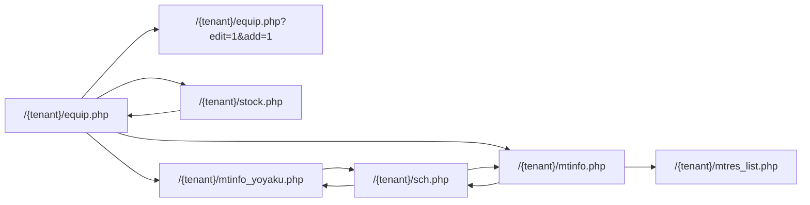
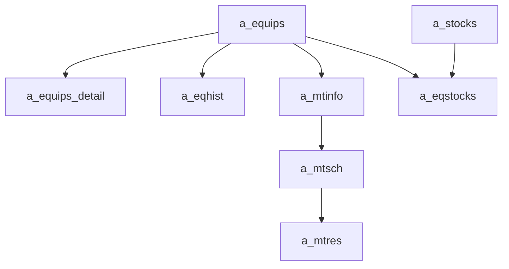

---
aliases:
  - PPES flow map
  - PPES page relationships
tags:
  - en
  - ppes
  - wiki
  - overview
  - obsidian
---

# PPES page map

This note is the entry point for the main PPES equipment, maintenance, schedule, and stock pages.

## Page notes

-[[Bản đồ trang PPES]]]
- [[管理 index]]
- [[設備機器 index]]
- [[保全 index]]
- [[在庫一覧 index]]
- [[Equipment page]]
- [[Edit-add equipment]]
- [[Stock management]]
- [[Maintenance reservation page]]
- [[Maintenance work page]]
- [[Maintenance results list]]
- [[Schedule calendar]]
- [[Multi-tenancy architecture]]

## Menu hierarchy

- `設備機器`
- `保全`
- `在庫一覧`
- `管理`

> **Super-admin layer:** The `/padmin/` module is a separate admin panel that sits above all tenants. It uses its own database (`zaikodb`) and is **not** part of the per-tenant menu hierarchy above. See [[Multi-tenancy architecture]] for the full picture.

## `/padmin/` super-admin pages

These pages live under `htdocs/padmin/` and authenticate via the `Staff` class against `zaikodb.staff`.

| File | Title | Description |
|---|---|---|
| `index.php` | 管理画面 | Dashboard / landing page |
| `buscomps.php` | 契約会社管理 | Tenant registry — create, edit, and view tenants. Creating a new tenant triggers `DatabaseSetup::createAndSetupDatabase()`. |
| `staff.php` | スタッフ管理 | Admin-panel staff accounts (`zaikodb.staff`) |
| `tagents.php` | 旅行代理店管理 | Travel agents (`zaikodb.tagents`) |
| `info.php` | お知らせ | System-wide announcements (`zaikodb.infos`) |
| `words.php` | 多言語対応 | View/export multilingual label list from `lib/lang.php` and `zaikodb.datamaster` |
| `login.php` | — | Login page for padmin |
| `create_db_and_setup.php` | — | `DatabaseSetup` class — included by `buscomps.php`, not a standalone page |
| `run_command.php` | — | One-off CLI script for DB maintenance tasks (not a web page) |

## Overall page flow

> Pages live under `/{tenantCode}/` in production (e.g. `/ahihi/equip.php`).

## Domain data flow

## How to read the notes

- Use [[Equipment page]] when you want the full controller behavior of `/{tenant}/equip.php`.
- Use [[Edit-add equipment]] when you want the narrow add form context for `edit=1&add=1`.
- Use [[Stock management]] for stock item ownership, equipment linkage, and stock download/export behavior.
- Use [[Maintenance reservation page]] for recurring reservation generation and reminder mail.
- Use [[Maintenance work page]] for the broader maintenance controller that feeds schedule and result flows.
- Use [[Maintenance results list]] for the completed-work reporting view.
- Use [[Schedule calendar]] for the read-only calendar projection over maintenance data.
- Use [[Multi-tenancy architecture]] for database routing, tenant provisioning, cookie structure, and isolation guarantees.

## Shared core tables

| Area | Main tables |
| --- | --- |
| Equipment master | `a_equips`, `a_equips_detail`, `a_eqhist` |
| Stock | `a_stocks`, `a_eqstocks` |
| Maintenance definition | `a_mtinfo` |
| Maintenance schedule | `a_mtsch` |
| Maintenance result | `a_mtres` |
| Lookup/master | `a_eqgroup`, `a_eqitem`, `a_eqgroup_detail`, `a_factory`, `a_line`, `a_floor`, `a_maker`, `datamaster` |
| Auth/session context | `buscomps`, `bk_staff`, `bkmasters`, `a_auths` |

## Important pattern

This part of the codebase is mostly controller-driven and procedural.

- The useful mental model is page -> branch -> helper -> tables -> side effects.
- Most page notes focus on data ownership, branching, and downstream page relationships rather than PHP class hierarchy.
