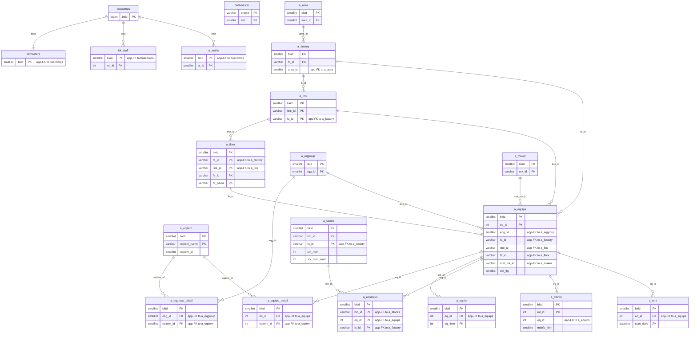

---
aliases:
  - /{tenant}/equip.php?edit=1&add=1
  - equip add page context
tags:
  - en
  - ppes
  - equip
  - database
  - obsidian
---

# Equipment add/edit

## Summary

This URL opens the equipment add screen in edit mode.

- Blank add load: renders the form and master data for a new equipment record.
- Save: inserts or updates equipment header/detail/history records.
- Optional stock upload: also touches stock tables when stock-list files are attached.
- Delete checks exist in the same PHP file, but they are not part of the `add=1` flow.

## Main Entry

- Page script: `htdocs/base/equip.php`
- Edit-mode branch: `htdocs/base/equip.php:94`
- Add flow is identified by `$_REQUEST['edit']` and `$_REQUEST['add']`

## Tables Involved

## Initial Add Form Load

These tables are involved when opening `ppes/equip.php?edit=1&add=1` before submitting the form.

| Table              | Usage                                                   |
| ------------------ | ------------------------------------------------------- |
| `buscomps`         | Company context during user open/login state            |
| `bk_staff`         | Logged-in staff context                                 |
| `bkmasters`        | Company-level settings merged into user context         |
| `a_auths`          | Permission check via `setMultiAuth()`                   |
| `datamaster`       | Master values loaded by `ppes_master()` / `getMaster()` |
| `a_eqgroup`        | Equipment group dropdown                                |
| `a_factory`        | Factory dropdown                                        |
| `a_area`           | Joined while loading factories                          |
| `a_line`           | Joined while loading factories and line dropdown        |
| `a_maker`          | Maker dropdown                                          |
| `a_eqgroup_detail` | Field definitions for selected equipment group          |
| `a_eqitem`         | Dynamic equipment item definitions                      |
| `a_floor`          | Floor/room dropdown                                     |

## Not Read On Blank Add Load

Because `add=1` has no `eq_id`, `makeEdit()` returns immediately and these tables are not read on the initial blank form load.

| Table | Why not used |
| --- | --- |
| `a_equips` | No existing equipment record to load |
| `a_equips_detail` | No existing detail rows to load |
| `a_eqhist` | No equipment history without `eq_id` |

## Save Flow

When the add form is submitted successfully, these tables are used.

| Table | Usage |
| --- | --- |
| `a_floor` | Converts `flr_name` to `flr_id` when needed |
| `a_equips` | Duplicate checks, serial generation, header save |
| `a_equips_detail` | Saves per-item equipment detail values |
| `a_eqhist` | Saves change history snapshot |

## Mermaid: inferred entity relationships

> **Note**: The database has zero explicit FK constraints. All relationships below are enforced at the application level.

Reasoning:

- This add screen is a composition point across equipment, dynamic field definitions, location masters, and optional stock linkage.
- Some edges, especially auth/master-label links, are application-level rather than strict DB foreign keys.

## Optional Stock Upload Flow

These are only involved when uploaded files include stock-list data.

Related note:

- [[Stock management]]
- [[Equipment page]]
- [[PPES page map]]

| Table | Usage |
| --- | --- |
| `a_stocks` | Saves stock master/header data parsed from uploaded file |
| `a_eqstocks` | Links stock items to the equipment |

## Present In Same PHP But Not Part Of `add=1`

The following tables are used by list, delete, or other helper flows in the same script, but not by the initial blank add page render.

| Table | Usage |
| --- | --- |
| `a_mtinfo` | Delete blocking check for maintenance reservations/history |
| `a_mtsch` | Joined with `a_mtinfo` for delete blocking checks |
| `a_rent` | Delete blocking check for rental records |

## Code Reference Map

| Area | Reference |
| --- | --- |
| Main edit branch | `htdocs/base/equip.php:94-265` |
| Form field definition load | `htdocs/base/equip.php:212-249` |
| Existing record load guard | `htdocs/base/equip.php:650-690` |
| Save logic | `htdocs/base/equip.php:716-846` |
| Stock upload helpers | `htdocs/base/equip.php:962-1203` |
| Duplicate machine-number check | `htdocs/base/equip.php:1782-1796` |
| Floors helper | `lib/ppes.php:479-500` |
| Lines helper | `lib/ppes.php:517-538` |
| User dropdown helpers | `lib/aspUser.php:714-747`, `840-947` |
| Datamaster loader | `lib/libCommon.php:529-549` |

## Quick Answer

For the actual `ppes/equip.php?edit=1&add=1` page load, the main business tables are:

- `a_eqgroup`
- `a_factory`
- `a_area`
- `a_line`
- `a_maker`
- `a_eqgroup_detail`
- `a_eqitem`
- `a_floor`
- `datamaster`

For authentication and authorization around the page load:

- `buscomps`
- `bk_staff`
- `bkmasters`
- `a_auths`

For the submit/save path:

- `a_equips`
- `a_equips_detail`
- `a_eqhist`
- `a_floor`
- `a_stocks` and `a_eqstocks` when stock files are uploaded

## Related Notes

- Equipment controller overview: [[Equipment page]]
- Stock management page: [[Stock management]]
- PPES page index: [[PPES page map]]

---

## Appendix: table glossary

> Full schema (columns, types, per-column purpose) for every table listed here is in [[Table Glossary]].

### Equipment domain (written on save)

| Table | Purpose |
| --- | --- |
| **[[Table Glossary#a_equips\|a_equips]]** | Equipment master. Duplicate-checked on save (machine number uniqueness), then inserted with a new `eq_id` serial. Stores header fields: name, group, factory/line/floor placement, maker, and custom field values. |
| **[[Table Glossary#a_equips_detail\|a_equips_detail]]** | Per-equipment item values. Written after the equipment header — one row per dynamic field per equipment (`eq_id` + `eqitem_id` → `eqd_val`). |
| **[[Table Glossary#a_eqhist\|a_eqhist]]** | Equipment change history. Inserted on save to capture a field-level snapshot for audit trail. |

### Dynamic field definitions (read on form load)

| Table | Purpose |
| --- | --- |
| **[[Table Glossary#a_eqgroup\|a_eqgroup]]** | Equipment group master. Populates the group dropdown on the add form. |
| **[[Table Glossary#a_eqgroup_detail\|a_eqgroup_detail]]** | Group-to-item mapping. Determines which dynamic fields appear for the selected equipment group. |
| **[[Table Glossary#a_eqitem\|a_eqitem]]** | Equipment item definition. Stores field name, type, and dropdown options for each dynamic field rendered on the form. |

### Location / org hierarchy (read on form load)

| Table | Purpose |
| --- | --- |
| **[[Table Glossary#a_area\|a_area]]** | Area master. Joined when loading factories for the dropdown. |
| **[[Table Glossary#a_factory\|a_factory]]** | Factory master. Populates the factory dropdown on the add form. |
| **[[Table Glossary#a_line\|a_line]]** | Line master. Populates the line dropdown, filtered by selected factory. |
| **[[Table Glossary#a_floor\|a_floor]]** | Floor / room master. Populates the floor dropdown and converts `flr_name` to `flr_id` on save. |

### Optional stock upload

| Table | Purpose |
| --- | --- |
| **[[Table Glossary#a_stocks\|a_stocks]]** | Stock item master. Written only when the add form includes stock-list file attachments. |
| **[[Table Glossary#a_eqstocks\|a_eqstocks]]** | Equipment-to-stock link. Written alongside `a_stocks` to link stock items to the new equipment. |

### Helper lookups

| Table | Purpose |
| --- | --- |
| **[[Table Glossary#a_maker\|a_maker]]** | Maker / supplier master. Populates the maker dropdown on the add form. |
| **[[Table Glossary#datamaster\|datamaster]]** | Generic dropdown value master. Used for column header and label resolution on the form. |

### Auth / session context

| Table | Purpose |
| --- | --- |
| **[[Table Glossary#buscomps\|buscomps]]** | Tenant registry (`zaikodb`). Read during login to identify the tenant company and check feature flags. |
| **[[Table Glossary#bk_staff\|bk_staff]]** | Tenant staff accounts. Checked by `openUser()` to authenticate the session cookie and resolve `bkid` + `stf_id`. |
| **[[Table Glossary#bkmasters\|bkmasters]]** | Tenant configuration. One row per `bkid`; stores company name, working-hour settings, display preferences, and other tenant-level config. |
| **[[Table Glossary#a_auths\|a_auths]]** | Feature permission groups. `setMultiAuth()` reads this to determine whether the current user can add equipment. |
