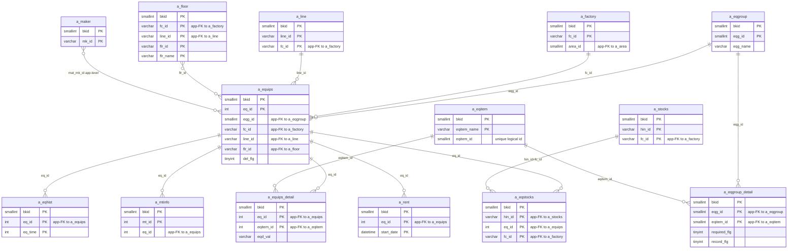

---
aliases:
  - /{tenant}/equip.php
  - equipment page context
tags:
  - en
  - ppes
  - equip
  - database
  - obsidian
---

# Equipment page

Related notes:

- [[PPES page map]]
- [[Edit-add equipment]]
- [[Stock management]]
- [[Maintenance reservation page]]
- [[Maintenance work page]]
- [[Schedule calendar]]

## Summary

`/{tenant}/equip.php` is the controller that owns the equipment master.

- List mode searches and exports equipment.
- Edit mode loads the dynamic equipment form based on equipment group.
- Save writes both the equipment header and its per-item detail rows.
- Stock-list file uploads from this page can also populate stock tables.
- Delete is guarded by maintenance, stock, and rental dependencies.

## What this page owns

- Canonical equipment header: `a_equips`
- Canonical equipment detail values: `a_equips_detail`
- Equipment change history: `a_eqhist`
- Attached stock-list import bridge into `a_stocks` and `a_eqstocks`

## Controller flow

| Branch | Trigger | Main reads | Main writes | Side effects |
| --- | --- | --- | --- | --- |
| Progress API | `api=check_dl` | progress file only | none | returns download progress |
| Admin lock | `lock` | `bkmasters` | `bkmasters` | toggles `ck_rule` |
| Admin floor repair | `set_floor` | `a_equips`, `a_floor` | `a_equips` | backfills `flr_id` |
| Bulk import | `upload=1` | `a_factory`, `a_line`, `a_eqgroup`, `a_eqgroup_detail`, `a_eqitem`, `a_equips` | `a_equips`, `a_equips_detail` | imports spreadsheet |
| Edit/add/copy/look | `edit=1` | lookup tables, `a_equips`, `a_equips_detail`, `a_eqhist` | `a_equips`, `a_equips_detail`, `a_eqhist` | file upload, validation, confirm step |
| Delete | `delete=1&eq_id=...` | dependency tables | `a_eqhist`, `a_equips`, `a_equips_detail` | removes physical files |
| List/default | no `edit` | `a_equips`, `a_eqgroup`, `a_factory`, `a_line` and lookups | none | CSV/XLSX download, pagination |

## Mermaid: controller data flow

```mermaid
flowchart TD
    Req["/{tenant}/equip.php request"] --> Auth["openUser + setMultiAuth"]
    Auth --> Mode{"mode"}

    Mode --> List["list / download"]
    Mode --> Edit["edit/add/copy/look"]
    Mode --> Upload["bulk upload"]
    Mode --> Delete["delete"]

    List --> LQ["read a_equips + a_eqgroup + a_factory + a_line"]

    Edit --> Form["load group fields from a_eqgroup_detail + a_eqitem"]
    Form --> Existing["optional load a_equips + a_equips_detail + a_eqhist"]
    Existing --> Save{"send?"}
    Save -->|yes| EqSave["upsert a_equips"]
    EqSave --> DetailSave["upsert a_equips_detail"]
    DetailSave --> HistSave["insert a_eqhist"]
    DetailSave --> StockFile{"stock file field?"}
    StockFile -->|yes| StockImport["upsert a_stocks + a_eqstocks"]

    Upload --> UploadSave["spreadsheet import into a_equips + a_equips_detail"]

    Delete --> Check["check a_mtinfo/a_mtsch/a_eqstocks/a_rent"]
    Check --> DeleteRows["delete a_eqhist + a_equips + a_equips_detail"]
```

## Mermaid: table relationships (PK/FK from live DB)

> **Note**: The database has zero explicit FK constraints. All relationships below are enforced at the application level.

## Tables involved

## Initial list load

Main list query and filter support:

- `a_equips`
- `a_eqgroup`
- `a_factory`
- `a_line`
- `a_area`
- `a_floor`
- `a_eqgroup_detail`
- `a_eqitem`
- `a_maker`
- `datamaster`

Auth/session context:

- `buscomps`
- `bk_staff`
- `bkmasters`
- `a_auths`

## Edit/add load

Always involved on the form:

- `a_eqgroup`
- `a_factory`
- `a_area`
- `a_line`
- `a_maker`
- `a_eqgroup_detail`
- `a_eqitem`
- `a_floor`
- `datamaster`

Only when editing an existing `eq_id`:

- `a_equips`
- `a_equips_detail`
- `a_eqhist`
- `bk_staff`

## Save path

Written directly:

- `a_equips`
- `a_equips_detail`
- `a_eqhist`

Written when stock-list files are attached:

- `a_stocks`
- `a_eqstocks`

## Delete checks

Delete is blocked if related rows exist in:

- `a_mtinfo`
- `a_mtsch`
- `a_eqstocks`
- `a_rent`

Delete also removes:

- `a_eqhist`
- `a_equips`
- `a_equips_detail`

## Side effects

- physical equipment files are created, copied, and deleted under the equipment data directory
- stock-list spreadsheets are converted to CSV and imported
- list mode can stream Excel/CSV downloads
- admin utility can backfill `a_equips.flr_id`
- access control can switch the page into redirect or read-only behavior

## Key helper functions

| Function | Role |
| --- | --- |
| `makeList()` | search, join, pagination, and download logic |
| `makeEdit()` | loads header and detail rows into request state |
| `saveData()` | canonical save for one equipment record |
| `getHist()` | reconstructs field-level history from `a_eqhist` |
| `checkStockFile()` | validates stock-list uploads before save |
| `uploadStkFile()` | imports stock-list files into stock tables |
| `uploadEqFile()` | bulk spreadsheet import for equipment |
| `set_floor()` | admin repair for missing floor IDs |

## Data ownership notes

- `a_equips` stores both real columns and denormalized data such as `eq_vals`, `details`, and `eqv*` helper columns.
- `a_equips_detail` is the flexible per-item storage keyed by `eqitem_id`.
- This page is the main owner of the equipment domain; other pages mostly read from it or depend on it.

## Notable relationships

- [[Edit-add equipment]] is the narrow add-form context for this same controller.
- [[Stock management]] consumes the `a_stocks` and `a_eqstocks` rows that can be created here.
- [[Maintenance reservation page]] and [[Maintenance work page]] use `a_equips.eq_id` as the parent maintenance target.
- [[Schedule calendar]] is a read-only projection over maintenance rows anchored back to equipment.

## Code references

- `htdocs/base/equip.php:38-47`
- `htdocs/base/equip.php:59-92`
- `htdocs/base/equip.php:94-264`
- `htdocs/base/equip.php:266-339`
- `htdocs/base/equip.php:379-648`
- `htdocs/base/equip.php:716-846`
- `htdocs/base/equip.php:962-1203`
- `htdocs/base/equip.php:1266-1751`
