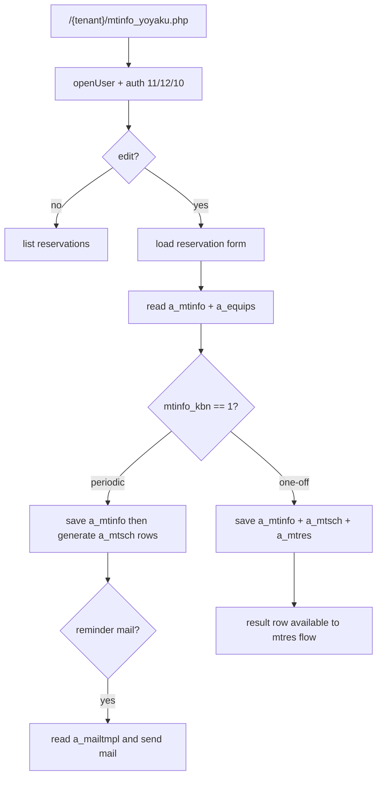
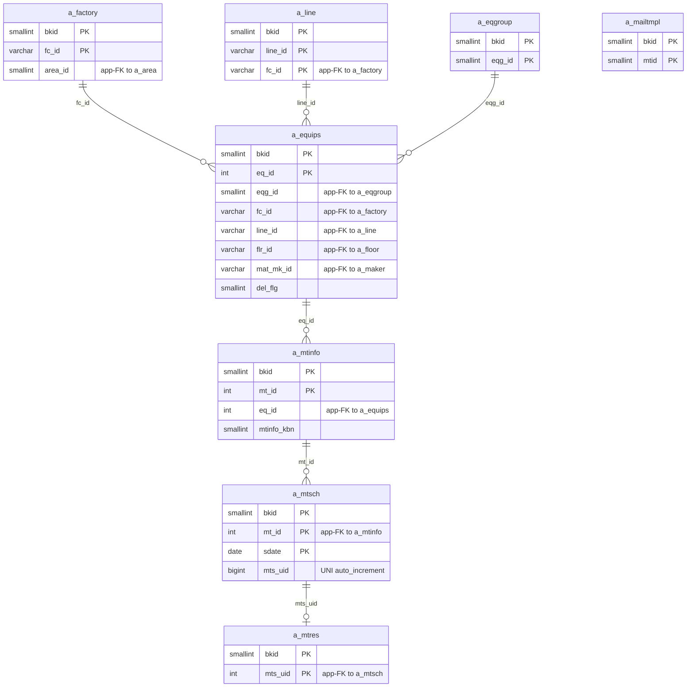

---
aliases:
  - /{tenant}/mtinfo_yoyaku.php
  - /{tenant}/mtinfo_yoyaku.php?
tags:
  - en
  - ppes
  - maintenance
  - reservation
  - obsidian
---

# Maintenance reservation page

Related notes:

- [[PPES page map]]
- [[Equipment page]]
- [[Maintenance work page]]
- [[Maintenance results list]]
- [[Schedule calendar]]

## Summary

`/{tenant}/mtinfo_yoyaku.php` is the reservation-oriented maintenance controller.

- It is effectively the reservation-mode sibling of `mtinfo.php`.
- It creates or edits the maintenance definition in `a_mtinfo`.
- For periodic work it expands recurring schedule rows in `a_mtsch`.
- For non-periodic work it can also create `a_mtsch` and `a_mtres` rows.
- It can send reminder mail for periodic maintenance.

## Why this page matters

This page is where maintenance intent becomes schedule data.

- `a_mtinfo` = maintenance header / definition
- `a_mtsch` = scheduled occurrences
- `a_mtres` = result row for one-off work paths

## Controller flow

| Branch | Trigger | Main reads | Main writes | Side effects |
| --- | --- | --- | --- | --- |
| Upload | `upload=1` | `a_equips` and lookup tables | `a_mtinfo`, `a_mtsch` | periodic import |
| Edit/look | `edit=1` | `a_mtinfo`, `a_equips`, optional `a_mtsch`, `a_mtres` | `a_mtinfo`, `a_mtsch`, `a_mtres` | file upload, confirm step |
| Delete row | `delete=1&mts_uid=...` | `a_mtsch`, `a_mtinfo` | `a_mtsch`, sometimes `a_mtinfo` | physical delete |
| List/default | no `edit` | `a_mtinfo`, `a_equips`, `a_eqgroup`, `a_factory`, optional `a_line`, optional `a_mtsch`, optional `a_mtres` | none | CSV download |

## Mermaid: reservation data flow

## Mermaid: reservation table relationships

> **Note**: The database has zero explicit FK constraints. All relationships below are enforced at the application level.

## Tables involved

## List and look/edit load

- `a_mtinfo`
- `a_equips`
- `a_eqgroup`
- `a_factory`
- `a_line`
- `a_mtsch`
- `a_mtres`
- `a_eqgroup_detail`
- `a_eqitem`
- `a_mailtmpl`
- `datamaster`
- `a_maker`

Auth/session context:

- `buscomps`
- `bk_staff`
- `bkmasters`
- `a_auths`

## Save path

Always written:

- `a_mtinfo`

Written for one-off work:

- `a_mtsch`
- `a_mtres`

Written for periodic work:

- `a_mtsch` via recurring schedule generation

## Import / Export

> For full architecture details, see [[Import-Export architecture]].

| Direction | Format | Template file | Output filename |
|-----------|--------|--------------|-----------------|
| **Export** | CSV | *(no template)* | `mtinfo-{ymdhi}.csv` |
| **Import** | Excel → CSV | *(no template — accepts any .xlsx/.csv)* | temp: `{bkid}-mtinfo.csv` |

- Export streams CSV directly via `printdownLoadHeader()` — no Excel template is used.
- Import via `uploadTeikiFile()` accepts an Excel file, converts to CSV, and creates/updates `a_mtinfo` + generates recurring `a_mtsch` schedule rows via `save_teiki()`.

## Side effects

- sends reminder mail using template `mtid=9`
- generates future schedule rows in `a_mtsch`
- can delete schedule rows and sometimes the parent `a_mtinfo`
- uploads and copies maintenance-related files
- list mode can export CSV

## Key helper functions

| Function | Role |
| --- | --- |
| `makeList()` | reservation/result list builder |
| `makeEdit()` | loads maintenance form state |
| `saveData()` | central save/delete orchestration |
| `save_teiki()` | periodic schedule row generation |
| `inputCheck()` | validation and date checks |
| `uploadTeikiFile()` | bulk periodic import |

## Important behavior notes

- This page is not only a reservation page; for non-periodic work it can also populate `a_mtres`.
- Periodic maintenance is expanded into concrete rows in `a_mtsch`, which is what the schedule and result pages later consume.
- Reminder mail only happens for periodic items under the right status conditions.

## Related page flow

- Starts from [[Equipment page]] when a user creates maintenance from an equipment record.
- Feeds [[Schedule calendar]] through `a_mtsch`.
- Overlaps heavily with [[Maintenance work page]], but this note focuses on the reservation-oriented entry path.

## Code references

- `htdocs/base/mtinfo_yoyaku.php:28-65`
- `htdocs/base/mtinfo_yoyaku.php:84-153`
- `htdocs/base/mtinfo_yoyaku.php:355-375`
- `htdocs/base/mtinfo_yoyaku.php:414-729`
- `htdocs/base/mtinfo_yoyaku.php:938-1266`
- `htdocs/base/mtinfo_yoyaku.php:1419-1529`

---

## Appendix: table glossary

> Full schema (columns, types, per-column purpose) for every table listed here is in [[Table Glossary]].

### Maintenance chain (owned by this page)

| Table | Purpose |
| --- | --- |
| **[[Table Glossary#a_mtinfo\|a_mtinfo]]** | Maintenance plan. The primary table owned by this page. One row per maintenance task per equipment. Stores task name (`mt_name`), type (`mtinfo_kbn` — periodic vs. one-off), planned schedule window (`sc_start_date`/`sc_end_date`), and category (`sc_kbn`). Both save paths (periodic and one-off) write this table. |
| **[[Table Glossary#a_mtsch\|a_mtsch]]** | Maintenance schedule instance. Generated from `a_mtinfo` — for periodic work, `save_teiki()` expands the plan into concrete date rows with `s_date`/`e_date` windows. For one-off work, one `a_mtsch` row is created. Delete can remove individual schedule rows. |
| **[[Table Glossary#a_mtres\|a_mtres]]** | Maintenance result. Written only for non-periodic (one-off) work paths, where this page creates a result row alongside the schedule entry. Keyed by `mts_uid`. |

### Equipment context (read-only)

| Table | Purpose |
| --- | --- |
| **[[Table Glossary#a_equips\|a_equips]]** | Equipment master. Loaded to display the target equipment's name, location, and group. `eq_id` is the parent foreign key for `a_mtinfo`. |
| **[[Table Glossary#a_eqgroup\|a_eqgroup]]** | Equipment group master. Used for the group filter dropdown on the list page. |
| **[[Table Glossary#a_eqgroup_detail\|a_eqgroup_detail]]** | Group-to-item mapping. Read to display dynamic field labels in maintenance context. |
| **[[Table Glossary#a_eqitem\|a_eqitem]]** | Equipment item definition. Read alongside `a_eqgroup_detail` for field label resolution. |

### Location / org hierarchy

| Table | Purpose |
| --- | --- |
| **[[Table Glossary#a_factory\|a_factory]]** | Factory master. Used for the factory filter dropdown on the list page. |
| **[[Table Glossary#a_line\|a_line]]** | Line master. Used for the line filter, shown as context on the edit form. |

### Mail notification

| Table | Purpose |
| --- | --- |
| **[[Table Glossary#a_mailtmpl\|a_mailtmpl]]** | Mail template master. Template `mtid=9` is loaded when sending periodic maintenance reminder mail. |

### Helper lookups

| Table | Purpose |
| --- | --- |
| **[[Table Glossary#a_maker\|a_maker]]** | Maker master. Read for equipment display context in some views. |
| **[[Table Glossary#datamaster\|datamaster]]** | Generic dropdown value master. Used for label resolution (e.g., `mtinfo_kbn` code → display name). |

### Auth / session context

| Table | Purpose |
| --- | --- |
| **[[Table Glossary#buscomps\|buscomps]]** | Tenant registry (`zaikodb`). Read during login to identify the tenant company and check feature flags. |
| **[[Table Glossary#bk_staff\|bk_staff]]** | Tenant staff accounts. Checked by `openUser()` to authenticate the session cookie and resolve `bkid` + `stf_id`. |
| **[[Table Glossary#bkmasters\|bkmasters]]** | Tenant configuration. One row per `bkid`; stores company name, working-hour settings, display preferences, and other tenant-level config. |
| **[[Table Glossary#a_auths\|a_auths]]** | Feature permission groups. `setAuth()` with auth IDs 11, 12, and 10 determines reservation list/edit/download permissions. |
