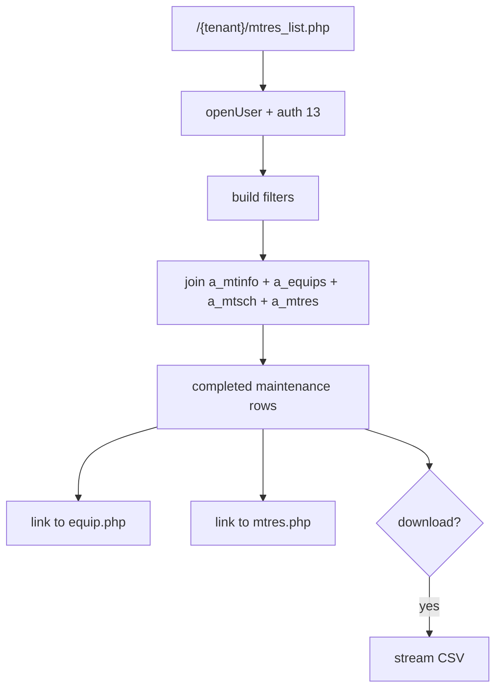
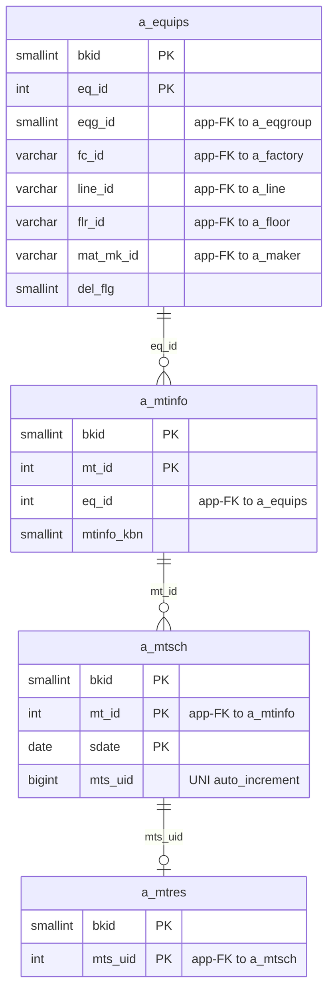

---
aliases:
  - /{tenant}/mtres_list.php
  - /{tenant}/mtres_list.php?
tags:
  - en
  - ppes
  - maintenance
  - results
  - obsidian
---

# Maintenance results list

Related notes:

- [[PPES page map]]
- [[Equipment page]]
- [[Maintenance work page]]
- [[Schedule calendar]]

## Summary

`/{tenant}/mtres_list.php` is a reporting/list page over completed maintenance work.

- It is primarily read-only.
- It filters and exports completed maintenance results.
- It joins maintenance definition, schedule, result, and equipment tables.
- It links out to equipment and maintenance-result detail pages.

## Controller flow

| Branch | Trigger | Main reads | Main writes | Side effects |
| --- | --- | --- | --- | --- |
| List/default | normal load | `a_mtinfo`, `a_equips`, `a_mtsch`, `a_mtres` | none | filters, pagination |
| Download | `download=1` | same joined set | none | CSV export |
| Delete | `delete=1&eq_id=...` | `a_equips` | `a_equips` | unusual equipment delete branch |

## Mermaid: result list data flow

## Mermaid: result list table relationships

> **Note**: The database has zero explicit FK constraints. All relationships below are enforced at the application level.

## Tables involved

Main result list:

- `a_mtinfo`
- `a_equips`
- `a_mtsch`
- `a_mtres`
- `a_factory`
- `a_area`
- `a_line`
- `a_eqgroup`
- `datamaster`

Auth/session context:

- `buscomps`
- `bk_staff`
- `bkmasters`
- `a_auths`

## Import / Export

> For full architecture details, see [[Import-Export architecture]].

| Direction | Format | Template file | Output filename |
|-----------|--------|--------------|-----------------|
| **Export** | CSV | *(no template)* | `mtres_list-{ymdhi}.csv` |
| **Import** | — | — | — |

- This page is **export-only** — there is no import/upload function.
- Export streams CSV directly via `printdownLoadHeader()`.

## Side effects

- CSV export of the filtered result set
- no normal business-table save path
- row actions open related pages in new windows
- there is a surprising delete branch that deletes from `a_equips`

## Important behavior notes

- This page is a projection over already-completed work, not the main owner of maintenance data.
- The real source rows come from [[Maintenance work page]] and the schedule chain.
- The `delete` branch is worth treating as risky because it targets equipment from a result list controller.

## Related page flow

- reads data created by [[Maintenance work page]]
- links back to [[Equipment page]]
- sits beside [[Schedule calendar]] as a reporting-oriented view of the same maintenance domain

## Code references

- `htdocs/base/mtres_list.php:16-45`
- `htdocs/base/mtres_list.php:67-195`
- `htdocs/base/mtres_list.php:205-399`

---

## Appendix: table glossary

> Full schema (columns, types, per-column purpose) for every table listed here is in [[Table Glossary]].

### Core maintenance chain (read-only)

| Table | Purpose |
| --- | --- |
| **[[Table Glossary#a_mtinfo\|a_mtinfo]]** | Maintenance plan. Joined to get the task name, type (`mtinfo_kbn`), and parent `eq_id`. This page reads but does not write this table. |
| **[[Table Glossary#a_equips\|a_equips]]** | Equipment master. Joined to display equipment name, location, and group. Also the target of a risky delete branch in this controller. |
| **[[Table Glossary#a_mtsch\|a_mtsch]]** | Maintenance schedule instance. Joined to get schedule dates (`s_date`/`e_date`) and completion flag (`mtr_done`). |
| **[[Table Glossary#a_mtres\|a_mtres]]** | Maintenance result. The central reporting target — completed work rows are projected through this table. |

### Location / org hierarchy

| Table | Purpose |
| --- | --- |
| **[[Table Glossary#a_area\|a_area]]** | Area master. Joined when loading factories for the filter dropdown. |
| **[[Table Glossary#a_factory\|a_factory]]** | Factory master. Used for the factory filter dropdown. |
| **[[Table Glossary#a_line\|a_line]]** | Line master. Used for the line filter. |
| **[[Table Glossary#a_eqgroup\|a_eqgroup]]** | Equipment group master. Used for the group filter dropdown. |

### Helper lookups

| Table | Purpose |
| --- | --- |
| **[[Table Glossary#datamaster\|datamaster]]** | Generic dropdown value master. Used for label resolution (e.g., `mtinfo_kbn` code → display name). |

### Auth / session context

| Table | Purpose |
| --- | --- |
| **[[Table Glossary#buscomps\|buscomps]]** | Tenant registry (`zaikodb`). Read during login to identify the tenant company and check feature flags. |
| **[[Table Glossary#bk_staff\|bk_staff]]** | Tenant staff accounts. Checked by `openUser()` to authenticate the session cookie and resolve `bkid` + `stf_id`. |
| **[[Table Glossary#bkmasters\|bkmasters]]** | Tenant configuration. One row per `bkid`; stores company name, working-hour settings, display preferences, and other tenant-level config. |
| **[[Table Glossary#a_auths\|a_auths]]** | Feature permission groups. `setAuth($db, $request, 13)` determines result-list view and export permissions. |
