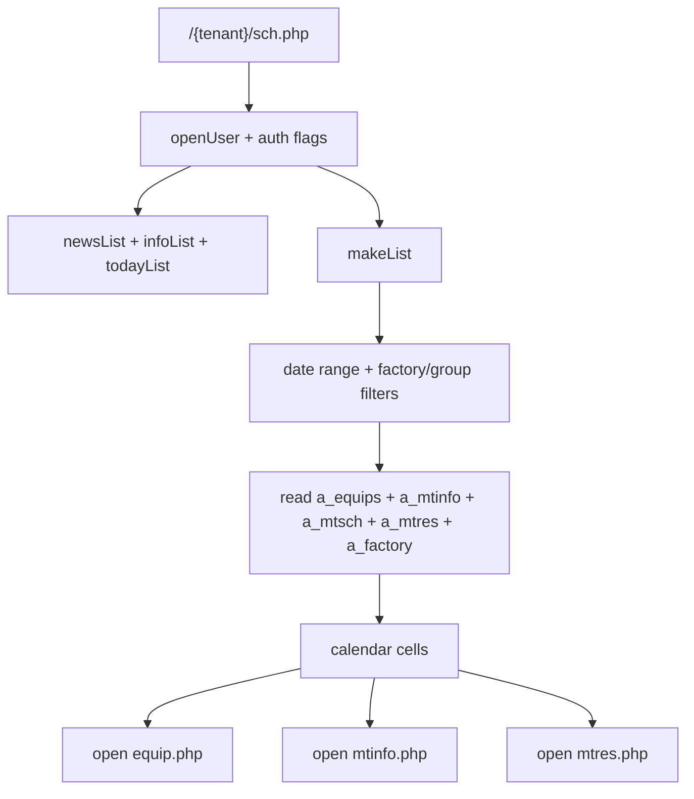
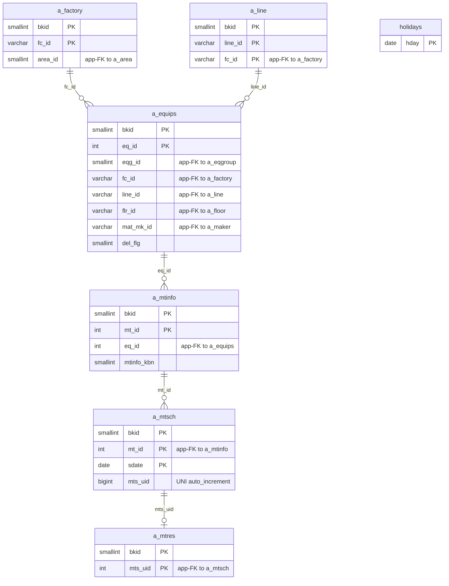

---
aliases:
  - /{tenant}/sch.php
  - schedule page context
tags:
  - en
  - ppes
  - schedule
  - calendar
  - obsidian
---

# Schedule calendar

Related notes:

- [[PPES page map]]
- [[Equipment page]]
- [[Maintenance reservation page]]
- [[Maintenance work page]]
- [[Maintenance results list]]

## Summary

`/{tenant}/sch.php` is a read-heavy calendar and dashboard page over maintenance schedules.

- It does not own the maintenance data.
- It projects schedule rows into day, month, year, and long-range views.
- It also shows today lists, news, and info widgets.
- Its main job is to help users navigate to equipment and maintenance detail pages.

## Controller flow

| Branch | Trigger | Main reads | Main writes | Side effects |
| --- | --- | --- | --- | --- |
| Day view | default `dm` | maintenance schedule joins | none | calendar rendering |
| Month view | `dm=month` | maintenance schedule joins | none | monthly grid |
| Year view | `dm=year` | maintenance schedule joins | none | yearly summary |
| Long view | `dm=long` | maintenance schedule joins | none | multi-year summary |

## Calendar icon mapping

Every icon in the calendar grid is driven solely by columns in `a_mtsch`. `a_mtres` is joined for display data only and does not control any icon.

### Path A — the calendar date falls within an `a_mtsch` row's `s_date`–`e_date` range

| Icon                        | Table     | Column     | Value condition                        | Cell background          |
| --------------------------- | --------- | ---------- | -------------------------------------- | ------------------------ |
| ● solid circle              | `a_mtsch` | `mtr_done` | any truthy value (result registered)   | default / green if today |
| ○ hollow circle             | `a_mtsch` | `mtr_done` | NULL or empty **and** `e_date` ≥ today | default / green if today |
| ○ hollow circle *(overdue)* | `a_mtsch` | `mtr_done` | NULL or empty **and** `e_date` < today | **yellow**               |

Link behaviour: when `mtr_done` is set the link opens `mtres.php` in read-only mode (`&look=1`); when unset it opens in edit mode.

### Path B — the calendar date does NOT fall in any `a_mtsch` range

Checked in priority order — first match wins:

| Priority | Icon              | Table     | Column        | Value condition          | Tooltip (ja) |
| -------- | ----------------- | --------- | ------------- | ------------------------ | ------------ |
| 1        | ■ filled square   | `a_mtsch` | `mtr_dpdate2` | equals the calendar date | 伝票発行日        |
| 2        | □ hollow square   | `a_mtsch` | `mtr_dpdate1` | equals the calendar date | 伝票発行予定日      |
| 3        | ▲ filled triangle | `a_mtsch` | `mtr_mtdate2` | equals the calendar date | 見積実績日        |
| 4        | △ hollow triangle | `a_mtsch` | `mtr_mtdate1` | equals the calendar date | 見積依頼予定日      |
| 5        | *(blank)*         | —         | —             | none of the above match  | —            |

All Path B icons link to `mtres.php` in read-only mode.

> **Suppression rule**: when `mtr_mtdate2` is set for a `mt_id`, the corresponding `mtr_mtdate1` entry is removed from the map in PHP (filled variant suppresses planned variant). Same applies to `mtr_dpdate2` suppressing `mtr_dpdate1`.

### Decision tree

```
a_mtsch row covers the date?
├─ YES → mtr_done set?
│         ├─ YES → ●  (result registered)
│         └─ NO  → e_date < today?
│                   ├─ YES → ○  yellow background (overdue, no result)
│                   └─ NO  → ○  normal background (scheduled, pending)
└─ NO  → check a_mtsch date columns in order:
          mtr_dpdate2 → ■
          mtr_dpdate1 → □
          mtr_mtdate2 → ▲
          mtr_mtdate1 → △
          (none)      → blank
```

## Mermaid: schedule projection flow



## Mermaid: schedule table relationships

> **Note**: The database has zero explicit FK constraints. All relationships below are enforced at the application level.



## Tables involved

Main calendar reads:

- `a_equips`
- `a_mtinfo`
- `a_mtsch`
- `a_mtres`
- `a_factory`
- `a_line`
- `holidays`
- `datamaster`

Page widget reads:

- `bk_infos`
- `infos`

Auth/session context:

- `buscomps`
- `bk_staff`
- `bkmasters`
- `a_auths`
- `a_eqgroup`

## Side effects

- no business-table writes in this controller
- redirects to login on failed auth
- applies display-mode auth flags used by the template
- renders a navigation hub into equipment and maintenance detail pages

## Important behavior notes

- This page is a projection, not a source-of-truth editor.
- The rows it shows come from maintenance pages that write `a_mtinfo`, `a_mtsch`, and `a_mtres`.
- If schedule data looks wrong here, the root cause is often upstream in [[Maintenance reservation page]] or [[Maintenance work page]].

## Related page flow

- reads schedule rows generated from [[Maintenance reservation page]] and [[Maintenance work page]]
- links to [[Equipment page]] and maintenance detail pages
- complements [[Maintenance results list]] as the calendar-oriented view of the same data

## Code references

- `htdocs/base/sch.php:19-48`
- `htdocs/base/sch.php:64-165`
- `htdocs/base/sch.php:167-733`

---

## Appendix: table glossary

> Full schema (columns, types, per-column purpose) for every table listed here is in [[Table Glossary]].

### Core maintenance chain

| Table | Purpose |
| --- | --- |
| **[[Table Glossary#a_equips\|a_equips]]** | Equipment master. One row per physical piece of equipment. Holds name, factory/line assignment, equipment group, machine number, and custom field values (`eq_vals`). Soft-deleted via `del_flg`. |
| **[[Table Glossary#a_mtinfo\|a_mtinfo]]** | Maintenance plan. One row per maintenance task attached to an equipment. Stores the task name, type (`mtinfo_kbn`), planned schedule window (`sc_start_date`/`sc_end_date`), and category (`sc_kbn` — distinguishes periodic BT from estimate/quotation workflows). |
| **[[Table Glossary#a_mtsch\|a_mtsch]]** | Maintenance schedule instance. One row per scheduled date of a plan. Owns the window (`s_date`/`e_date`), completion flag (`mtr_done`), and all four quote/slip date columns (`mtr_mtdate1/2`, `mtr_dpdate1/2`) that drive the Path B icons. This is the single source of truth for all calendar icons. |
| **[[Table Glossary#a_mtres\|a_mtres]]** | Maintenance result. One row per completed schedule entry (keyed by `mts_uid`). Stores work details, staff names, actual dates, costs, and attached files. Joined for display only on `sch.php`; does not control any icon. |

### Location / org hierarchy

| Table | Purpose |
| --- | --- |
| **[[Table Glossary#a_factory\|a_factory]]** | Factory master. Top-level location grouping. Each equipment row has a `fc_id` foreign key into this table. Used for the factory filter dropdown on `sch.php`. |
| **[[Table Glossary#a_line\|a_line]]** | Line master. Sub-location within a factory (`fc_id` + `line_id`). Used for the line filter dropdown and shown as a column in the calendar grid. |

### Calendar display support

| Table | Purpose |
| --- | --- |
| **[[Table Glossary#holidays\|holidays]]** | Public holiday date list. Used to colour holiday dates pink in the calendar column header. |
| **[[Table Glossary#datamaster\|datamaster]]** | Generic dropdown value master. Stores named item lists keyed by `propid` (e.g. `mtinfo_kbn`) with labels in four languages. Read via `ppes_master()` to resolve code → display name. |

### Page widget data

| Table | Purpose |
| --- | --- |
| **[[Table Glossary#bk_infos\|bk_infos]]** | Tenant-scoped announcements. Shown in the **【お知らせ】** info widget on the TOP/schedule page. Admins can edit entries directly from the widget. |
| **[[Table Glossary#infos\|infos]]** | System-wide announcements published from `/padmin/`. Also rendered in the info widget alongside `bk_infos` entries. |

### Auth / session context

| Table | Purpose |
| --- | --- |
| **[[Table Glossary#buscomps\|buscomps]]** | Tenant registry (`zaikodb`). Read during login to identify the tenant company and check feature flags (e.g. `use_api`, `spe_*` toggles). |
| **[[Table Glossary#bk_staff\|bk_staff]]** | Tenant staff accounts. Checked by `openUser()` to authenticate the session cookie and resolve `bkid` + `stf_id`. |
| **[[Table Glossary#bkmasters\|bkmasters]]** | Tenant configuration. One row per `bkid`; stores company name, working-hour settings, display preferences, and other tenant-level config used across all pages. |
| **[[Table Glossary#a_auths\|a_auths]]** | Feature permission groups. Each row is an auth group with per-feature permission flags (`at_1`, `at_10` … `at_15`). `setAuth($db, $request, $authId)` reads this to determine what the current user can view or edit on the page. |
| **[[Table Glossary#a_eqgroup\|a_eqgroup]]** | Equipment group master. Groups of equipment for the `eqg_id` filter on the calendar search form. |
