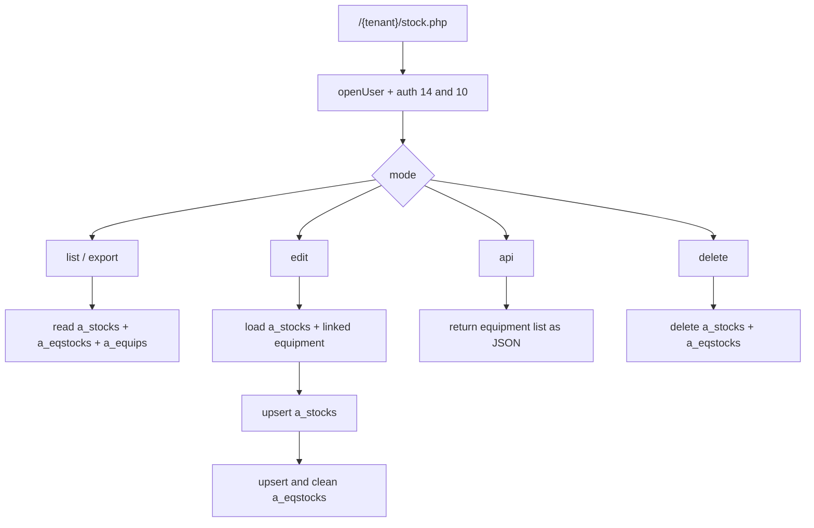
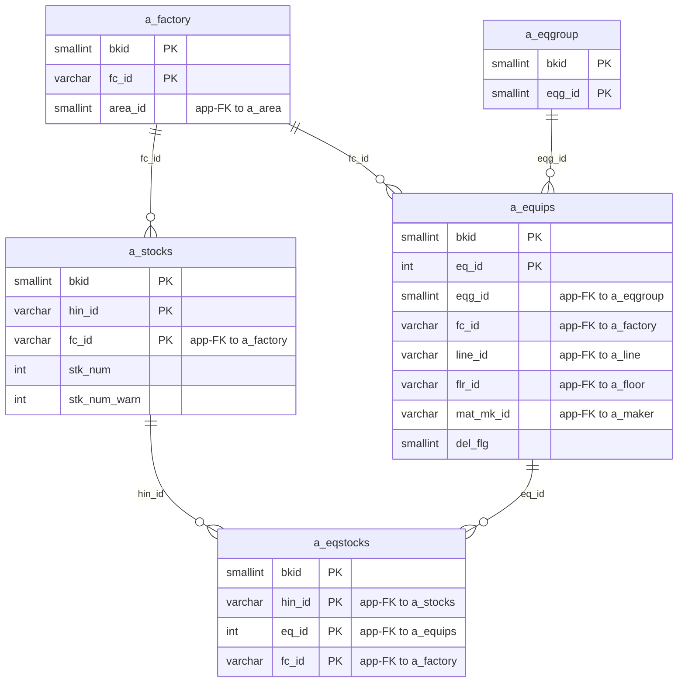

---
aliases:
  - /{tenant}/stock.php
  - stock page context
tags:
  - en
  - ppes
  - stock
  - database
  - obsidian
---

# Stock management

Related notes:

- [[PPES page map]]
- [[Equipment page]]
- [[Edit-add equipment]]

## Summary

`/{tenant}/stock.php` is the stock management page for spare parts and related items.

- List mode shows stock records and shortage warnings.
- Edit mode creates or updates a stock record and its linked equipment.
- API mode returns equipment choices for a selected factory.
- Delete removes the stock record and its equipment links.

## Important ownership note

This page owns the stock item side of the relationship:

- `a_stocks` = stock item header per item and factory
- `a_eqstocks` = link between stock item and equipment

It also consumes stock data that can be imported indirectly from [[Edit-add equipment]].

## Controller flow

| Branch | Trigger | Main reads | Main writes | Side effects |
| --- | --- | --- | --- | --- |
| API | `api=...` | `a_equips` | none | JSON response |
| Edit | `edit=1` | lookup tables, `a_stocks`, `a_eqstocks`, `a_equips` | `a_stocks`, `a_eqstocks` | confirm step |
| Delete | `delete=1&stk_uid=...` | `a_stocks` | `a_stocks`, `a_eqstocks` | prints `OK` |
| List/default | no `edit` | `a_stocks`, `a_eqstocks`, `a_equips` and lookups | none | CSV/XLSX export, low-stock warnings |

## Mermaid: stock page data flow

## Mermaid: stock table relationships

> **Note**: The database has zero explicit FK constraints. All relationships below are enforced at the application level.

## Tables involved

## Authentication and permissions

- `buscomps`
- `bk_staff`
- `bkmasters`
- `a_auths`

## List mode

- `a_stocks`
- `a_eqstocks`
- `a_equips`
- `a_factory`
- `a_area`
- `a_line`
- `a_eqgroup`
- `datamaster`

## Edit mode

- `a_stocks`
- `a_eqstocks`
- `a_equips`
- `a_eqgroup_detail`
- `a_eqitem`
- `a_factory`
- `a_area`
- `a_line`
- `a_eqgroup`
- `a_maker`
- `datamaster`

## Save path

Written directly:

- `a_stocks`
- `a_eqstocks`

## Side effects

- JSON equipment picker API
- CSV and XLSX export
- low-stock warning generation when `stk_num < stk_num_warn`
- auth gating can block edits even if list view is allowed

## Important behavior notes

- Edit and delete navigation use `stk_uid`, but save logic keys `a_stocks` by `hin_id + fc_id`.
- The page treats one stock row as one item per factory.
- Equipment linkage is maintained separately through `a_eqstocks`.
- Equipment deletion is blocked in [[Equipment page]] when these link rows exist.

## Related page flow

- linked equipment is displayed and navigated back to [[Equipment page]]
- stock-list files uploaded from [[Edit-add equipment]] can populate the same `a_stocks` and `a_eqstocks` rows

## Code references

- `htdocs/base/stock.php:19-50`
- `htdocs/base/stock.php:51-139`
- `htdocs/base/stock.php:140-154`
- `htdocs/base/stock.php:180-422`
- `htdocs/base/stock.php:424-553`
