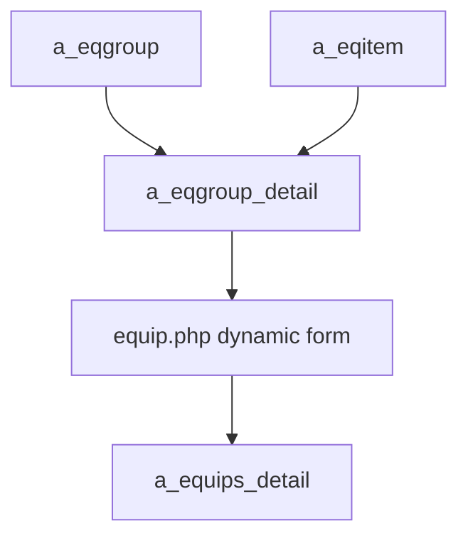
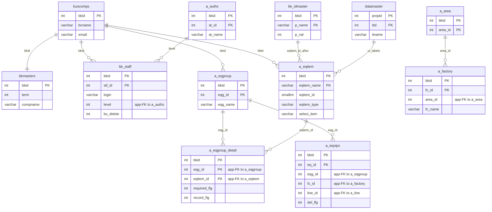

---
aliases:
  - /{tenant}/eqgroup.php
tags:
  - en
  - ppes
  - admin
  - eqgroup
  - obsidian
---
# Equipment group master

Related notes:

- [[管理 index]]
- [[Equipment item master]]
- [[Equipment page]]

## Summary

`/{tenant}/eqgroup.php` is more than a group list page.

- it maintains `a_eqgroup`
- its upload flow also maintains `a_eqitem`
- and it owns the group-to-item mapping in `a_eqgroup_detail`

This page effectively shapes which fields appear on the equipment form.

## Mermaid: dynamic equipment model

## Tables involved

- `a_eqgroup`
- `a_eqgroup_detail`
- `a_eqitem`
- `bk_idmaster`
- `a_area`
- `a_factory`
- `datamaster`
- `buscomps`
- `bk_staff`
- `bkmasters`
- `a_auths`

## Mermaid: inferred entity relationships

> **Note**: The database has zero explicit FK constraints. All relationships below are enforced at the application level.

Reasoning:

- `a_eqgroup_detail` is the application-level junction between groups and items.
- `a_eqgroup` shapes the dynamic equipment form because `equip.php` resolves fields through `a_eqgroup_detail`.

## Import / Export

> For full architecture details, see [[Import-Export architecture]].

| Direction | Format | Template file | Output filename |
|-----------|--------|--------------|-----------------|
| **Export** | Excel (.xlsx) | `M_EQGROUP.xlsx` | `eqgroup-{ymdhi}.xlsx` |
| **Import** | Excel → CSV | *(no template — accepts any .xlsx/.csv)* | temp: `{bkid}-eqgroup.csv` |

- Export loads `htdocs/base/M_EQGROUP.xlsx` (or `htdocs/sys/M_EQGROUP.xlsx` for the sys module) as a template, populates it with data, and streams it to the browser.
- Import accepts an Excel file, converts it to CSV via `Excel::convToCsv()`, then parses rows with `fgetcsv()` and upserts into `a_eqgroup`, `a_eqitem`, and `a_eqgroup_detail`.
- Upload can advance `bk_idmaster` serial for new `a_eqitem` records.

## Side effects

- item/group mapping regeneration during upload
- upload can advance `bk_idmaster` for `a_eqitem`

## Important behavior notes

- `eqitem.php` edits item definitions, but group membership is effectively owned here through upload logic
- changes here directly affect `equip.php` field composition and required/history flags

## Code references

- `htdocs/base/eqgroup.php:28-44`
- `htdocs/base/eqgroup.php:46-86`
- `htdocs/base/eqgroup.php:95-339`
- `htdocs/base/eqgroup.php:352-655`

---

## Appendix: table glossary

> Full schema (columns, types, per-column purpose) for every table listed here is in [[Table Glossary]].

### Equipment group model (owned by this page)

| Table | Purpose |
| --- | --- |
| **[[Table Glossary#a_eqgroup\|a_eqgroup]]** | Equipment group master. One row per group per tenant. Defines a named grouping of equipment (e.g. "Injection Molding", "CNC Mill"). Keyed by `eqg_id`. List, edit, import/export all target this table. |
| **[[Table Glossary#a_eqgroup_detail\|a_eqgroup_detail]]** | Group-to-item mapping. Junction table linking `eqg_id` to `eqitem_id`. Controls which dynamic fields appear on the equipment form, plus per-field `required_flg` and `record_flg` (history tracking). Rebuilt during import. |
| **[[Table Glossary#a_eqitem\|a_eqitem]]** | Equipment item definition. One row per field definition. Stores field name, type (`eqitem_type`), and dropdown options (`select_item`). Import on this page can create new `a_eqitem` rows and advance the serial in `bk_idmaster`. |

### ID allocation

| Table | Purpose |
| --- | --- |
| **[[Table Glossary#bk_idmaster\|bk_idmaster]]** | Application-level serial allocator. Stores the next available `eqitem_id` value per tenant. Incremented when import creates new equipment item definitions. |

### Location / org hierarchy

| Table | Purpose |
| --- | --- |
| **[[Table Glossary#a_area\|a_area]]** | Area master. Used in the page UI for area filter dropdown. |
| **[[Table Glossary#a_factory\|a_factory]]** | Factory master. Used in the page UI for factory filter dropdown. |

### UI label support

| Table | Purpose |
| --- | --- |
| **[[Table Glossary#datamaster\|datamaster]]** | Generic dropdown value master. Stores named item lists keyed by `propid` with labels in four languages. Used for column header and label resolution. |

### Auth / session context

| Table | Purpose |
| --- | --- |
| **[[Table Glossary#buscomps\|buscomps]]** | Tenant registry (`zaikodb`). Read during login to identify the tenant company and check feature flags. |
| **[[Table Glossary#bk_staff\|bk_staff]]** | Tenant staff accounts. Checked by `openUser()` to authenticate the session cookie and resolve `bkid` + `stf_id`. |
| **[[Table Glossary#bkmasters\|bkmasters]]** | Tenant configuration. One row per `bkid`; stores company name, working-hour settings, display preferences, and other tenant-level config used across all pages. |
| **[[Table Glossary#a_auths\|a_auths]]** | Feature permission groups. `setAuth($db, $request, $authId)` reads this to determine what the current user can view or edit on the page. |
