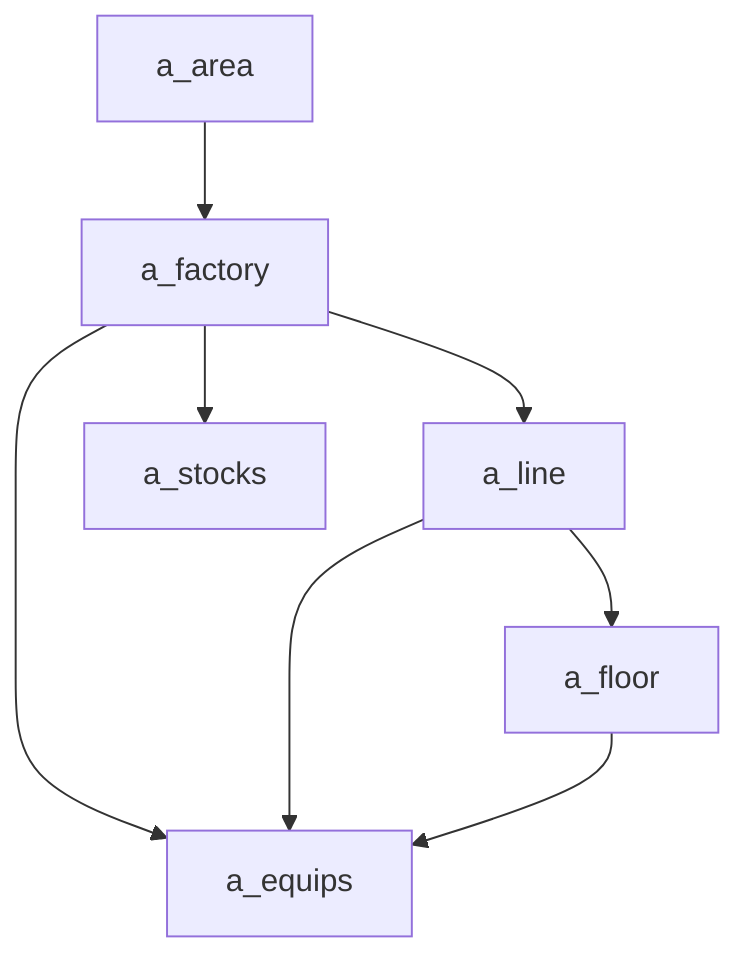
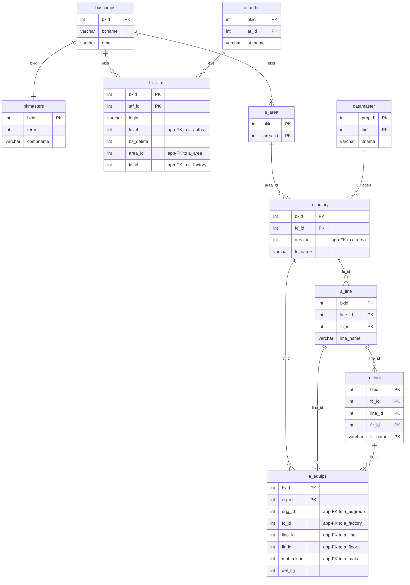

---
aliases:
  - /{tenant}/factory.php
tags:
  - en
  - ppes
  - admin
  - factory
  - obsidian
---

# Factory and location master

Related notes:

- [[管理 index]]
- [[Equipment page]]
- [[Stock management]]

## Summary

`/{tenant}/factory.php` is the source-of-truth controller for the location hierarchy.

- `a_area`
- `a_factory`
- `a_line`
- `a_floor`

It supports list/edit, guarded delete, and bulk upload/export.

## Mermaid: location hierarchy

## Tables involved

- `a_area`
- `a_factory`
- `a_line`
- `a_floor`
- `a_equips`
- `datamaster`
- `buscomps`
- `bk_staff`
- `bkmasters`
- `a_auths`

## Mermaid: inferred entity relationships

> **Note**: The database has zero explicit FK constraints. All relationships below are enforced at the application level.

Reasoning:

- `a_area -> a_factory -> a_line -> a_floor` is the location hierarchy enforced mostly by application logic.
- `a_equips` consumes these masters as placement dimensions even where formal constraints are loose.

## Import / Export

> For full architecture details, see [[Import-Export architecture]].

| Direction | Format | Template file | Output filename |
|-----------|--------|--------------|-----------------|
| **Export** | Excel (.xlsx) | `M_FACTORY_LINE.xlsx` | `factory-{ymdhi}.xlsx` |
| **Import** | Excel → CSV | *(no template — accepts any .xlsx/.csv)* | temp: `{bkid}-factory.csv` |

- Export loads `htdocs/base/M_FACTORY_LINE.xlsx` (or `htdocs/sys/M_FACTORY_LINE.xlsx` for the sys module) as a template, populates it with data, and streams it to the browser.
- Import accepts an Excel file, converts it to CSV via `Excel::convToCsv()`, then parses rows with `fgetcsv()` and upserts into `a_factory`, `a_line`, `a_floor`, and auto-creates `a_area` records if needed.
- Pre-validation: checks for duplicate `fc_id` and `fc_name` before saving.

## Side effects

- guarded JSON delete endpoints for factory, line, and floor rows
- transaction-based bulk upload
- delete is blocked when location rows are referenced by equipment or child rows

## Important behavior notes

- downstream pages like `equip.php` and `stock.php` rely on these masters for selectors and display names
- `Factorys()` only returns factories joined to `a_line`, so incomplete location setup can hide factories from consumers

## Code references

- `htdocs/base/factory.php:28-49`
- `htdocs/base/factory.php:51-177`
- `htdocs/base/factory.php:186-346`
- `htdocs/base/factory.php:429-754`

---

## Appendix: table glossary

> Full schema (columns, types, per-column purpose) for every table listed here is in [[Table Glossary]].

### Location hierarchy (owned by this page)

| Table | Purpose |
| --- | --- |
| **[[Table Glossary#a_area\|a_area]]** | Area master. Top-level geographic grouping. Auto-created during import when a new area name appears. Keyed by `area_id`. |
| **[[Table Glossary#a_factory\|a_factory]]** | Factory master. Second-level location. Each row has `fc_id` (factory code), `fc_name`, and `area_id` (app-FK to `a_area`). This page is the primary owner — list, edit, import/export, and guarded delete all target this table. |
| **[[Table Glossary#a_line\|a_line]]** | Line master. Third-level location within a factory (`fc_id` + `line_id`). Managed inline via the factory page — import rows include line columns, and deletes cascade-check child lines. |
| **[[Table Glossary#a_floor\|a_floor]]** | Floor / room master. Fourth-level location within a line (`fc_id` + `line_id` + `flr_id` + `flr_name`). Also managed through this page's import and delete flows. |

### Downstream consumers (read-only on this page)

| Table | Purpose |
| --- | --- |
| **[[Table Glossary#a_equips\|a_equips]]** | Equipment master. Consumes `fc_id`, `line_id`, `flr_id` from the location hierarchy. Delete on this page is blocked when equipment rows reference the location being deleted. |

### UI label support

| Table | Purpose |
| --- | --- |
| **[[Table Glossary#datamaster\|datamaster]]** | Generic dropdown value master. Stores named item lists keyed by `propid` with labels in four languages. Used for column header and label resolution. |

### Auth / session context

| Table | Purpose |
| --- | --- |
| **[[Table Glossary#buscomps\|buscomps]]** | Tenant registry (`zaikodb`). Read during login to identify the tenant company and check feature flags. |
| **[[Table Glossary#bk_staff\|bk_staff]]** | Tenant staff accounts. Checked by `openUser()` to authenticate the session cookie and resolve `bkid` + `stf_id`. |
| **[[Table Glossary#bkmasters\|bkmasters]]** | Tenant configuration. One row per `bkid`; stores company name, working-hour settings, display preferences, and other tenant-level config used across all pages. |
| **[[Table Glossary#a_auths\|a_auths]]** | Feature permission groups. `setAuth($db, $request, $authId)` reads this to determine what the current user can view or edit on the page. |
