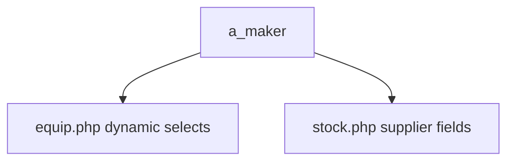
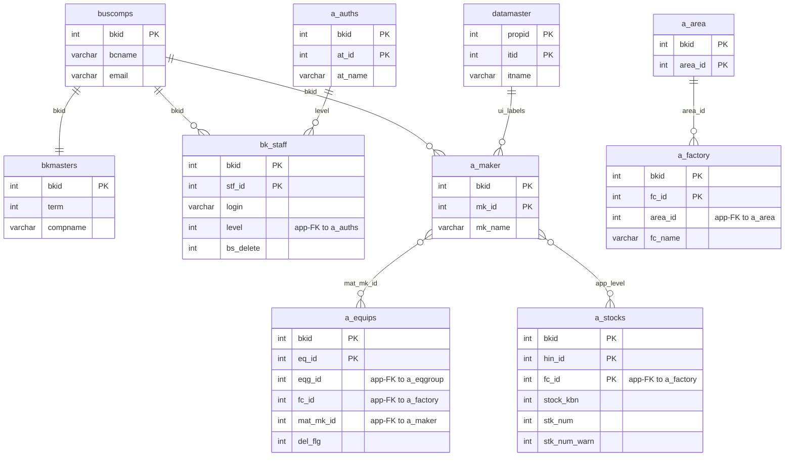

---
aliases:
  - /{tenant}/maker.php
tags:
  - en
  - ppes
  - admin
  - maker
  - obsidian
---

# Maker master

Related notes:

- [[管理 index]]
- [[Equipment page]]
- [[Stock management]]

## Summary

`/{tenant}/maker.php` manages `a_maker`, the shared maker/supplier master.

- equipment forms consume it for maker-like dynamic fields
- stock forms consume it for supplier/maker selection
- it supports list/edit/order/import/export flows

## Mermaid: maker usage

## Tables involved

- `a_maker`
- `a_area`
- `a_factory`
- `datamaster`
- `buscomps`
- `bk_staff`
- `bkmasters`
- `a_auths`

## Mermaid: inferred entity relationships

> **Note**: The database has zero explicit FK constraints. All relationships below are enforced at the application level.

Reasoning:

- `a_maker` is consumed mostly as a shared option source rather than by strong DB foreign keys.
- The relationships to `a_equips` and `a_stocks` are application-level selection relationships.

## Import / Export

> For full architecture details, see [[Import-Export architecture]].

| Direction | Format | Template file | Output filename |
|-----------|--------|--------------|-----------------|
| **Export** | Excel (.xlsx) | `M_MAKER.xlsx` | `maker-{ymdhi}.xlsx` |
| **Import** | Excel → CSV | *(no template — accepts any .xlsx/.csv)* | temp: `{bkid}-maker.csv` |

- Export loads `htdocs/base/M_MAKER.xlsx` (or `htdocs/sys/M_MAKER.xlsx` for the sys module) as a template, populates it with data, and streams it to the browser.
- Import accepts an Excel file, converts it to CSV via `Excel::convToCsv()`, then parses rows with `fgetcsv()` and upserts into `a_maker`.
- Pre-validation: checks for duplicate `mk_id` and `mk_name` before saving.

## Side effects

- sort-order updates
- import temp CSV generation

## Important behavior notes

- save/delete/detail lookups key primarily on `mk_id`
- stock persistence uses maker values indirectly through packed additional fields
- equipment import utilities also depend on maker name/id mapping

## Code references

- `htdocs/base/maker.php:27-40`
- `htdocs/base/maker.php:42-106`
- `htdocs/base/maker.php:115-206`
- `htdocs/base/maker.php:241-422`

---

## Appendix: table glossary

> Full schema (columns, types, per-column purpose) for every table listed here is in [[Table Glossary]].

### Maker catalog

| Table | Purpose |
| --- | --- |
| **[[Table Glossary#a_maker\|a_maker]]** | Maker / supplier master. One row per maker per tenant. Consumed as a shared option source by equipment forms (`mat_mk_id` dropdown) and stock forms (supplier selection). Keyed by `mk_id`; supports sort-order display via `disporder`. |

### Location / org hierarchy

| Table | Purpose |
| --- | --- |
| **[[Table Glossary#a_area\|a_area]]** | Area master. Top-level geographic grouping above factory. Used in the page UI for the area filter dropdown. |
| **[[Table Glossary#a_factory\|a_factory]]** | Factory master. Top-level location grouping. Used in the page UI for the factory filter dropdown and for scoping maker usage by location. |

### UI label support

| Table | Purpose |
| --- | --- |
| **[[Table Glossary#datamaster\|datamaster]]** | Generic dropdown value master. Stores named item lists keyed by `propid` with labels in four languages. Used on `maker.php` for column header and label resolution. |

### Auth / session context

| Table | Purpose |
| --- | --- |
| **[[Table Glossary#buscomps\|buscomps]]** | Tenant registry (`zaikodb`). Read during login to identify the tenant company and check feature flags. |
| **[[Table Glossary#bk_staff\|bk_staff]]** | Tenant staff accounts. Checked by `openUser()` to authenticate the session cookie and resolve `bkid` + `stf_id`. |
| **[[Table Glossary#bkmasters\|bkmasters]]** | Tenant configuration. One row per `bkid`; stores company name, working-hour settings, display preferences, and other tenant-level config used across all pages. |
| **[[Table Glossary#a_auths\|a_auths]]** | Feature permission groups. `setAuth($db, $request, $authId)` reads this to determine what the current user can view or edit on the page. |
