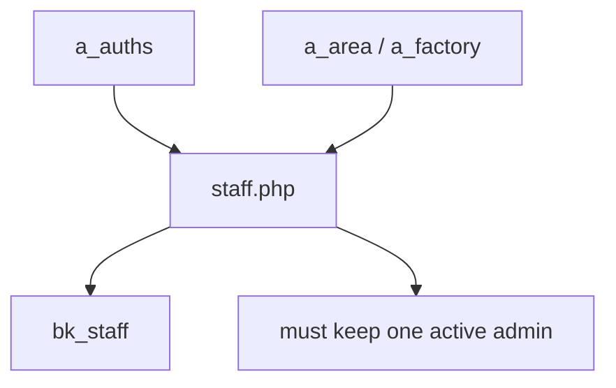
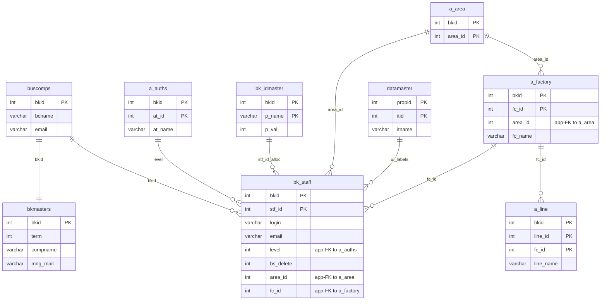

---
aliases:
  - /{tenant}/staff.php
tags:
  - en
  - ppes
  - admin
  - staff
  - obsidian
---

# Staff management

Related notes:

- [[管理 index]]
- [[Authorization master]]
- [[Factory and location master]]

## Summary

`/{tenant}/staff.php` is the user-management controller for `bk_staff`.

- it uses `a_auths` for assignable permission levels
- it uses area/factory masters for organization scoping
- it supports CSV/Excel import
- it enforces the rule that at least one active admin must remain

## Mermaid: staff data flow

## Tables involved

- `bk_staff`
- `bk_idmaster`
- `a_auths`
- `a_area`
- `a_factory`
- `a_line`
- `datamaster`
- `buscomps`
- `bkmasters`

## Mermaid: inferred entity relationships

> **Note**: The database has zero explicit FK constraints. All relationships below are enforced at the application level.

Reasoning:

- `bk_staff` is tenant-scoped and gets permission meaning from `a_auths`.
- Location masters are not strict foreign-key owners in all cases, but the page uses them as organizational scope for staff rows.
- `bk_idmaster` is the application-level serial allocator for new `stf_id` values.

## Import / Export

> For full architecture details, see [[Import-Export architecture]].

| Direction | Format | Template file | Output filename |
|-----------|--------|--------------|-----------------|
| **Export** | CSV | *(no template)* | `staff-{ymdhi}.csv` |
| **Import** | Excel → CSV | *(no template — accepts any .xlsx/.csv)* | temp: `{bkid}-staff.csv` |

- Export streams CSV directly to the browser via `printdownLoadHeader()` — no Excel template is used.
- Import accepts an Excel file, converts it to CSV via `Excel::convToCsv()`, then parses rows with `fgetcsv()` and upserts into `bk_staff`.
- Pre-validation: checks for duplicate email, ensures at least one admin remains.

## Side effects

- login/access redirects
- upload temp CSV generation
- soft-delete style updates through `bs_delete`

## Important behavior notes

- delete is not a hard delete; it is persisted as `bs_delete=1`
- new `stf_id` values come from `bk_idmaster`
- this page depends on `a_auths` and location masters being maintained correctly

## Code references

- `htdocs/base/staff.php:28-45`
- `htdocs/base/staff.php:47-110`
- `htdocs/base/staff.php:123-205`
- `htdocs/base/staff.php:337-550`

---

## Appendix: table glossary

> Full schema (columns, types, per-column purpose) for every table listed here is in [[Table Glossary]].

### Staff accounts

| Table | Purpose |
| --- | --- |
| **[[Table Glossary#bk_staff\|bk_staff]]** | Tenant staff accounts. The primary table owned by this page. One row per user per tenant. Stores login credentials, email, permission level (`level` → app-FK to `a_auths`), area/factory assignment, and soft-delete flag (`bs_delete`). Import/export and manual edit all target this table. |

### ID allocation

| Table | Purpose |
| --- | --- |
| **[[Table Glossary#bk_idmaster\|bk_idmaster]]** | Application-level serial allocator. Stores the next available `stf_id` value per tenant. Incremented when a new staff record is created. |

### Permission lookup

| Table | Purpose |
| --- | --- |
| **[[Table Glossary#a_auths\|a_auths]]** | Feature permission groups. Used on the staff form as a dropdown for assignable permission levels. `bk_staff.level` resolves against `a_auths.at_id` at the application layer. |

### Location / org hierarchy

| Table | Purpose |
| --- | --- |
| **[[Table Glossary#a_area\|a_area]]** | Area master. Top-level geographic grouping. Used in the staff form for area assignment dropdown. |
| **[[Table Glossary#a_factory\|a_factory]]** | Factory master. Top-level location grouping. Used in the staff form for factory assignment dropdown. |
| **[[Table Glossary#a_line\|a_line]]** | Line master. Sub-location within a factory. Used when displaying staff assignments in context. |

### UI label support

| Table | Purpose |
| --- | --- |
| **[[Table Glossary#datamaster\|datamaster]]** | Generic dropdown value master. Stores named item lists keyed by `propid` with labels in four languages. Used for column header and label resolution on the staff form. |

### Auth / session context

| Table | Purpose |
| --- | --- |
| **[[Table Glossary#buscomps\|buscomps]]** | Tenant registry (`zaikodb`). Read during login to identify the tenant company and check feature flags. |
| **[[Table Glossary#bkmasters\|bkmasters]]** | Tenant configuration. One row per `bkid`; stores company name, working-hour settings, display preferences, and other tenant-level config used across all pages. |
