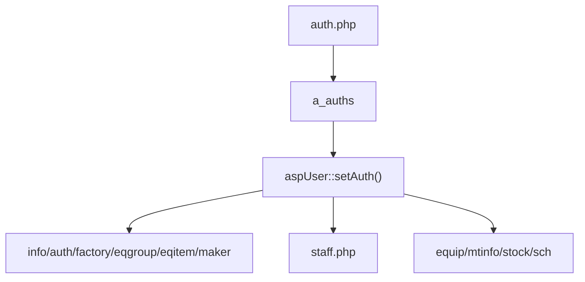
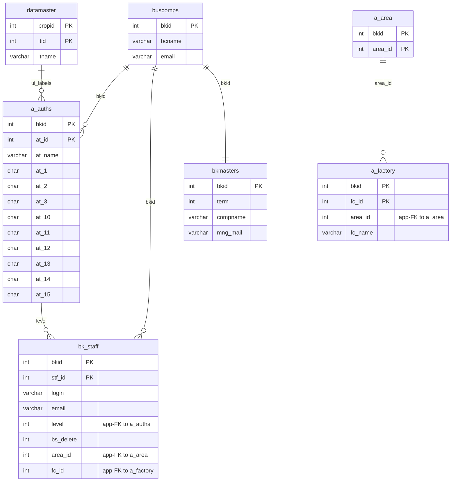

---
aliases:
  - /{tenant}/auth.php
tags:
  - en
  - admin
  - auth
---

# Authorization master

Related notes:

- [[管理 index]]
- [[Staff management]]

## Summary

`/{tenant}/auth.php` manages the permission master in `a_auths`.

- real active write path is the upload/import flow
- list and download are active
- manual edit/save logic appears stale or partially broken
- downstream pages consume these auth flags via `aspUser::setAuth()`

## Mermaid: permission flow

## Tables involved

- `a_auths`
- `datamaster`
- `a_area`
- `a_factory`
- `buscomps`
- `bk_staff`
- `bkmasters`

## Mermaid: inferred entity relationships

> **Note**: The database has zero explicit FK constraints. All relationships below are enforced at the application level.

Reasoning:

- `a_auths` is effectively the permission catalog per tenant.
- `bk_staff.level` is resolved against `a_auths` at the application layer.
- `a_area` and `a_factory` are helper lookups used in the page UI, not direct children of `a_auths` in the DB model.

Upload/save-order oddities:

- upload writes `a_auths`
- save-order path appears to update `a_maker`, likely stale copy-paste logic

## Side effects

- Excel import/export
- auth redirects
- import temp CSV generation
- important downstream effect: permission changes alter access across many PPES pages

## Important behavior notes

- `staff.php` uses `a_auths` to resolve assignable levels
- `setAuth()` interprets `at_1`, `at_2`, `at_3`, `at_10` ... `at_14`
- manual edit path should be treated with caution because the controller/template look inconsistent

## Code references

- `htdocs/base/auth.php:25-40`
- `htdocs/base/auth.php:43-83`
- `htdocs/base/auth.php:93-212`
- `htdocs/base/auth.php:305-442`

---

## Appendix: table glossary

> Full schema (columns, types, per-column purpose) for every table listed here is in [[Table Glossary]].

### Permission catalog

| Table | Purpose |
| --- | --- |
| **[[Table Glossary#a_auths\|a_auths]]** | Feature permission groups. One row per permission group per tenant. `aspUser->setAuth()` reads this to determine what the current user can view or edit. Each `at_N` flag maps to a specific feature. |

### Location / org hierarchy

| Table | Purpose |
| --- | --- |
| **[[Table Glossary#a_area\|a_area]]** | Area master. Top-level geographic grouping above factory. Used in the page UI as a helper lookup — not a direct structural parent of `a_auths` in the DB model. |
| **[[Table Glossary#a_factory\|a_factory]]** | Factory master. Top-level location grouping. Used in the page UI for factory-scoped staff assignment lookups. |

### Calendar display support

| Table | Purpose |
| --- | --- |
| **[[Table Glossary#datamaster\|datamaster]]** | Generic dropdown value master. Stores named item lists keyed by `propid` with labels in four languages. Used on `auth.php` for permission-group label resolution. |

### Auth / session context

| Table | Purpose |
| --- | --- |
| **[[Table Glossary#buscomps\|buscomps]]** | Tenant registry (`zaikodb`). Read during login to identify the tenant company and check feature flags. |
| **[[Table Glossary#bk_staff\|bk_staff]]** | Tenant staff accounts. Checked by `openUser()` to authenticate the session cookie and resolve `bkid` + `stf_id`. |
| **[[Table Glossary#bkmasters\|bkmasters]]** | Tenant configuration. One row per `bkid`; stores company name, working-hour settings, display preferences, and other tenant-level config used across all pages. |
