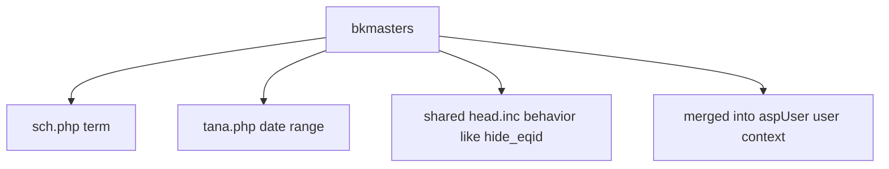
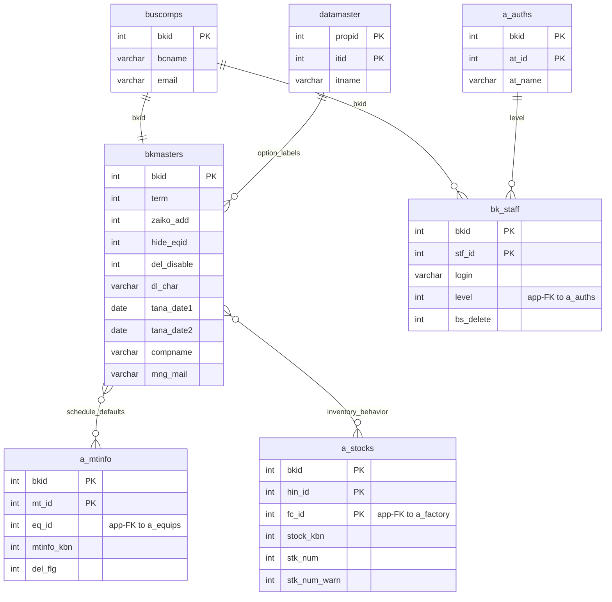

---
aliases:
  - /{tenant}/config.php
tags:
  - en
  - ppes
  - admin
  - config
  - obsidian
---

# Configuration page

Related notes:

- [[管理 index]]
- [[Schedule calendar]]

## Summary

`/{tenant}/config.php` edits shared tenant configuration in `bkmasters`.

- it is mostly a single-record edit/view page
- it exposes configuration values consumed by schedule, inventory, and shared template behavior
- it has no list page in practice; it acts like a configuration form

## Mermaid: config consumers

## Tables involved

- `bkmasters`
- `buscomps`
- `bk_staff`
- `a_auths`
- `datamaster`

## Mermaid: inferred entity relationships

> **Note**: The database has zero explicit FK constraints. All relationships below are enforced at the application level.

Reasoning:

- `bkmasters` is a shared tenant configuration row merged into user/application context.
- Its relationships to maintenance and stock are application-level behavior links, not direct foreign keys.

## Side effects

- login/access redirects
- updates shared tenant behavior seen by other pages
- no file handling, no mail sending, no background jobs in this controller

## Important behavior notes

- `aspUser::open()` merges `bkmasters` into the in-memory user context, so many pages can consume these values indirectly
- confirmed consumers include schedule term defaults, inventory date windows, and shared CSS/display flags

## Code references

- `htdocs/base/config.php:25-64`
- `htdocs/base/config.php:85-150`
- `htdocs/base/sch.php:38-44`
