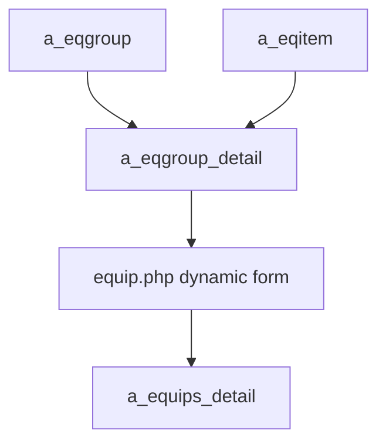
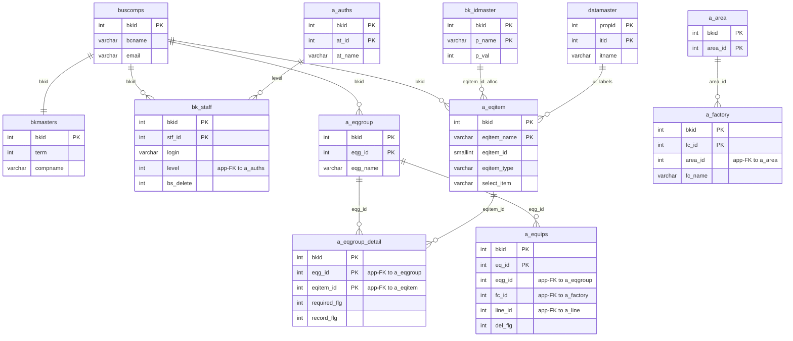

---
aliases:
  - /{tenant}/eqgroup.php
tags:
  - en
  - ppes
  - admin
  - eqgroup
  - obsidian
---

# Equipment group master

Related notes:

- [[管理 index]]
- [[Equipment item master]]
- [[Equipment page]]

## Summary

`/{tenant}/eqgroup.php` is more than a group list page.

- it maintains `a_eqgroup`
- its upload flow also maintains `a_eqitem`
- and it owns the group-to-item mapping in `a_eqgroup_detail`

This page effectively shapes which fields appear on the equipment form.

## Mermaid: dynamic equipment model

## Tables involved

- `a_eqgroup`
- `a_eqgroup_detail`
- `a_eqitem`
- `bk_idmaster`
- `a_area`
- `a_factory`
- `datamaster`
- `buscomps`
- `bk_staff`
- `bkmasters`
- `a_auths`

## Mermaid: inferred entity relationships

> **Note**: The database has zero explicit FK constraints. All relationships below are enforced at the application level.

Reasoning:

- `a_eqgroup_detail` is the application-level junction between groups and items.
- `a_eqgroup` shapes the dynamic equipment form because `equip.php` resolves fields through `a_eqgroup_detail`.

## Side effects

- Excel import/export
- item/group mapping regeneration during upload
- upload can advance `bk_idmaster` for `a_eqitem`

## Important behavior notes

- `eqitem.php` edits item definitions, but group membership is effectively owned here through upload logic
- changes here directly affect `equip.php` field composition and required/history flags

## Code references

- `htdocs/base/eqgroup.php:28-44`
- `htdocs/base/eqgroup.php:46-86`
- `htdocs/base/eqgroup.php:95-339`
- `htdocs/base/eqgroup.php:352-655`
