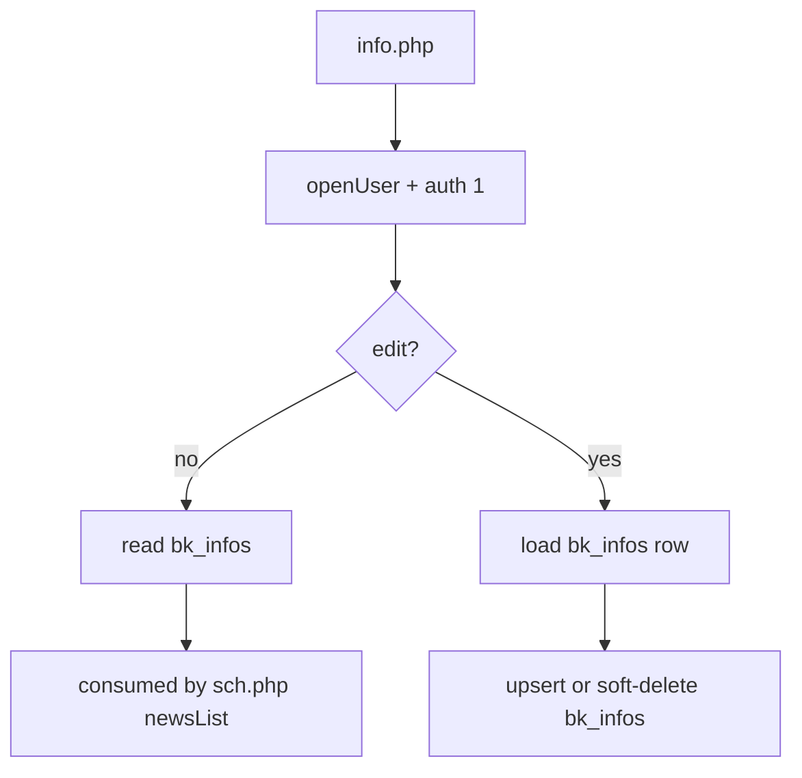
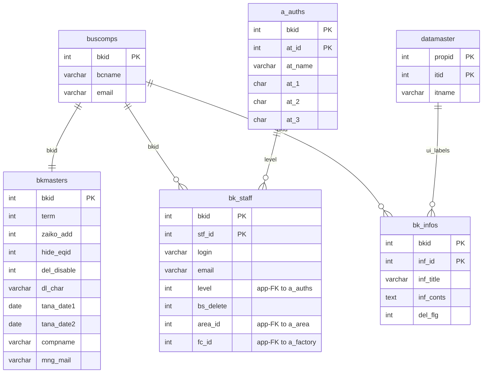

---
aliases:
  - /{tenant}/info.php
tags:
  - en
  - ppes
  - admin
  - info
  - obsidian
---

# Info announcements

Related notes:

- [[管理 index]]
- [[Schedule calendar]]

## Summary

`/{tenant}/info.php` is a simple CRUD page for tenant announcements.

- main business table: `bk_infos`
- list, edit, confirm, save, and soft-delete flow
- content is later surfaced as news/information in schedule-style pages

## Mermaid: flow

## Tables involved

- `bk_infos`
- `datamaster`
- `buscomps`
- `bk_staff`
- `bkmasters`
- `a_auths`

## Mermaid: inferred entity relationships

> **Note**: The database has zero explicit FK constraints. All relationships below are enforced at the application level.

Reasoning:

- `bk_infos` is scoped by `bkid`, so it belongs to the tenant/company represented by `buscomps`.
- `bk_staff` and `a_auths` are not content owners of `bk_infos`, but they control who can read/edit it.
- `datamaster` is only a helper/master-data source at the UI/application layer.

## Side effects

- login/access redirects
- confirm/read-only UI states
- no file handling or mail sending in this controller

## Key behaviors

- list mode filters `bk_infos.del_flg = 0`
- delete path is soft-delete oriented
- this page is the editor for announcement data consumed by `sch.php` and `cale.php`

## Code references

- `htdocs/base/info.php:25-61`
- `htdocs/base/info.php:71-102`
- `htdocs/base/info.php:104-179`
