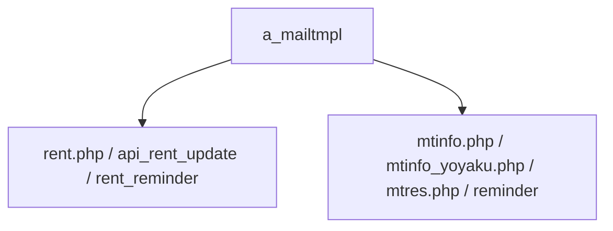
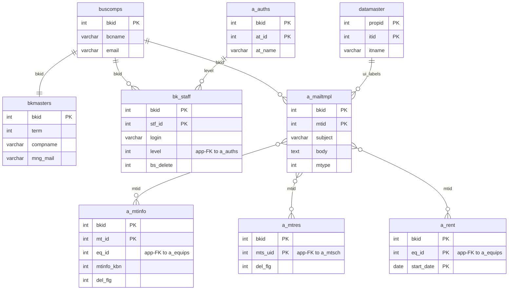

---
aliases:
  - /{tenant}/mailtmpl.php
tags:
  - en
  - ppes
  - admin
  - mail
  - obsidian
---

# Mail template master

Related notes:

- [[管理 index]]
- [[Maintenance reservation page]]
- [[Maintenance work page]]

## Summary

`/{tenant}/mailtmpl.php` edits rows in `a_mailtmpl`.

- it does not send mail directly
- it controls the subject/body templates later used by maintenance and rent flows
- it is mostly a simple list/edit/save page

## Mermaid: mail template consumers

## Tables involved

- `a_mailtmpl`
- `datamaster`
- `buscomps`
- `bk_staff`
- `bkmasters`
- `a_auths`

## Mermaid: inferred entity relationships

> **Note**: The database has zero explicit FK constraints. All relationships below are enforced at the application level.

Reasoning:

- `a_mailtmpl` does not own maintenance or rent rows, but those flows load templates by `mtid` at the application layer.
- The maintenance/rent links are therefore inferred usage relationships, not strict relational dependencies.

## Side effects

- login/access redirects
- no mail sending from this controller itself
- downstream effect is significant because changed templates alter user-facing mail content

## Important behavior notes

- maintenance flows use template IDs like `9` and `10`
- rent flows use other template IDs such as the return reminder
- available tags are defined in code rather than in a DB table

## Code references

- `htdocs/base/mailtmpl.php:26-68`
- `htdocs/base/mailtmpl.php:72-176`
- `lib/ppes.php:248-343`
