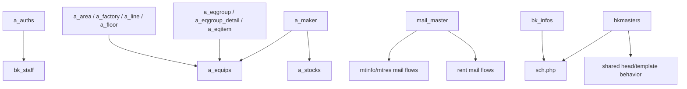

---
aliases:
  - admin menu index
tags:
  - en
  - ppes
  - admin
  - menu
  - obsidian
---

# 管理 index

Menu group for `管理` and `master_tab.inc`. These are **per-tenant** admin pages accessible after logging in as a tenant admin.

> **Note:** There is also a separate super-admin panel at `/padmin/` that manages tenant provisioning and the `zaikodb` database. That layer is documented in [[Multi-tenancy architecture]] and is not part of this menu group.

## Notes

- [[Info announcements]]
- [[Authorization master]]
- [[Staff management]]
- [[Factory and location master]]
- [[Equipment group master]]
- [[Equipment item master]]
- [[Maker master]]
- [[Mail template master]]
- [[Configuration page]]

## Master relationships

