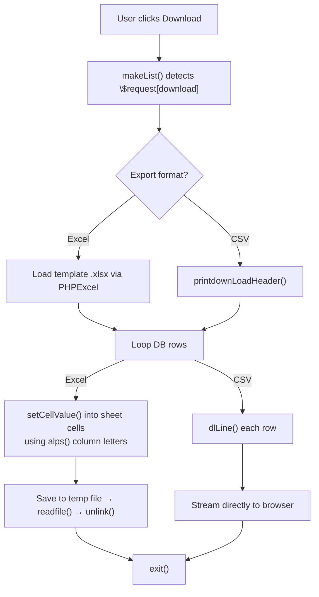
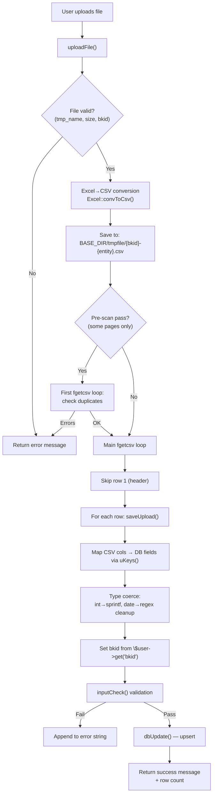

---
aliases:
  - import export pattern
  - upload download pattern
tags:
  - en
  - ppes
  - architecture
  - import
  - export
  - obsidian
---

# Import-Export architecture

Related notes:

- [[管理 index]]
- [[Multi-tenancy architecture]]
- [[Maker master]]
- [[Staff management]]
- [[Factory and location master]]
- [[Equipment group master]]
- [[Authorization master]]

## Overview

Nearly every master-management and data-listing page in the system shares a **single copy-pasted architecture** for importing data from Excel/CSV files and exporting data to Excel/CSV files. This document describes that shared pattern, catalogs every page that uses it, and notes where individual pages deviate.

There is **no shared base class or library** — each PHP file reimplements the same functions with entity-specific constants. This makes the pattern implicit rather than explicit.

## The shared page skeleton

Every import/export page follows the same `#main` block structure:

```
#main {
  1. Bootstrap ─── require env.php, Browser, TakeDbTest, aspUser, PHPExcel, Excel
  2. Auth ───────── openUser() → gotoLogin() if fail
  3. Permissions ── setAuth($db, $_REQUEST, $authId)
  4. Route by $_REQUEST flags:
     ├── $_REQUEST[upload]   → uploadFile(...)
     ├── $_REQUEST[edit]     → edit flow
     │     ├── inputCheck() → saveData() → makeEdit()
     │     └── template = "*_edit.tmpl"
     ├── $_REQUEST[download] → handled inside makeList()
     └── else               → makeList(...)
  5. Post-route ── if download → exit; if save_order → redirect
  6. Assign ────── request, title, prop
  7. Render ────── printHeader() → dispPage($template)
}
```

## The 6 core functions

Every page with both import and export defines these 6 functions. The table name, column names, and validation rules change — the structure does not.

### Data definition functions

| Function | Purpose | Returns |
|----------|---------|---------|
| `Keys()` | Field schema for the **edit form** (create/update single record) | `array("field" => array(type, min, max, label, flags))` |
| `uKeys()` | Field schema for **upload** — maps CSV column index to DB field | `array("field" => array(type, min, max, label, csv_col_index))` |
| `dlKeys()` | Column headers for **download** — maps DB field to display name | `array("db_field" => "Header label")` |

Example from `maker.php`:

```php
// Keys() — edit form schema
"mk_id"    => array("uid",  1, 16,    "メーカーID", 1),
"mk_name"  => array("char", 1, 64,    "メーカー名", 1),
"disporder"=> array("int",  0, 99999, "表示順",     1),

// uKeys() — upload column mapping (index 0 = first CSV column)
"mk_id"    => array("char", 1, 16,    "メーカーID", 0),  // ← CSV col 0
"mk_name"  => array("char", 1, 64,    "メーカー名", 1),  // ← CSV col 1
"disporder"=> array("int",  0, 999999,"表示順",     2),  // ← CSV col 2

// dlKeys() — download columns
"mk_id"    => "メーカーID",
"mk_name"  => "メーカー名",
"disporder"=> "表示順",
```

### Processing functions

| Function | Purpose | Signature |
|----------|---------|-----------|
| `makeList()` | Builds SQL query, loops rows, either populates `$lists[]` for display **or** writes to Excel/CSV when `$request[download]` is set | `($db, &$browser, &$request, $server, $user)` |
| `uploadFile()` | Validates uploaded file, converts Excel→CSV, loops rows calling `saveUpload()` | `($db, $browser, $request, $file, $user)` |
| `saveUpload()` | Processes one CSV row: maps columns via `uKeys()`, validates via `inputCheck()`, upserts to DB | `($db, $browser, $cols, $user)` |

Supporting functions present in all files:

| Function | Purpose |
|----------|---------|
| `makeEdit()` | Loads one record for the edit form |
| `saveData()` | Saves/deletes one record from the edit form |
| `inputCheck()` | Loops `Keys`/`uKeys`, calls `$browser->checkInput()` on each field |
| `saveOrder()` | Reorders records by current sort (used by drag-to-sort) |

## Export (download) flow



### Excel export details

1. `PHPExcel_IOFactory::createReader('Excel2007')` loads a **template file** (e.g. `M_MAKER.xlsx`)
2. The template contains the header row pre-formatted in row 1
3. Data starts at row 2; styles are duplicated from row 2 for each new row
4. `alps()` returns `['A','B','C',...]` to map `dlKeys()` index to column letters
5. `PHPExcel_IOFactory::createWriter()` saves to `$user->excelPath()` (temp directory)
6. `$browser->printExcelHeader($fileName)` sets response headers
7. `readfile()` streams it, then `unlink()` removes the temp file

### CSV export details

1. `$browser->printdownLoadHeader($fileName)` sets CSV response headers
2. Header row: `join(",", dlKeys())`
3. Each data row: `$browser->dlLine($row, $dlkeys)` outputs comma-separated values

## Import (upload) flow



### Key implementation details

- **File conversion**: All pages accept Excel files. `Excel::convToCsv()` converts `.xlsx`/`.xls` to CSV before parsing with `fgetcsv()`.
- **Temp file path**: `BASE_DIR/tmpfile/{bkid}-{entity}.csv` (e.g. `-maker.csv`, `-staff.csv`)
- **Header skip**: Row 1 is always skipped (`if ($n==1) { $n++; continue; }`)
- **Column mapping**: `uKeys()` array index `[4]` holds the CSV column number
- **Upsert pattern**: `$user->dbUpdate($db, $table, $data, $where)` — inserts if not found, updates if exists
- **Error accumulation**: Errors are collected as `"N行目: error message<br>"` and returned as a single string
- **Timestamp**: Most pages set `$data[uptime] = time()` on each upserted row

## Exception routes


## Complete file inventory

### Pages with BOTH import and export

#### `htdocs/base/` (Equipment/ADS module)

| File | Table(s) | Export | Import template | Auth ID |
|------|----------|--------|----------------|---------|
| `auth.php` | `a_auths` | Excel | `M_PERMIT.xlsx` | 2 |
| `maker.php` | `a_maker` | Excel | `M_MAKER.xlsx` | 2 |
| `staff.php` | `bk_staff` | CSV | — | 3 |
| `factory.php` | `a_factory`, `a_line`, `a_floor`, `a_area` | Excel | `M_FACTORY_LINE.xlsx` | 2 |
| `eqgroup.php` | `a_eqgroup`, `a_eqgroup_detail` | Excel | `M_EQGROUP.xlsx` | 2 |
| `mt_master.php` | `datamaster` | Excel | `download.xlsx` | 2 |
| `tana.php` | `a_tana` + `a_equips`/`a_equips_detail` | CSV | — | 14 |
| `equip.php` | `a_equips`, `a_equips_detail`, etc. | Excel + CSV | `equip.xlsx` | 10 |
| `mtinfo.php` | `a_mtinfo`, `a_mtsch` | CSV | — | 11 |

#### `htdocs/sys/` (System module — mostly clones of base)

| File | Cloned from | Differences |
|------|-------------|-------------|
| `maker.php`, `maker0.php` | `base/maker.php` | Template path `sys/` instead of `ads/` |
| `staff.php`, `staff0.php` | `base/staff.php` | Template path only |
| `factory.php`, `factory0.php`, `factory2.php` | `base/factory.php` | Template path only |
| `auth.php` | `base/auth.php` | Template path only |
| `eqgroup.php` | `base/eqgroup.php` | Template path only |
| `equip.php`, `equip0.php`, `equip2.php` | `base/equip.php` | CSV-only export (no Excel) |
| `ckgroup.php` | *(unique to sys)* | Check-list master; `M_CHECK.xlsx` |
| `master.php` | *(unique to sys)* | Direct CSV import (no convToCsv) |

### Pages with export ONLY

| File | Table(s) | Format |
|------|----------|--------|
| `base/stock.php` / `sys/stock.php` | `a_stocks`, `a_eqstocks` | CSV + Excel (`T_STOCK.xlsx`) |
| `base/mtres_list.php` / `sys/mtres_list.php` | `a_mtinfo`, `a_mtres` | CSV |
| `sys/loginhist.php` | `loginhist`, `bk_staff` | CSV |
| `padmin/words.php` | `datamaster` + `lang.php` | CSV |

## Conformance tiers

Not every page follows the pattern with the same fidelity. Here is how they classify:

### Tier 1 — Exact match (~16 files)

All 6 functions present with identical structure. Only table names, column definitions, and template paths differ. This includes all the standard masters (`maker`, `auth`, `factory`, `eqgroup`, `staff`, `mt_master`) and their `sys/` clones.

### Tier 2 — Same skeleton, minor tweaks (~3 files)

| File | Variation |
|------|-----------|
| `sys/ckgroup.php` | Download runs a **different query** than the list (joins `a_ckitem` + `a_ckgroup_detail`). Upload has a two-pass header parse: rows 1–2 define groups, row 3+ defines items. Extra functions `saveGroup()`, `checkUpload()`. |
| `sys/master.php` | **No `convToCsv`** — reads CSV directly from `$file[tmp_name]`. `saveUpload()` uses `dlKeys()` instead of `uKeys()` for column mapping. `$user` not passed to upload functions. |
| `base/tana.php` | **Two import modes**: `upload=1` → `uploadFile()` for `a_tana`; `upload=2` → `uploadFile_eq()` for `a_equips`. No edit flow — list-only page. |

### Tier 3 — Same skeleton, heavily extended (~4 files)

| File | Variation |
|------|-----------|
| `base/equip.php` | Most complex. Import function is `uploadEqFile()` with two-pass processing (check pass + update pass). Export has two formats (`download=1` → Excel, `download=2` → CSV). Async progress tracking via `donefile`. `dlKeys()` is **dynamic** — built at runtime from `detailKeys()` based on equipment group configuration. |
| `base/mtinfo.php` | Import function is `uploadTeikiFile()` for scheduled maintenance. Save function is `saveTeikiUpload()` which creates recurring schedule entries. Export is standard CSV. |
| `sys/equip*.php` | Clones of `base/equip.php` with CSV-only export. |

## What an abstraction would look like

If this pattern were refactored into a reusable base class, the configuration per entity would be:

```
Per-entity configuration:
  - $tableName         — "a_maker", "bk_staff", etc.
  - $templateFile      — "M_MAKER.xlsx" or null for CSV
  - $entityKey         — "maker", "staff", etc.
  - $authId            — 2, 3, 10, etc.
  - $downloadFormat    — "excel" | "csv" | "both"
  - Keys()             — edit field schema
  - uKeys()            — upload field schema
  - dlKeys()           — download column schema

Overridable hooks:
  - buildWhere()       — per-entity search filters
  - preValidateUpload()— duplicate/admin checks
  - postProcessRow()   — cascade inserts (factory), auto-gen IDs (staff)
```

~80% of the code is identical across all files and could be shared.

## Code references

Key examples showing the pattern:

- Standard pattern: `htdocs/base/maker.php` (414 lines)
- CSV export variant: `htdocs/base/staff.php` (542 lines)
- Multi-table import: `htdocs/base/factory.php` (600 lines)
- Complex outlier: `htdocs/base/equip.php` (~1700 lines)
- Direct CSV import: `htdocs/sys/master.php` (271 lines)
- Two-import-mode: `htdocs/base/tana.php` (712 lines)
- Check-list variant: `htdocs/sys/ckgroup.php` (616 lines)
- Scheduled maintenance import: `htdocs/base/mtinfo.php` (1442 lines)
