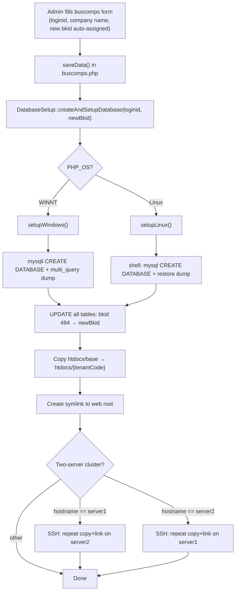
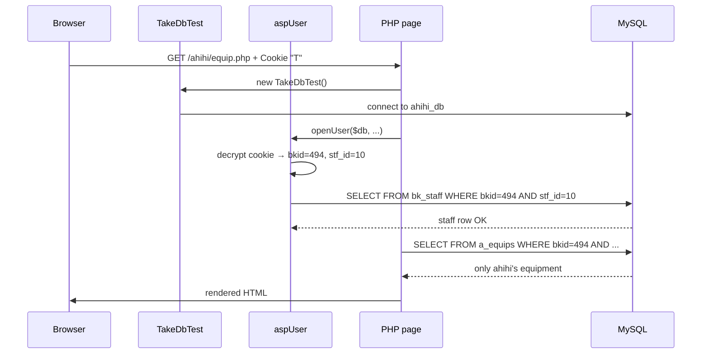

---
aliases:
  - multi-tenancy
  - tenant architecture
  - database routing
tags:
  - en
  - ppes
  - architecture
  - database
  - obsidian
---

# Multi-tenancy architecture

This note documents how the system isolates data and routes requests across multiple business tenants.

## See also

- [[PPES page map]]

---

## Overview

The system uses a **hybrid isolation strategy**:

1. **Database-per-tenant** — each tenant gets its own MySQL database (`{tenantCode}_db`).
2. **Row-level isolation** — every table carries a `bkid` column; all queries filter by it automatically.

These two layers together ensure that no tenant can read or write another tenant's data, even if application logic has a bug that omits a WHERE clause — the database connection itself is already scoped to the correct DB.

---

## Tenant identifiers

| Identifier | Type | Example | Source |
|---|---|---|---|
| `tenantCode` | URL path segment | `ahihi` | First segment of `$_SERVER['REQUEST_URI']` |
| `bkid` | `SMALLINT` in DB | `494` | Stored in cookie; read from `buscomps.bkid` |

`tenantCode` determines which **database** to connect to.
`bkid` is the **row-level key** used inside that database.

Both must be consistent: when a tenant logs in, the cookie stores the `bkid` that matches their entry in `buscomps`.

---

## Database routing (`TakeDbTest`)

`lib/TakeDbTest.php` extends `TakeDbMysql` and automatically selects the tenant DB at construction time:

```
URL path                  → Database
/{tenantCode}/page.php    → {tenantCode}_db
/padmin/page.php          → zaikodb  (super-admin only)
```

```php
$path  = parse_url($_SERVER['REQUEST_URI'], PHP_URL_PATH);
$parts = explode('/', trim($path, '/'));
$tenantCode = $parts[0] ?? '';               // e.g. "ahihi"
$dbName = ($tenantCode == "padmin")
    ? "zaikodb"
    : $tenantCode . "_db";                   // e.g. "ahihi_db"
```

A secondary method `TakeDbTestWithDbName($dbName)` allows the admin panel to connect to an arbitrary tenant DB by name. This is used by `DatabaseSetup::updateTableAdmin()` during provisioning and bulk admin updates.

**Always use `TakeDbTest`, never instantiate `TakeDbMysql` directly.**

---

## Cookie and `bkid` propagation

`aspUser` reads and decrypts the cookie named `T` on every request:

```
Cookie "T" (base64, AES-encrypted):
  {bkid} \002 {stf_id} \002 {crypted_pw} \002 {nicknm} \002 {emp_flag}
```

After `openUser()` succeeds, `$this->_bkid` is set and injected into `$_REQUEST['bkid']`.
Every subsequent business-logic helper — `$user->Areas()`, `$user->Staffs()`, `$user->Equips()`, etc. — automatically appends `WHERE bkid = $this->_bkid` to its query.

> **Note:** The `/padmin/` module uses a separate `Staff` class (not `aspUser`) with its own session/cookie logic. Admin staff accounts live in `zaikodb.staff` (not `bk_staff`).

---

## Tenant databases

### Per-tenant schema (`{tenantCode}_db`)

All tables use `bkid` as the leading component of the primary key (composite key).

| Table group | Tables |
|---|---|
| Equipment master | `a_equips`, `a_equips_detail`, `a_eqhist` |
| Maintenance | `a_mtinfo`, `a_mtsch`, `a_mtres`, `a_mtbf` |
| Inspection (check) | `a_ckgroup`, `a_ckgroup_detail`, `a_ckitem` |
| Masters / lookup | `a_area`, `a_factory`, `a_line`, `a_floor`, `a_eqgroup`, `a_eqgroup_detail`, `a_eqitem`, `a_maker`, `a_eqpoint` |
| Stock | `a_stocks`, `a_eqstocks`, `a_tana` |
| Rental | `a_rent` |
| Mail | `a_mailtmpl`, `mail_master` |
| Tenant config | `bkmasters`, `bk_infos`, `bk_idmaster`, `calendars` |
| Auth / users | `bk_staff`, `a_auths`, `loginhist` |
| Files | `a_files` |
| Projects | `p_proj`, `p_purchase`, `p_puritem`, `p_ringi`, `p_rinitem`, `p_sisan`, `p_sisancode`, `p_mente`, `p_item` |
| Other | `ads_master`, `myview` |

The template schema is kept in `docker/base_db.dump` (seeded with `bkid = 494`). Provisioning replaces every `494` with the new tenant's real `bkid`.

### Super-admin database (`zaikodb`)

Used exclusively by the `/padmin/` module.

| Table | Purpose |
|---|---|
| `buscomps` | Tenant registry — one row per tenant (`bkid`, `loginid`, company name, status, feature flags) |
| `staff` | Admin-panel staff accounts (separate from per-tenant `bk_staff`) |
| `tagents` | Travel agents managed by padmin |
| `infos` | System-wide announcements published via `padmin/info.php` |
| `datamaster` | Multilingual label master browsable via `padmin/words.php` |

---

## Tenant provisioning (`padmin/create_db_and_setup.php`)

Provisioning is triggered from `padmin/buscomps.php → saveData()` when creating a new tenant (`bkid` is empty).

The `DatabaseSetup` class handles all steps and branches on `PHP_OS`:



### Production paths (Linux)

| Asset | Path |
|---|---|
| MySQL config | `/home/www/db_backup/.my.cnf` |
| Base DB dump | `/home/www/db_backup/base_dump/base_db.dump` |
| Base source code | `/home/www/tbtech/htdocs/base` |
| New tenant code | `/home/www/tbtech/htdocs/{tenantCode}` |
| Web-root symlink | `/var/www/html/{tenantCode}` |

### Windows paths (local dev)

| Asset | Path |
|---|---|
| Source copy command | `robocopy {src} /home/www/tbtech/htdocs/{tenantCode} /E /COPYALL /SL` |
| Web-root symlink | `mklink /D C:\Apache24\htdocs\{tenantCode} C:\home\www\tbtech\htdocs\{tenantCode}` |

### Two-server cluster (production)

Server hostnames: `hozen-tak-honban-1` (IP `10.0.10.98`) and `hozen-tak-honban-2` (IP `10.0.13.232`).
Whichever server handles the request SSHs to the other and repeats the `cp` + `ln` commands using the EC2 key at `/home/www/.ssh/TBTECH-WEB.pem`.

### Tables updated during provisioning (all tables in `updateTableList`)

`ads_master`, `a_area`, `a_auths`, `a_eqgroup`, `a_eqgroup_detail`, `a_eqhist`, `a_eqitem`, `a_eqpoint`, `a_eqstocks`, `a_equips`, `a_equips_detail`, `a_factory`, `a_files`, `a_floor`, `a_line`, `a_maker`, `a_mtinfo`, `a_mtres`, `a_mtsch`, `a_stocks`, `bkmasters`, `bk_idmaster`, `bk_infos`, `bk_staff`, `buscomps`, `calendars`, `loginhist`, `mail_master`, `myview`, `p_item`, `p_mente`, `p_proj`, `p_purchase`, `p_puritem`, `p_ringi`, `p_rinitem`, `p_sisan`, `p_sisancode`, `syain_master`

> Tables NOT in the provisioning list (because they are seeded/left blank or managed separately): `a_ckgroup`, `a_ckgroup_detail`, `a_ckitem`, `a_mailtmpl`, `a_mtbf`, `a_rent`, `a_tana`, `datamaster`.

### Post-provisioning records

After DB+filesystem setup, `buscomps.php → saveData()` also inserts:
- A row in `buscomps` (tenant registry)
- A row in `bkmasters` (tenant config)
- A row in `bk_idmaster` (ID counter seed)
- A row in `bk_staff` with `stf_id=1`, `level=1`, `name="管理者"` (initial tenant admin)

`updateTableAdmin()` in `DatabaseSetup` connects to the tenant DB via `TakeDbTestWithDbName()` and mirrors these writes into the tenant's own DB.

---

## File storage isolation

Uploaded files are stored under `DATA_DIR/{bkid}/`:

```
data/
├── 494/          ← tenant bkid=494
│   ├── equips/
│   ├── mtres/
│   └── ...
├── 500/          ← another tenant
└── ...
```

`aspUser->getFilePath()` always constructs paths using `$this->_bkid`, so files are never cross-accessible at the filesystem level.

---

## End-to-end request flow



---

## Isolation guarantees

| Layer | Mechanism | Breaks if |
|---|---|---|
| DB connection | `TakeDbTest` routes to `{tenant}_db` | Attacker controls URL path segment |
| Row filter | Every query: `WHERE bkid = $this->_bkid` | Query omits bkid filter |
| Cookie auth | AES-encrypted, validated against `bk_staff` | Cookie is forged (encryption broken) |
| File path | `DATA_DIR/{bkid}/...` | Application constructs path with wrong bkid |
| Admin panel | Separate `zaikodb` DB, unreachable from tenant URLs | Misconfiguration of web root |
