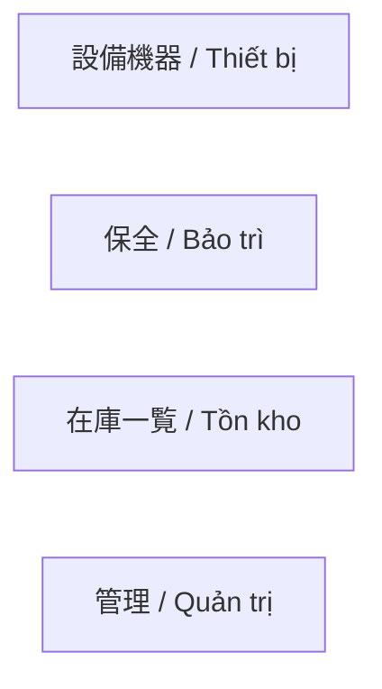
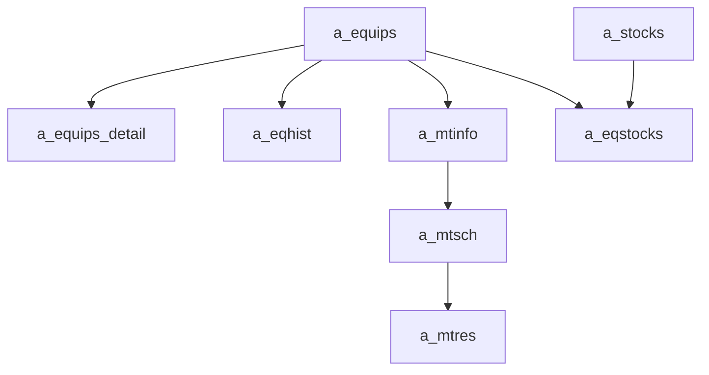

---
aliases:
  - PPES map VI
  - Vietnamese PPES map
tags:
  - ppes
  - vi
  - overview
  - obsidian
---

# Bản đồ trang PPES

Note tổng quan tiếng Việt cho wiki PPES.

## Chỉ mục theo menu

- [[Thiết bị index]]
- [[Bảo trì index]]
- [[Tồn kho index (VI)]]
- [[Quản trị index]]
- [[Từ vựng chuyên ngành JA-VI]]

## Sơ đồ menu

> **Super-admin layer:** Module `/padmin/` là panel quản trị cấp trên, dùng database riêng (`zaikodb`) và **không nằm trong** menu trên. Xem [[Kiến trúc đa tenant]] để biết toàn cảnh.

## Các trang `/padmin/` (super-admin)

| File | Tiêu đề | Mô tả |
|---|---|---|
| `index.php` | 管理画面 | Trang chủ dashboard |
| `buscomps.php` | 契約会社管理 | Quản lý tenant — tạo/sửa/xem. Tạo mới kích hoạt `DatabaseSetup::createAndSetupDatabase()`. |
| `staff.php` | スタッフ管理 | Tài khoản staff admin panel (`zaikodb.staff`) |
| `tagents.php` | 旅行代理店管理 | Travel agents (`zaikodb.tagents`) |
| `info.php` | お知らせ | Thông báo hệ thống toàn cục (`zaikodb.infos`) |
| `words.php` | 多言語対応 | Xem/xuất danh sách nhãn đa ngôn ngữ từ `lib/lang.php` và `zaikodb.datamaster` |
| `login.php` | — | Trang đăng nhập padmin |
| `create_db_and_setup.php` | — | Class `DatabaseSetup` — được include bởi `buscomps.php` |

## Sơ đồ dữ liệu lõi

## Cách đọc bộ note VI

- Dùng bản VI để nắm ý nghĩa nghiệp vụ nhanh.
- Dùng note tiếng Anh gốc khi cần chi tiết controller, code reference, hoặc rủi ro kỹ thuật sâu hơn.
- Thuật ngữ chuyên ngành giữ dạng `JA-VI` theo [[Từ vựng chuyên ngành JA-VI]].

## Link sang bản chi tiết gốc

- [[PPES page map]]
