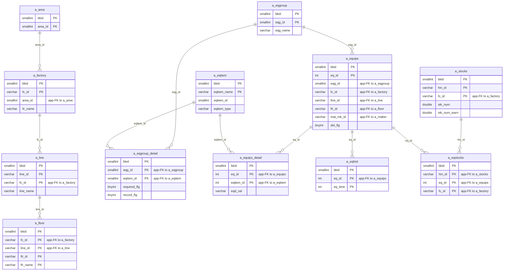
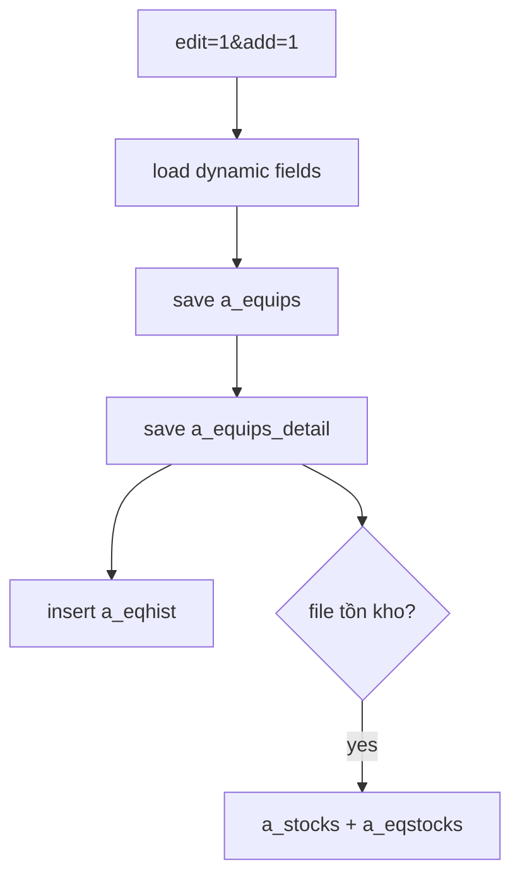

---
aliases:
  - /{tenant}/equip.php?edit=1&add=1
tags:
  - ppes
  - vi
  - equip
  - add
---

# Thêm thiết bị

## Thuật ngữ chính

- `追加登録 (đăng ký thêm mới)`
- `設備名称 (tên thiết bị)`
- `機番 (mã máy)`

## Tóm tắt

Đây là nhánh add form của `equip.php`.

- load master data và field động theo `a_eqgroup_detail + a_eqitem`
- khi save sẽ ghi `a_equips + a_equips_detail + a_eqhist`
- nếu có file tồn kho thì còn ghi `a_stocks + a_eqstocks`

## Bảng chính

- load form: `a_eqgroup`, `a_factory`, `a_area`, `a_line`, `a_floor`, `a_maker`, `a_eqgroup_detail`, `a_eqitem`, `datamaster`
- save: `a_equips`, `a_equips_detail`, `a_eqhist`
- optional stock import: `a_stocks`, `a_eqstocks`

## Mermaid ER

> **Ghi chú**: Database không có FK constraint. Tất cả quan hệ đều ở tầng application.

## Luồng chính

## Xem thêm

- [[Edit-add equipment]]
- [[Trang thiết bị]]

---

## Phụ lục: giải thích tên bảng

> Schema đầy đủ (cột, kiểu dữ liệu, mục đích từng cột) cho tất cả bảng liệt kê ở đây xem tại [[Bảng từ điển]].

### Domain thiết bị (ghi khi save)

| Bảng | Vai trò |
| --- | --- |
| **[[Bảng từ điển#a_equips\|a_equips]]** | Master thiết bị. Kiểm tra trùng lặp khi save (mã máy duy nhất), rồi insert với serial `eq_id` mới. Lưu các field header: tên, nhóm, vị trí factory/line/floor, maker, và giá trị field tùy chỉnh. |
| **[[Bảng từ điển#a_equips_detail\|a_equips_detail]]** | Giá trị hạng mục theo thiết bị. Ghi sau header thiết bị — mỗi row cho mỗi field động (`eq_id` + `eqitem_id` → `eqd_val`). |
| **[[Bảng từ điển#a_eqhist\|a_eqhist]]** | Lịch sử thay đổi thiết bị. Insert khi save để capture snapshot field-level cho audit trail. |

### Định nghĩa field động (đọc khi load form)

| Bảng | Vai trò |
| --- | --- |
| **[[Bảng từ điển#a_eqgroup\|a_eqgroup]]** | Master nhóm thiết bị. Populate dropdown nhóm trên form thêm. |
| **[[Bảng từ điển#a_eqgroup_detail\|a_eqgroup_detail]]** | Bảng nối nhóm → hạng mục. Quyết định field động nào xuất hiện cho nhóm thiết bị đã chọn. |
| **[[Bảng từ điển#a_eqitem\|a_eqitem]]** | Định nghĩa hạng mục thiết bị. Lưu tên field, kiểu, và giá trị dropdown cho mỗi field động render trên form. |

### Phân cấp địa điểm / tổ chức (đọc khi load form)

| Bảng | Vai trò |
| --- | --- |
| **[[Bảng từ điển#a_area\|a_area]]** | Master khu vực. Join khi load factory cho dropdown. |
| **[[Bảng từ điển#a_factory\|a_factory]]** | Master nhà máy. Populate dropdown nhà máy trên form thêm. |
| **[[Bảng từ điển#a_line\|a_line]]** | Master dây chuyền. Populate dropdown dây chuyền, lọc theo nhà máy đã chọn. |
| **[[Bảng từ điển#a_floor\|a_floor]]** | Master tầng / phòng. Populate dropdown tầng và convert `flr_name` sang `flr_id` khi save. |

### Upload tồn kho tùy chọn

| Bảng | Vai trò |
| --- | --- |
| **[[Bảng từ điển#a_stocks\|a_stocks]]** | Master vật tư tồn kho. Chỉ ghi khi form thêm có đính kèm file danh sách tồn kho. |
| **[[Bảng từ điển#a_eqstocks\|a_eqstocks]]** | Liên kết thiết bị → tồn kho. Ghi cùng `a_stocks` để link vật tư tồn kho với thiết bị mới. |

### Tra cứu hỗ trợ

| Bảng | Vai trò |
| --- | --- |
| **[[Bảng từ điển#a_maker\|a_maker]]** | Master hãng / nhà cung cấp. Populate dropdown maker trên form thêm. |
| **[[Bảng từ điển#datamaster\|datamaster]]** | Master giá trị dropdown tổng quát. Dùng cho resolve tiêu đề cột và nhãn trên form. |

### Auth / session context

| Bảng | Vai trò |
| --- | --- |
| **[[Bảng từ điển#buscomps\|buscomps]]** | Registry tenant (`zaikodb`). Được đọc khi đăng nhập để xác định công ty tenant và kiểm tra feature flag. |
| **[[Bảng từ điển#bk_staff\|bk_staff]]** | Tài khoản nhân viên theo tenant. Được `openUser()` kiểm tra để xác thực session cookie và resolve `bkid` + `stf_id`. |
| **[[Bảng từ điển#bkmasters\|bkmasters]]** | Cấu hình tenant. Mỗi row ứng với một `bkid`; lưu tên công ty, cài đặt giờ làm việc, tùy chọn hiển thị, và config cấp tenant khác. |
| **[[Bảng từ điển#a_auths\|a_auths]]** | Nhóm quyền tính năng. `setMultiAuth()` đọc bảng này để xác định người dùng hiện tại có thể thêm thiết bị hay không. |
