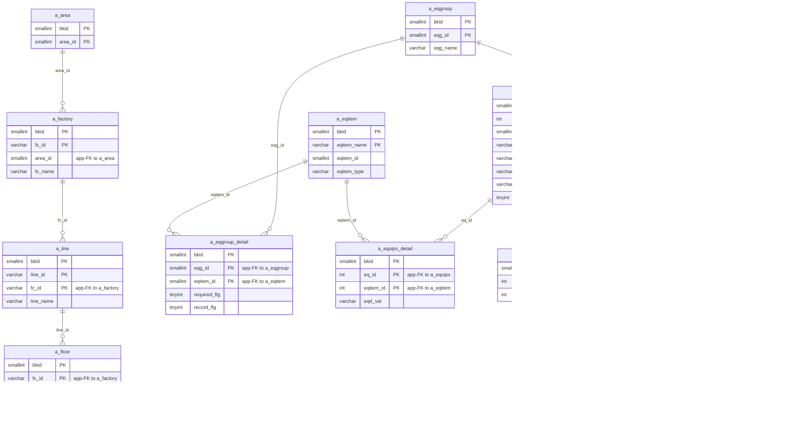
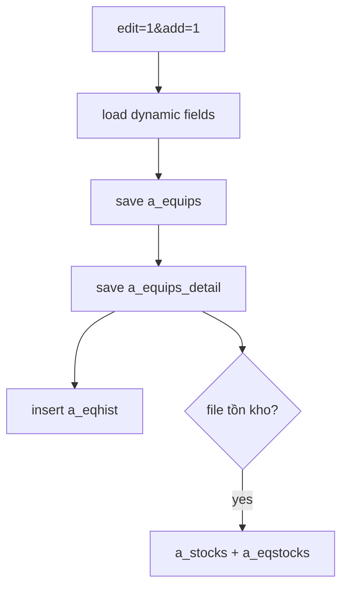

---
aliases:
  - /{tenant}/equip.php?edit=1&add=1 (VI)
tags:
  - ppes
  - vi
  - equip
  - add
---

# Thêm thiết bị

## Thuật ngữ chính

- `追加登録 (đăng ký thêm mới)`
- `設備名称 (tên thiết bị)`
- `機番 (mã máy)`

## Tóm tắt

Đây là nhánh add form của `equip.php`.

- load master data và field động theo `a_eqgroup_detail + a_eqitem`
- khi save sẽ ghi `a_equips + a_equips_detail + a_eqhist`
- nếu có file tồn kho thì còn ghi `a_stocks + a_eqstocks`

## Bảng chính

- load form: `a_eqgroup`, `a_factory`, `a_area`, `a_line`, `a_floor`, `a_maker`, `a_eqgroup_detail`, `a_eqitem`, `datamaster`
- save: `a_equips`, `a_equips_detail`, `a_eqhist`
- optional stock import: `a_stocks`, `a_eqstocks`

## Mermaid ER

> **Ghi chú**: Database không có FK constraint. Tất cả quan hệ đều ở tầng application.

## Mermaid

## Xem thêm

- [[Edit-add equipment]]
- [[Trang thiết bị]]
