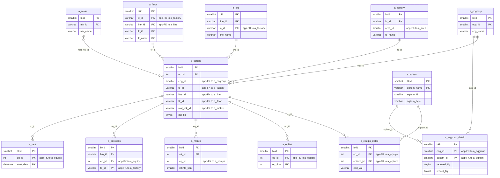
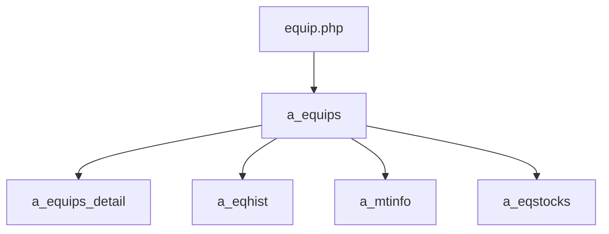

---
aliases:
  - /{tenant}/equip.php
tags:
  - ppes
  - vi
  - equip
---

# Trang thiết bị

## Thuật ngữ chính

- `設備機器 (thiết bị / máy móc)`
- `設備グループ (nhóm thiết bị)`
- `設備項目 (hạng mục thiết bị)`

## Tóm tắt

`/{tenant}/equip.php` là controller trung tâm của domain thiết bị.

- sở hữu `a_equips`, `a_equips_detail`, `a_eqhist`
- list/search/export thiết bị
- edit/add/copy/look thiết bị
- có thể import file tồn kho liên kết sang `a_stocks` và `a_eqstocks`
- delete bị chặn nếu đang bị dùng bởi bảo trì, tồn kho, hoặc mượn trả

## Bảng chính

- đọc: `a_equips`, `a_eqgroup`, `a_factory`, `a_line`, `a_floor`, `a_eqitem`, `a_eqgroup_detail`, `a_maker`, `datamaster`
- ghi: `a_equips`, `a_equips_detail`, `a_eqhist`
- phụ thuộc khi delete: `a_mtinfo`, `a_mtsch`, `a_eqstocks`, `a_rent`

## Mermaid ER

> **Ghi chú**: Database không có FK constraint. Tất cả quan hệ đều ở tầng application.

Ghi chú suy luận:

- một số link như `a_maker -> a_equips` là quan hệ ở mức application/UI, không nhất thiết là foreign key cứng.

## Import / Export

> Chi tiết kiến trúc đầy đủ xem tại [[Kiến trúc Import-Export]].

| Hướng | Định dạng | File template | Tên file xuất |
|-------|-----------|--------------|---------------|
| **Export (Excel)** | Excel (.xlsx) | `equip.xlsx` | `equip-{ymdhi}.xlsx` |
| **Export (CSV)** | CSV | *(không có template)* | `equip-{ymdhi}.csv` |
| **Import** | Excel → CSV | *(không có template — chấp nhận mọi .xlsx/.csv)* | temp: `{bkid}-equip.csv` |

- Trang này hỗ trợ **xuất kép**: `download=1` → Excel dùng `htdocs/base/equip.xlsx` làm template; `download=2` → CSV stream trực tiếp.
- Export Excel có theo dõi tiến độ bất đồng bộ qua `donefile` (poll bởi `api=check_dl`).
- `dlKeys()` được **tạo động** — các cột được xây dựng lúc runtime từ `detailKeys()` dựa trên cấu hình nhóm thiết bị.
- Import qua `uploadEqFile()` dùng phương pháp **hai bước**: bước 1 validate tất cả hàng, bước 2 ghi vào DB.
- Biến thể `sys/equip.php` chỉ hỗ trợ export CSV (không có template Excel).

## Side effects

- upload/copy/delete file vật lý của thiết bị
- import spreadsheet tồn kho
- download Excel/CSV
- utility sửa `flr_id`

## Mermaid

## Xem thêm

- [[Equipment page]]
- [[Thêm thiết bị]]
- [[Quản lý tồn kho]]

---

## Phụ lục: giải thích tên bảng

> Schema đầy đủ (cột, kiểu dữ liệu, mục đích từng cột) cho tất cả bảng liệt kê ở đây xem tại [[Bảng từ điển]].

### Domain thiết bị (sở hữu bởi trang này)

| Bảng | Vai trò |
| --- | --- |
| **[[Bảng từ điển#a_equips\|a_equips]]** | Master thiết bị. Bảng chính của trang này. Mỗi row là một thiết bị vật lý theo tenant. Lưu tên (`eq_name`), vị trí factory/line/floor (`fc_id`, `line_id`, `flr_id`), nhóm thiết bị (`eqg_id`), maker (`mat_mk_id`), số máy, và giá trị field tùy chỉnh serialised (`eq_vals`). Xóa mềm qua `del_flg`. |
| **[[Bảng từ điển#a_equips_detail\|a_equips_detail]]** | Giá trị hạng mục theo thiết bị. Lưu một row cho mỗi field động theo thiết bị (`eq_id` + `eqitem_id` → `eqd_val`). Ghi cùng lúc với header thiết bị khi save. |
| **[[Bảng từ điển#a_eqhist\|a_eqhist]]** | Lịch sử thay đổi thiết bị. Mỗi row là một event save. Ghi snapshot giá trị field tại mỗi lần sửa để hiển thị audit/history. |

### Định nghĩa field động

| Bảng | Vai trò |
| --- | --- |
| **[[Bảng từ điển#a_eqgroup\|a_eqgroup]]** | Master nhóm thiết bị. Dùng cho dropdown lọc nhóm trên trang list và quyết định field động nào xuất hiện trên form edit. |
| **[[Bảng từ điển#a_eqgroup_detail\|a_eqgroup_detail]]** | Bảng nối nhóm → hạng mục. Định nghĩa hạng mục nào thuộc nhóm nào, với cờ `required_flg` và `record_flg`. `dlKeys()` và form edit đọc bảng này để build cột động. |
| **[[Bảng từ điển#a_eqitem\|a_eqitem]]** | Định nghĩa hạng mục thiết bị. Lưu tên field, kiểu, và giá trị dropdown. Dùng để render form thiết bị động và build cột export. |

### Phân cấp địa điểm / tổ chức

| Bảng | Vai trò |
| --- | --- |
| **[[Bảng từ điển#a_area\|a_area]]** | Master khu vực. Join khi load factory cho dropdown/filter. |
| **[[Bảng từ điển#a_factory\|a_factory]]** | Master nhà máy. Dùng cho dropdown lọc nhà máy và là dimension vị trí cho thiết bị. |
| **[[Bảng từ điển#a_line\|a_line]]** | Master dây chuyền. Dùng cho dropdown lọc dây chuyền và vị trí thiết bị. |
| **[[Bảng từ điển#a_floor\|a_floor]]** | Master tầng / phòng. Mức địa điểm chi tiết nhất. Dùng cho vị trí thiết bị và dropdown tầng trên form edit. |

### Liên kết tồn kho

| Bảng | Vai trò |
| --- | --- |
| **[[Bảng từ điển#a_stocks\|a_stocks]]** | Master vật tư tồn kho. Ghi khi upload file danh sách tồn kho từ form edit thiết bị. |
| **[[Bảng từ điển#a_eqstocks\|a_eqstocks]]** | Liên kết thiết bị → tồn kho. Ghi cùng `a_stocks` khi upload file tồn kho. Cũng được kiểm tra như delete blocker. |

### Delete blockers (chỉ đọc)

| Bảng | Vai trò |
| --- | --- |
| **[[Bảng từ điển#a_mtinfo\|a_mtinfo]]** | Kế hoạch bảo trì. Kiểm tra trước khi xóa thiết bị — nếu có bản ghi bảo trì tham chiếu, delete bị chặn. |
| **[[Bảng từ điển#a_mtsch\|a_mtsch]]** | Instance lịch bảo trì. Join với `a_mtinfo` khi kiểm tra delete blocking. |
| **[[Bảng từ điển#a_rent\|a_rent]]** | Bản ghi mượn trả. Kiểm tra trước khi xóa thiết bị — nếu có bản ghi mượn trả tham chiếu, delete bị chặn. |

### Tra cứu hỗ trợ

| Bảng | Vai trò |
| --- | --- |
| **[[Bảng từ điển#a_maker\|a_maker]]** | Master hãng / nhà cung cấp. Dùng cho dropdown maker trên form edit. Thiết bị lưu `mat_mk_id` tham chiếu bảng này. |
| **[[Bảng từ điển#datamaster\|datamaster]]** | Master giá trị dropdown tổng quát. Dùng cho resolve tiêu đề cột và nhãn trên toàn trang. |

### Auth / session context

| Bảng | Vai trò |
| --- | --- |
| **[[Bảng từ điển#buscomps\|buscomps]]** | Registry tenant (`zaikodb`). Được đọc khi đăng nhập để xác định công ty tenant và kiểm tra feature flag. |
| **[[Bảng từ điển#bk_staff\|bk_staff]]** | Tài khoản nhân viên theo tenant. Được `openUser()` kiểm tra để xác thực session cookie và resolve `bkid` + `stf_id`. Cũng dùng để hiển thị tên người sửa cuối. |
| **[[Bảng từ điển#bkmasters\|bkmasters]]** | Cấu hình tenant. Mỗi row ứng với một `bkid`; lưu tên công ty, cài đặt giờ làm việc, tùy chọn hiển thị (`hide_eqid`, `del_disable`), và config cấp tenant khác. |
| **[[Bảng từ điển#a_auths\|a_auths]]** | Nhóm quyền tính năng. `setMultiAuth()` đọc bảng này để xác định quyền list/edit/import/export cho người dùng hiện tại. |
