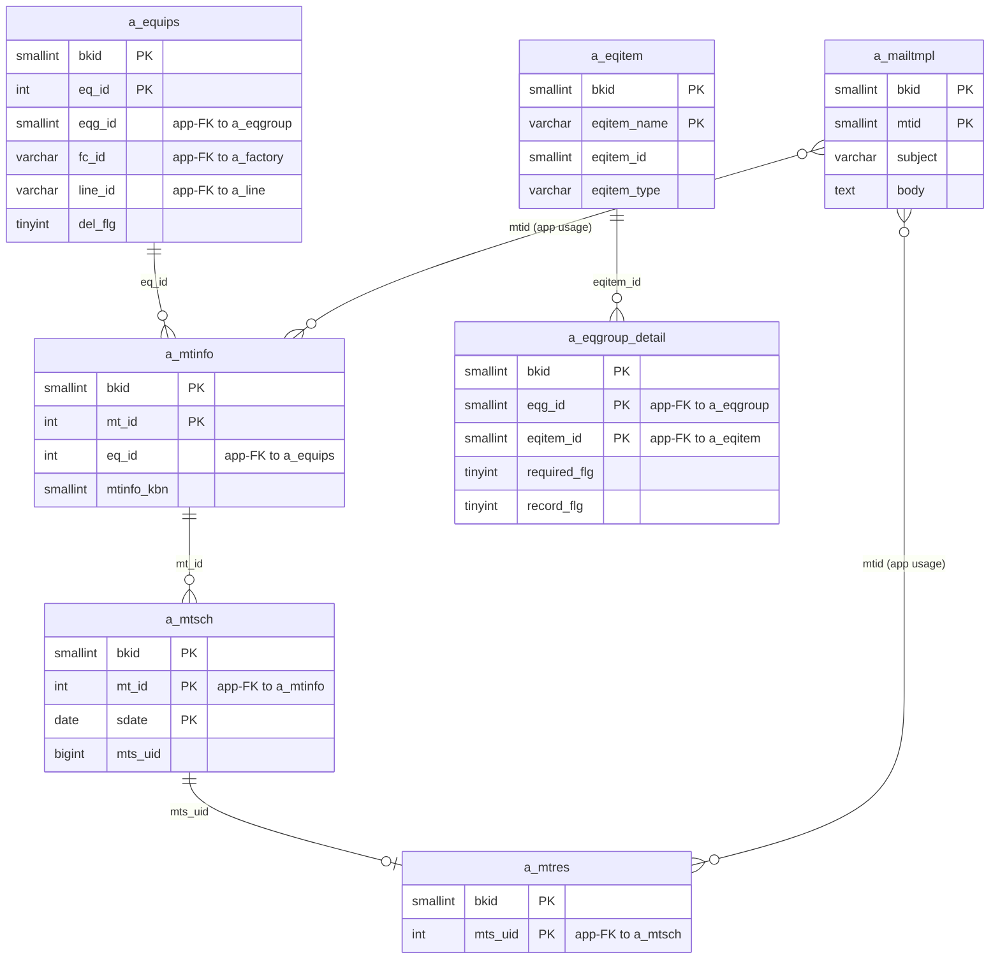
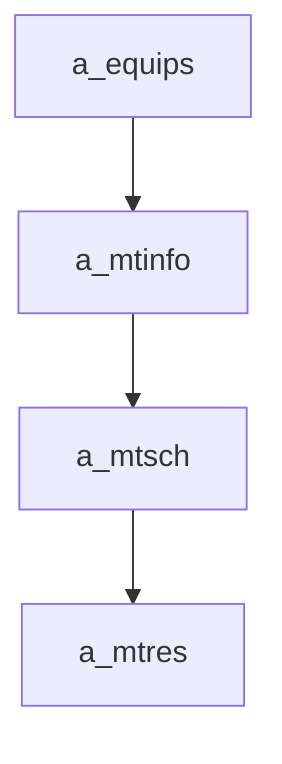

---
aliases:
  - /{tenant}/mtinfo.php
tags:
  - ppes
  - vi
  - maintenance
---

# Công việc bảo trì

## Thuật ngữ chính

- `保全情報 (thông tin bảo trì)`
- `実績 (kết quả thực hiện)`
- `履歴 (lịch sử)`

## Tóm tắt

`/{tenant}/mtinfo.php` là controller bảo trì tổng quát.

- quản lý header `a_mtinfo`
- sync lịch `a_mtsch`
- sync kết quả `a_mtres` cho one-off work
- là nguồn dữ liệu chính cho schedule và result list

## Bảng chính

- đọc: `a_mtinfo`, `a_equips`, `a_mtsch`, `a_mtres`, `a_eqitem`, `a_eqgroup_detail`, `a_mailtmpl`
- ghi: `a_mtinfo`, `a_mtsch`, `a_mtres`

## Mermaid ER

> **Ghi chú**: Database không có FK constraint. Tất cả quan hệ đều ở tầng application.

## Side effects

- prune/regenerate lịch định kỳ
- copy file từ mtinfo sang mtres trong một số nhánh
- gửi reminder mail
- CSV export/import

## Mermaid

## Xem thêm

- [[Maintenance work page]]
- [[Danh sách kết quả bảo trì]]
- [[Lịch bảo trì]]

---

## Phụ lục: giải thích tên bảng

> Schema đầy đủ (cột, kiểu dữ liệu, mục đích từng cột) cho tất cả bảng liệt kê ở đây xem tại [[Bảng từ điển]].

### Chuỗi bảo trì (sở hữu bởi trang này)

| Bảng | Vai trò |
| --- | --- |
| **[[Bảng từ điển#a_mtinfo\|a_mtinfo]]** | Kế hoạch bảo trì. Bảng chính của trang này. Mỗi row là một nhiệm vụ BT theo thiết bị. Lưu tên nhiệm vụ, loại (`mtinfo_kbn`), cửa sổ kế hoạch, và danh mục. Cả nhánh regenerate định kỳ và tạo đột xuất đều ghi bảng này. Delete cũng có thể xóa row này. |
| **[[Bảng từ điển#a_mtsch\|a_mtsch]]** | Instance lịch bảo trì. Với bảo trì định kỳ, `save_teiki()` prune và regenerate các row lịch tương lai. Với đột xuất, một row được tạo/cập nhật. Delete nhắm vào từng row lịch theo `mts_uid`. |
| **[[Bảng từ điển#a_mtres\|a_mtres]]** | Kết quả bảo trì. Với đột xuất, trang này tạo và cập nhật row kết quả. File đính kèm có thể được mirror từ slot file mtinfo sang slot mtres. |

### Context thiết bị (chỉ đọc)

| Bảng | Vai trò |
| --- | --- |
| **[[Bảng từ điển#a_equips\|a_equips]]** | Master thiết bị. Load để hiển thị thông tin thiết bị mục tiêu. `eq_id` là khóa ngoại parent cho `a_mtinfo`. |
| **[[Bảng từ điển#a_equips_detail\|a_equips_detail]]** | Giá trị hạng mục theo thiết bị. Đọc ở chế độ edit để hiển thị context field thiết bị cùng dữ liệu bảo trì. |
| **[[Bảng từ điển#a_eqgroup\|a_eqgroup]]** | Master nhóm thiết bị. Dùng cho dropdown lọc nhóm trên trang list. |
| **[[Bảng từ điển#a_eqgroup_detail\|a_eqgroup_detail]]** | Bảng nối nhóm → hạng mục. Đọc ở chế độ edit để resolve nhãn field. |
| **[[Bảng từ điển#a_eqitem\|a_eqitem]]** | Định nghĩa hạng mục thiết bị. Đọc để hiển thị nhãn field động. |

### Phân cấp địa điểm / tổ chức

| Bảng | Vai trò |
| --- | --- |
| **[[Bảng từ điển#a_factory\|a_factory]]** | Master nhà máy. Dùng cho dropdown lọc nhà máy trên trang list. |
| **[[Bảng từ điển#a_line\|a_line]]** | Master dây chuyền. Dùng cho lọc dây chuyền. |

### Thông báo mail

| Bảng | Vai trò |
| --- | --- |
| **[[Bảng từ điển#a_mailtmpl\|a_mailtmpl]]** | Master mẫu email. Load khi gửi mail nhắc bảo trì định kỳ. |

### Tra cứu hỗ trợ

| Bảng | Vai trò |
| --- | --- |
| **[[Bảng từ điển#a_maker\|a_maker]]** | Master maker. Đọc cho context hiển thị thiết bị. |
| **[[Bảng từ điển#datamaster\|datamaster]]** | Master giá trị dropdown tổng quát. Dùng cho resolve nhãn (ví dụ `mtinfo_kbn` code → tên hiển thị). |

### Auth / session context

| Bảng | Vai trò |
| --- | --- |
| **[[Bảng từ điển#buscomps\|buscomps]]** | Registry tenant (`zaikodb`). Được đọc khi đăng nhập để xác định công ty tenant và kiểm tra feature flag. |
| **[[Bảng từ điển#bk_staff\|bk_staff]]** | Tài khoản nhân viên theo tenant. Được `openUser()` kiểm tra để xác thực session cookie và resolve `bkid` + `stf_id`. |
| **[[Bảng từ điển#bkmasters\|bkmasters]]** | Cấu hình tenant. Mỗi row ứng với một `bkid`; lưu tên công ty, cài đặt giờ làm việc, tùy chọn hiển thị, và config cấp tenant khác. |
| **[[Bảng từ điển#a_auths\|a_auths]]** | Nhóm quyền tính năng. `setAuth()` với auth ID 11, 12, và 10 xác định quyền list/edit/download bảo trì. |
