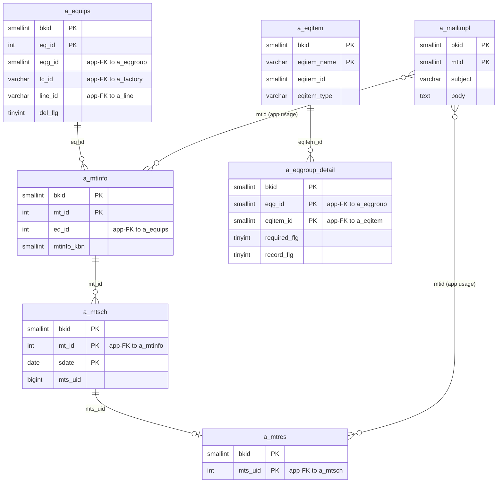
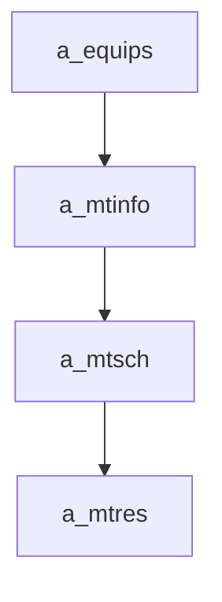

---
aliases:
  - /{tenant}/mtinfo.php
tags:
  - ppes
  - vi
  - maintenance
---

# Công việc bảo trì

## Thuật ngữ chính

- `保全情報 (thông tin bảo trì)`
- `実績 (kết quả thực hiện)`
- `履歴 (lịch sử)`

## Tóm tắt

`/{tenant}/mtinfo.php` là controller bảo trì tổng quát.

- quản lý header `a_mtinfo`
- sync lịch `a_mtsch`
- sync kết quả `a_mtres` cho one-off work
- là nguồn dữ liệu chính cho schedule và result list

## Bảng chính

- đọc: `a_mtinfo`, `a_equips`, `a_mtsch`, `a_mtres`, `a_eqitem`, `a_eqgroup_detail`, `a_mailtmpl`
- ghi: `a_mtinfo`, `a_mtsch`, `a_mtres`

## Mermaid ER

> **Ghi chú**: Database không có FK constraint. Tất cả quan hệ đều ở tầng application.

## Side effects

- prune/regenerate lịch định kỳ
- copy file từ mtinfo sang mtres trong một số nhánh
- gửi reminder mail
- CSV export/import

## Mermaid

## Xem thêm

- [[Maintenance work page]]
- [[Danh sách kết quả bảo trì]]
- [[Lịch bảo trì]]
