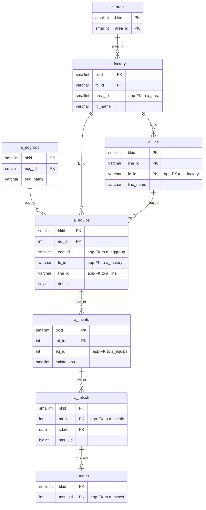
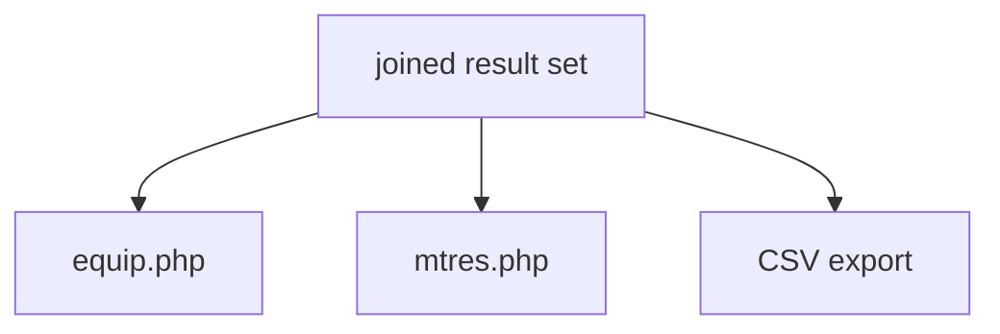

---
aliases:
  - /{tenant}/mtres_list.php
tags:
  - ppes
  - vi
  - maintenance
  - results
---

# Danh sách kết quả bảo trì

## Thuật ngữ chính

- `実績一覧 (danh sách kết quả)`
- `保全履歴 (lịch sử bảo trì)`

## Tóm tắt

`/{tenant}/mtres_list.php` là trang reporting trên các maintenance row đã hoàn tất.

- chủ yếu read-only
- join `a_mtinfo + a_equips + a_mtsch + a_mtres`
- export CSV
- link sang equip và mtres detail

## Bảng chính

- `a_mtinfo`
- `a_equips`
- `a_mtsch`
- `a_mtres`
- `a_factory`
- `a_area`
- `a_line`
- `a_eqgroup`

## Mermaid ER

> **Ghi chú**: Database không có FK constraint. Tất cả quan hệ đều ở tầng application.

## Import / Export

> Chi tiết kiến trúc đầy đủ xem tại [[Kiến trúc Import-Export]].

| Hướng | Định dạng | File template | Tên file xuất |
|-------|-----------|--------------|---------------|
| **Export** | CSV | *(không có template)* | `mtres_list-{ymdhi}.csv` |
| **Import** | — | — | — |

- Trang này **chỉ có export** — không có chức năng import/upload.
- Export stream CSV trực tiếp qua `printdownLoadHeader()`.

## Điểm cần chú ý

- có một nhánh delete bất thường đụng vào `a_equips`

## Mermaid

## Xem thêm

- [[Maintenance results list]]
- [[Công việc bảo trì]]

---

## Phụ lục: giải thích tên bảng

> Schema đầy đủ (cột, kiểu dữ liệu, mục đích từng cột) cho tất cả bảng liệt kê ở đây xem tại [[Bảng từ điển]].

### Chuỗi bảo trì cốt lõi (chỉ đọc)

| Bảng | Vai trò |
| --- | --- |
| **[[Bảng từ điển#a_mtinfo\|a_mtinfo]]** | Kế hoạch bảo trì. Join để lấy tên nhiệm vụ, loại (`mtinfo_kbn`), và `eq_id` parent. Trang này đọc nhưng không ghi bảng này. |
| **[[Bảng từ điển#a_equips\|a_equips]]** | Master thiết bị. Join để hiển thị tên, vị trí, và nhóm thiết bị. Cũng là đích của một nhánh delete rủi ro trong controller này. |
| **[[Bảng từ điển#a_mtsch\|a_mtsch]]** | Instance lịch bảo trì. Join để lấy ngày lịch (`s_date`/`e_date`) và cờ hoàn thành (`mtr_done`). |
| **[[Bảng từ điển#a_mtres\|a_mtres]]** | Kết quả bảo trì. Đích reporting chính — các row công việc đã hoàn tất được project qua bảng này. |

### Phân cấp địa điểm / tổ chức

| Bảng | Vai trò |
| --- | --- |
| **[[Bảng từ điển#a_area\|a_area]]** | Master khu vực. Join khi load factory cho dropdown lọc. |
| **[[Bảng từ điển#a_factory\|a_factory]]** | Master nhà máy. Dùng cho dropdown lọc nhà máy. |
| **[[Bảng từ điển#a_line\|a_line]]** | Master dây chuyền. Dùng cho lọc dây chuyền. |
| **[[Bảng từ điển#a_eqgroup\|a_eqgroup]]** | Master nhóm thiết bị. Dùng cho dropdown lọc nhóm. |

### Tra cứu hỗ trợ

| Bảng | Vai trò |
| --- | --- |
| **[[Bảng từ điển#datamaster\|datamaster]]** | Master giá trị dropdown tổng quát. Dùng cho resolve nhãn (ví dụ `mtinfo_kbn` code → tên hiển thị). |

### Auth / session context

| Bảng | Vai trò |
| --- | --- |
| **[[Bảng từ điển#buscomps\|buscomps]]** | Registry tenant (`zaikodb`). Được đọc khi đăng nhập để xác định công ty tenant và kiểm tra feature flag. |
| **[[Bảng từ điển#bk_staff\|bk_staff]]** | Tài khoản nhân viên theo tenant. Được `openUser()` kiểm tra để xác thực session cookie và resolve `bkid` + `stf_id`. |
| **[[Bảng từ điển#bkmasters\|bkmasters]]** | Cấu hình tenant. Mỗi row ứng với một `bkid`; lưu tên công ty, cài đặt giờ làm việc, tùy chọn hiển thị, và config cấp tenant khác. |
| **[[Bảng từ điển#a_auths\|a_auths]]** | Nhóm quyền tính năng. `setAuth($db, $request, 13)` xác định quyền xem và export danh sách kết quả. |
