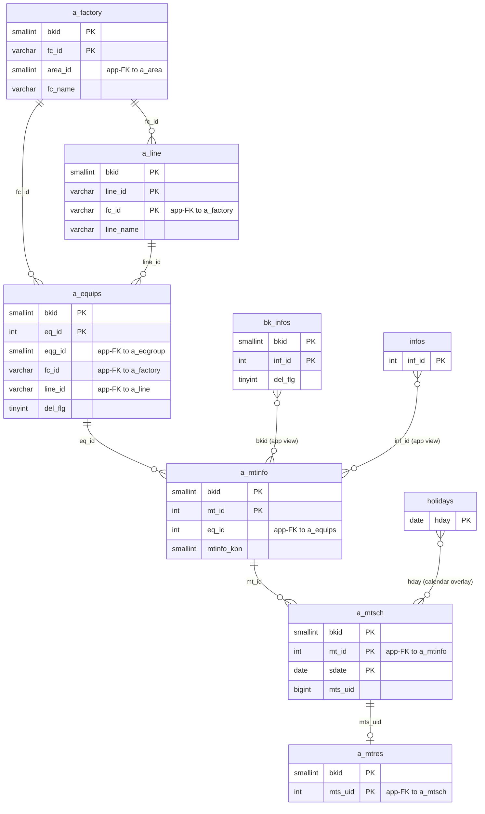
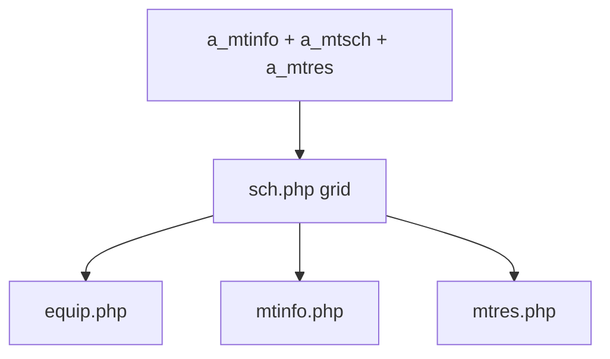

---
aliases:
  - /{tenant}/sch.php (VI)
tags:
  - ppes
  - vi
  - maintenance
  - calendar
---

# Lịch bảo trì

## Thuật ngữ chính

- `保全カレンダー (lịch bảo trì)`
- `日次計画 (kế hoạch ngày)`
- `月次計画 (kế hoạch tháng)`
- `年次計画 (kế hoạch năm)`

## Tóm tắt

`/{tenant}/sch.php` là trang calendar/projection, không phải source-of-truth editor.

- đọc lịch từ `a_mtinfo + a_mtsch + a_mtres + a_equips`
- hỗ trợ view day/month/year/long
- là hub điều hướng sang equip/mtinfo/mtres

## Bảng chính

- `a_equips`
- `a_mtinfo`
- `a_mtsch`
- `a_mtres`
- `a_factory`
- `a_line`
- `holidays`
- `bk_infos`
- `infos`

## Ký hiệu lịch

Toàn bộ icon trên calendar grid đều được điều khiển bởi các cột trong `a_mtsch`. `a_mtres` chỉ được join để lấy dữ liệu hiển thị, không ảnh hưởng đến icon nào.

### Path A — ngày nằm trong khoảng `s_date`–`e_date` của một row `a_mtsch`

| Icon | Bảng | Cột | Điều kiện | Màu nền ô |
| --- | --- | --- | --- | --- |
| ● tròn đặc | `a_mtsch` | `mtr_done` | có giá trị (đã đăng ký kết quả BT) | mặc định / xanh nếu là hôm nay |
| ○ tròn rỗng | `a_mtsch` | `mtr_done` | NULL hoặc rỗng **và** `e_date` ≥ hôm nay | mặc định / xanh nếu là hôm nay |
| ○ tròn rỗng *(quá hạn)* | `a_mtsch` | `mtr_done` | NULL hoặc rỗng **và** `e_date` < hôm nay | **vàng** |

Hành vi link: khi `mtr_done` có giá trị → mở `mtres.php` chế độ xem (`&look=1`); khi rỗng → mở chế độ chỉnh sửa.

### Path B — ngày KHÔNG nằm trong khoảng của bất kỳ row `a_mtsch` nào

Kiểm tra theo thứ tự ưu tiên — match đầu tiên thắng:

| Ưu tiên | Icon | Bảng | Cột | Điều kiện | Tooltip (ja) |
| --- | --- | --- | --- | --- | --- |
| 1 | ■ vuông đặc | `a_mtsch` | `mtr_dpdate2` | bằng ngày trên calendar | 伝票発行日 (ngày phát hành phiếu thực tế) |
| 2 | □ vuông rỗng | `a_mtsch` | `mtr_dpdate1` | bằng ngày trên calendar | 伝票発行予定日 (ngày dự kiến phát hành phiếu) |
| 3 | ▲ tam giác đặc | `a_mtsch` | `mtr_mtdate2` | bằng ngày trên calendar | 見積実績日 (ngày báo giá thực tế) |
| 4 | △ tam giác rỗng | `a_mtsch` | `mtr_mtdate1` | bằng ngày trên calendar | 見積依頼予定日 (ngày dự kiến yêu cầu báo giá) |
| 5 | *(trống)* | — | — | không match | — |

Tất cả icon Path B đều link sang `mtres.php` chế độ xem.

> **Quy tắc suppression**: khi `mtr_mtdate2` có giá trị cho một `mt_id`, entry `mtr_mtdate1` tương ứng bị xóa khỏi map trong PHP (variant đặc loại trừ variant rỗng). Tương tự `mtr_dpdate2` loại trừ `mtr_dpdate1`.

### Sơ đồ quyết định

```
Ngày nằm trong khoảng s_date–e_date của a_mtsch?
├─ CÓ → mtr_done có giá trị?
│         ├─ CÓ → ●  (đã đăng ký kết quả)
│         └─ KHÔNG → e_date < hôm nay?
│                     ├─ CÓ → ○  nền vàng (quá hạn, chưa có kết quả)
│                     └─ KHÔNG → ○  nền bình thường (đã lên lịch, chờ xử lý)
└─ KHÔNG → kiểm tra cột date trong a_mtsch theo thứ tự:
            mtr_dpdate2 → ■
            mtr_dpdate1 → □
            mtr_mtdate2 → ▲
            mtr_mtdate1 → △
            (không có)  → trống
```

## Mermaid ER

> **Ghi chú**: Database không có FK constraint. Tất cả quan hệ đều ở tầng application.



Ghi chú suy luận:

- `bk_infos`, `infos`, `holidays` không phải parent thực của maintenance data; chúng chỉ được ghép vào calendar ở mức application view.

## Side effects

- không ghi business table
- redirect login nếu fail auth
- render widget news/info/today list

## Mermaid



## Xem thêm

- [[Schedule calendar]]
- [[Đặt lịch bảo trì]]
- [[Công việc bảo trì]]

---

## Phụ lục: giải thích tên bảng

> Schema đầy đủ (cột, kiểu dữ liệu, mục đích từng cột) cho tất cả bảng liệt kê ở đây xem tại [[Bảng từ điển]].

### Chuỗi bảo trì cốt lõi

| Bảng | Vai trò |
| --- | --- |
| **[[Bảng từ điển#a_equips\|a_equips]]** | Master thiết bị. Mỗi row là một thiết bị vật lý. Lưu tên, vị trí (factory/line), nhóm thiết bị, số máy, và các trường tùy chỉnh (`eq_vals`). Xóa mềm qua `del_flg`. |
| **[[Bảng từ điển#a_mtinfo\|a_mtinfo]]** | Kế hoạch bảo trì. Mỗi row là một nhiệm vụ BT gắn với thiết bị. Lưu tên nhiệm vụ, loại (`mtinfo_kbn`), cửa sổ kế hoạch (`sc_start_date`/`sc_end_date`), và danh mục (`sc_kbn` — phân biệt BT định kỳ với quy trình báo giá/phát hành phiếu). |
| **[[Bảng từ điển#a_mtsch\|a_mtsch]]** | Instance lịch bảo trì. Mỗi row là một ngày thực hiện cụ thể của kế hoạch. Lưu cửa sổ thực hiện (`s_date`/`e_date`), cờ hoàn thành (`mtr_done`), và bốn cột ngày báo giá/phiếu (`mtr_mtdate1/2`, `mtr_dpdate1/2`) điều khiển icon Path B. **Đây là nguồn sự thật duy nhất cho tất cả icon trên calendar.** |
| **[[Bảng từ điển#a_mtres\|a_mtres]]** | Kết quả bảo trì. Mỗi row là kết quả của một lịch đã thực hiện (khóa bởi `mts_uid`). Lưu chi tiết công việc, tên nhân viên, ngày thực tế, chi phí, file đính kèm. Chỉ được join để hiển thị trên `sch.php`; không điều khiển icon nào. |

### Phân cấp địa điểm / tổ chức

| Bảng | Vai trò |
| --- | --- |
| **[[Bảng từ điển#a_factory\|a_factory]]** | Master nhà máy. Nhóm địa điểm cấp cao nhất. Mỗi thiết bị có khóa `fc_id` trỏ vào bảng này. Dùng cho dropdown lọc nhà máy trên `sch.php`. |
| **[[Bảng từ điển#a_line\|a_line]]** | Master dây chuyền. Địa điểm con trong nhà máy (`fc_id` + `line_id`). Dùng cho dropdown lọc dây chuyền và hiển thị như một cột trong lưới calendar. |

### Hỗ trợ hiển thị calendar

| Bảng | Vai trò |
| --- | --- |
| **[[Bảng từ điển#holidays\|holidays]]** | Danh sách ngày lễ. Dùng để tô màu hồng cho cột ngày lễ trong header của calendar. |
| **[[Bảng từ điển#datamaster\|datamaster]]** | Master giá trị dropdown tổng quát. Lưu danh sách tên item theo `propid` (ví dụ `mtinfo_kbn`) với nhãn bốn ngôn ngữ. Đọc qua `ppes_master()` để chuyển code → tên hiển thị. |

### Dữ liệu widget trang

| Bảng | Vai trò |
| --- | --- |
| **[[Bảng từ điển#bk_infos\|bk_infos]]** | Thông báo theo tenant. Hiển thị trong widget **【お知らせ】** trên trang TOP/lịch. Admin có thể chỉnh sửa trực tiếp từ widget. |
| **[[Bảng từ điển#infos\|infos]]** | Thông báo toàn hệ thống, đăng từ `/padmin/`. Cũng hiển thị trong widget info cùng với `bk_infos`. |

### Auth / session context

| Bảng | Vai trò |
| --- | --- |
| **[[Bảng từ điển#buscomps\|buscomps]]** | Registry tenant (`zaikodb`). Đọc khi đăng nhập để xác định công ty tenant và kiểm tra feature flag (ví dụ `use_api`, `spe_*`). |
| **[[Bảng từ điển#bk_staff\|bk_staff]]** | Tài khoản nhân viên theo tenant. Được `openUser()` kiểm tra để xác thực session cookie và resolve `bkid` + `stf_id`. |
| **[[Bảng từ điển#bkmasters\|bkmasters]]** | Cấu hình tenant. Mỗi row ứng với một `bkid`; lưu tên công ty, cài đặt giờ làm việc, tùy chọn hiển thị, và config cấp tenant dùng trên tất cả các trang. |
| **[[Bảng từ điển#a_auths\|a_auths]]** | Nhóm quyền tính năng. Mỗi row là một nhóm auth với flag quyền theo tính năng (`at_1`, `at_10` … `at_15`). `setAuth($db, $request, $authId)` đọc bảng này để xác định người dùng hiện tại có thể xem hay chỉnh sửa gì trên trang. |
| **[[Bảng từ điển#a_eqgroup\|a_eqgroup]]** | Master nhóm thiết bị. Nhóm các thiết bị cho bộ lọc `eqg_id` trên form tìm kiếm calendar. |
