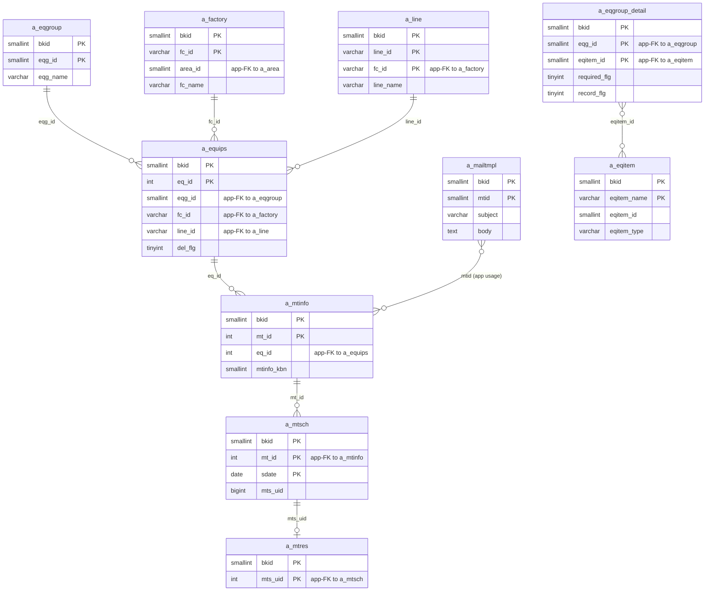
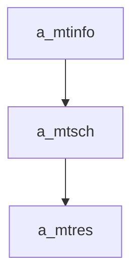

---
aliases:
  - /{tenant}/mtinfo_yoyaku.php
tags:
  - ppes
  - vi
  - maintenance
  - reservation
---

# Đặt lịch bảo trì

## Thuật ngữ chính

- `保全予約 (đặt lịch bảo trì)`
- `定期 (định kỳ)`
- `突発 (đột xuất)`

## Tóm tắt

`/{tenant}/mtinfo_yoyaku.php` là nhánh reservation-oriented của maintenance.

- tạo/sửa `a_mtinfo`
- với `定期` sẽ generate nhiều row `a_mtsch`
- với non-periodic có thể ghi cả `a_mtsch` và `a_mtres`
- có thể gửi mail nhắc việc

## Bảng chính

- đọc: `a_mtinfo`, `a_equips`, `a_eqgroup`, `a_factory`, `a_line`, `a_mtsch`, `a_mtres`, `a_eqitem`, `a_eqgroup_detail`, `a_mailtmpl`
- ghi: `a_mtinfo`, `a_mtsch`, `a_mtres`

## Mermaid ER

> **Ghi chú**: Database không có FK constraint. Tất cả quan hệ đều ở tầng application.

## Import / Export

> Chi tiết kiến trúc đầy đủ xem tại [[Kiến trúc Import-Export]].

| Hướng | Định dạng | File template | Tên file xuất |
|-------|-----------|--------------|---------------|
| **Export** | CSV | *(không có template)* | `mtinfo-{ymdhi}.csv` |
| **Import** | Excel → CSV | *(không có template — chấp nhận mọi .xlsx/.csv)* | temp: `{bkid}-mtinfo.csv` |

- Export stream CSV trực tiếp qua `printdownLoadHeader()` — không dùng template Excel.
- Import qua `uploadTeikiFile()` chấp nhận file Excel, chuyển sang CSV, và tạo/cập nhật `a_mtinfo` + generate các row lịch trình `a_mtsch` qua `save_teiki()`.

## Side effects

- generate lịch bảo trì tương lai
- gửi mail template `mtid=9`
- import periodic plan từ file

## Mermaid

## Xem thêm

- [[Maintenance reservation page]]
- [[Công việc bảo trì]]
- [[Lịch bảo trì]]

---

## Phụ lục: giải thích tên bảng

> Schema đầy đủ (cột, kiểu dữ liệu, mục đích từng cột) cho tất cả bảng liệt kê ở đây xem tại [[Bảng từ điển]].

### Chuỗi bảo trì (sở hữu bởi trang này)

| Bảng | Vai trò |
| --- | --- |
| **[[Bảng từ điển#a_mtinfo\|a_mtinfo]]** | Kế hoạch bảo trì. Bảng chính của trang này. Mỗi row là một nhiệm vụ BT theo thiết bị. Lưu tên nhiệm vụ (`mt_name`), loại (`mtinfo_kbn` — định kỳ vs. đột xuất), cửa sổ kế hoạch (`sc_start_date`/`sc_end_date`), và danh mục (`sc_kbn`). Cả hai nhánh save (định kỳ và đột xuất) đều ghi bảng này. |
| **[[Bảng từ điển#a_mtsch\|a_mtsch]]** | Instance lịch bảo trì. Generate từ `a_mtinfo` — với bảo trì định kỳ, `save_teiki()` mở rộng kế hoạch thành các row ngày cụ thể với cửa sổ `s_date`/`e_date`. Với đột xuất, một row `a_mtsch` được tạo. Delete có thể xóa từng row lịch. |
| **[[Bảng từ điển#a_mtres\|a_mtres]]** | Kết quả bảo trì. Chỉ ghi cho nhánh đột xuất, trang này tạo row kết quả cùng lúc với lịch. Khóa bởi `mts_uid`. |

### Context thiết bị (chỉ đọc)

| Bảng | Vai trò |
| --- | --- |
| **[[Bảng từ điển#a_equips\|a_equips]]** | Master thiết bị. Load để hiển thị tên, vị trí, và nhóm của thiết bị mục tiêu. `eq_id` là khóa ngoại parent cho `a_mtinfo`. |
| **[[Bảng từ điển#a_eqgroup\|a_eqgroup]]** | Master nhóm thiết bị. Dùng cho dropdown lọc nhóm trên trang list. |
| **[[Bảng từ điển#a_eqgroup_detail\|a_eqgroup_detail]]** | Bảng nối nhóm → hạng mục. Đọc để hiển thị nhãn field động trong context bảo trì. |
| **[[Bảng từ điển#a_eqitem\|a_eqitem]]** | Định nghĩa hạng mục thiết bị. Đọc cùng `a_eqgroup_detail` để resolve nhãn field. |

### Phân cấp địa điểm / tổ chức

| Bảng | Vai trò |
| --- | --- |
| **[[Bảng từ điển#a_factory\|a_factory]]** | Master nhà máy. Dùng cho dropdown lọc nhà máy trên trang list. |
| **[[Bảng từ điển#a_line\|a_line]]** | Master dây chuyền. Dùng cho lọc dây chuyền, hiển thị như context trên form edit. |

### Thông báo mail

| Bảng | Vai trò |
| --- | --- |
| **[[Bảng từ điển#a_mailtmpl\|a_mailtmpl]]** | Master mẫu email. Template `mtid=9` được load khi gửi mail nhắc bảo trì định kỳ. |

### Tra cứu hỗ trợ

| Bảng | Vai trò |
| --- | --- |
| **[[Bảng từ điển#a_maker\|a_maker]]** | Master maker. Đọc cho context hiển thị thiết bị ở một số view. |
| **[[Bảng từ điển#datamaster\|datamaster]]** | Master giá trị dropdown tổng quát. Dùng cho resolve nhãn (ví dụ `mtinfo_kbn` code → tên hiển thị). |

### Auth / session context

| Bảng | Vai trò |
| --- | --- |
| **[[Bảng từ điển#buscomps\|buscomps]]** | Registry tenant (`zaikodb`). Được đọc khi đăng nhập để xác định công ty tenant và kiểm tra feature flag. |
| **[[Bảng từ điển#bk_staff\|bk_staff]]** | Tài khoản nhân viên theo tenant. Được `openUser()` kiểm tra để xác thực session cookie và resolve `bkid` + `stf_id`. |
| **[[Bảng từ điển#bkmasters\|bkmasters]]** | Cấu hình tenant. Mỗi row ứng với một `bkid`; lưu tên công ty, cài đặt giờ làm việc, tùy chọn hiển thị, và config cấp tenant khác. |
| **[[Bảng từ điển#a_auths\|a_auths]]** | Nhóm quyền tính năng. `setAuth()` với auth ID 11, 12, và 10 xác định quyền list/edit/download cho đặt lịch bảo trì. |
