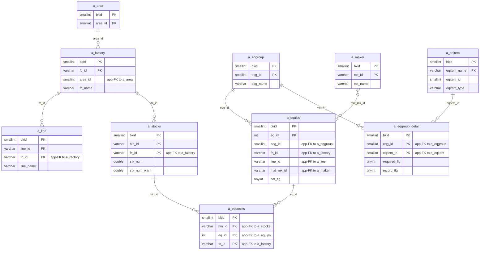
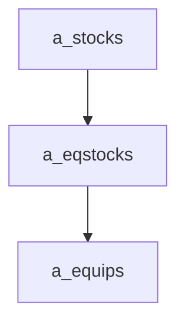

---
aliases:
  - /{tenant}/stock.php (VI)
tags:
  - ppes
  - vi
  - stock
---

# Quản lý tồn kho (VI)

## Thuật ngữ chính

- `在庫一覧 (danh sách tồn kho)`
- `在庫区分 (loại tồn kho)`
- `品名 (tên vật tư)`

## Tóm tắt

`/{tenant}/stock.php` quản lý `a_stocks` và liên kết thiết bị qua `a_eqstocks`.

- list/search/export tồn kho
- edit tồn kho và chọn thiết bị liên quan
- API trả equipment list theo factory
- delete xóa row tồn kho và link thiết bị

## Bảng chính

- đọc: `a_stocks`, `a_eqstocks`, `a_equips`, `a_factory`, `a_area`, `a_line`, `a_eqgroup`, `a_maker`, `a_eqitem`, `a_eqgroup_detail`
- ghi: `a_stocks`, `a_eqstocks`

## Mermaid ER

> **Ghi chú**: Database không có FK constraint. Tất cả quan hệ đều ở tầng application.

## Side effects

- JSON API
- CSV/XLSX export
- warning khi `stk_num < stk_num_warn`

## Mermaid

## Xem thêm

- [[Stock management]]
- [[Trang thiết bị]]
