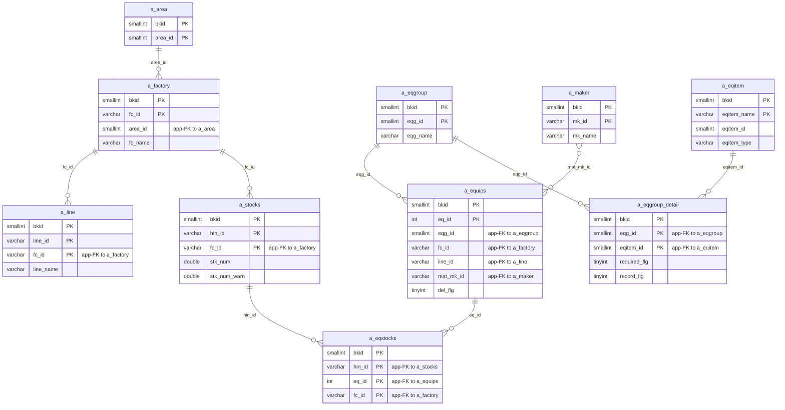
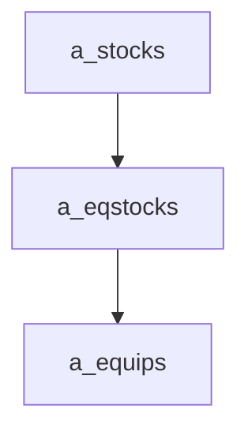

---
aliases:
  - /{tenant}/stock.php
tags:
  - ppes
  - vi
  - stock
---

# Quản lý tồn kho

## Thuật ngữ chính

- `在庫一覧 (danh sách tồn kho)`
- `在庫区分 (loại tồn kho)`
- `品名 (tên vật tư)`

## Tóm tắt

`/{tenant}/stock.php` quản lý `a_stocks` và liên kết thiết bị qua `a_eqstocks`.

- list/search/export tồn kho
- edit tồn kho và chọn thiết bị liên quan
- API trả equipment list theo factory
- delete xóa row tồn kho và link thiết bị

## Bảng chính

- đọc: `a_stocks`, `a_eqstocks`, `a_equips`, `a_factory`, `a_area`, `a_line`, `a_eqgroup`, `a_maker`, `a_eqitem`, `a_eqgroup_detail`
- ghi: `a_stocks`, `a_eqstocks`

## Mermaid ER

> **Ghi chú**: Database không có FK constraint. Tất cả quan hệ đều ở tầng application.

## Import / Export

> Chi tiết kiến trúc đầy đủ xem tại [[Kiến trúc Import-Export]].

| Hướng | Định dạng | File template | Tên file xuất |
|-------|-----------|--------------|---------------|
| **Export (Excel)** | Excel (.xlsx) | `T_STOCK.xlsx` | `stock-{ymdhi}.xlsx` |
| **Export (CSV)** | CSV | *(không có template)* | `stock-{ymdhi}.csv` |
| **Import** | — | — | — |

- Trang này hỗ trợ **xuất kép**: `download="ex"` → Excel dùng `htdocs/base/T_STOCK.xlsx` (hoặc `htdocs/sys/T_STOCK.xlsx`) làm template; giá trị truthy khác → CSV stream trực tiếp.
- Trang này **không có import trực tiếp**. Dữ liệu tồn kho có thể import gián tiếp qua upload file danh sách tồn kho trên [[Trang thiết bị]] (`equip.php`).

## Side effects

- JSON API
- CSV/XLSX export
- warning khi `stk_num < stk_num_warn`

## Mermaid

## Xem thêm

- [[Stock management]]
- [[Trang thiết bị]]

---

## Phụ lục: giải thích tên bảng

> Schema đầy đủ (cột, kiểu dữ liệu, mục đích từng cột) cho tất cả bảng liệt kê ở đây xem tại [[Bảng từ điển]].

### Domain tồn kho (sở hữu bởi trang này)

| Bảng | Vai trò |
| --- | --- |
| **[[Bảng từ điển#a_stocks\|a_stocks]]** | Master vật tư tồn kho. Bảng chính của trang này. Mỗi row là một vật tư tồn kho theo nhà máy (`hin_id` + `fc_id`). Lưu tên vật tư, phân loại (`stock_kbn`), số lượng hiện tại (`stk_num`), và ngưỡng cảnh báo (`stk_num_warn`). List/edit/delete đều nhắm vào bảng này. |
| **[[Bảng từ điển#a_eqstocks\|a_eqstocks]]** | Liên kết thiết bị → tồn kho. Bảng nối link vật tư tồn kho với thiết bị (`hin_id` + `eq_id` + `fc_id`). Quản lý khi edit/delete cùng `a_stocks`. |

### Context thiết bị (chỉ đọc)

| Bảng | Vai trò |
| --- | --- |
| **[[Bảng từ điển#a_equips\|a_equips]]** | Master thiết bị. Đọc để hiển thị thiết bị liên kết và cho API equipment picker. |
| **[[Bảng từ điển#a_eqgroup\|a_eqgroup]]** | Master nhóm thiết bị. Dùng cho dropdown lọc nhóm trên trang list. |
| **[[Bảng từ điển#a_eqgroup_detail\|a_eqgroup_detail]]** | Bảng nối nhóm → hạng mục. Đọc ở chế độ edit để hiển thị context field động của thiết bị. |
| **[[Bảng từ điển#a_eqitem\|a_eqitem]]** | Định nghĩa hạng mục thiết bị. Đọc cùng `a_eqgroup_detail` để hiển thị nhãn. |

### Phân cấp địa điểm / tổ chức

| Bảng | Vai trò |
| --- | --- |
| **[[Bảng từ điển#a_area\|a_area]]** | Master khu vực. Join khi load factory cho dropdown lọc. |
| **[[Bảng từ điển#a_factory\|a_factory]]** | Master nhà máy. Dùng cho dropdown lọc nhà máy và là dimension khóa của vật tư tồn kho (`fc_id` là phần của composite PK). |
| **[[Bảng từ điển#a_line\|a_line]]** | Master dây chuyền. Dùng cho lọc dây chuyền. |

### Tra cứu hỗ trợ

| Bảng | Vai trò |
| --- | --- |
| **[[Bảng từ điển#a_maker\|a_maker]]** | Master hãng / nhà cung cấp. Đọc cho context hiển thị thiết bị ở chế độ edit. |
| **[[Bảng từ điển#datamaster\|datamaster]]** | Master giá trị dropdown tổng quát. Dùng cho resolve nhãn (ví dụ `stock_kbn` code → tên hiển thị). |

### Auth / session context

| Bảng | Vai trò |
| --- | --- |
| **[[Bảng từ điển#buscomps\|buscomps]]** | Registry tenant (`zaikodb`). Được đọc khi đăng nhập để xác định công ty tenant và kiểm tra feature flag. |
| **[[Bảng từ điển#bk_staff\|bk_staff]]** | Tài khoản nhân viên theo tenant. Được `openUser()` kiểm tra để xác thực session cookie và resolve `bkid` + `stf_id`. |
| **[[Bảng từ điển#bkmasters\|bkmasters]]** | Cấu hình tenant. Mỗi row ứng với một `bkid`; lưu tên công ty, cài đặt giờ làm việc, tùy chọn hiển thị, và config cấp tenant khác. |
| **[[Bảng từ điển#a_auths\|a_auths]]** | Nhóm quyền tính năng. `setAuth()` với auth ID 14 và 10 xác định quyền list/edit tồn kho. |
