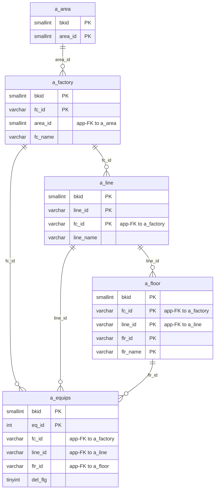
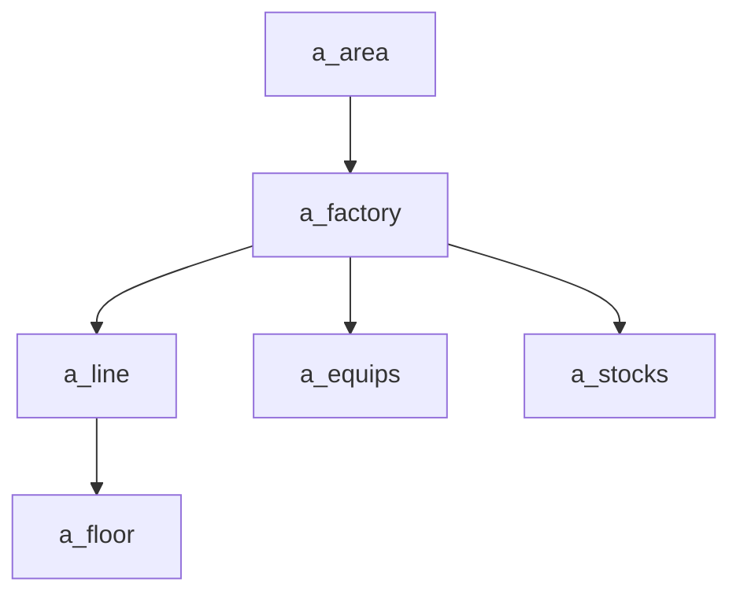

---
aliases:
  - /{tenant}/factory.php
tags:
  - ppes
  - vi
  - admin
  - factory
---

# Master cơ sở và vị trí

## Thuật ngữ chính

- `拠点 (cơ sở)`
- `エリア (khu vực)`
- `設置場所・建屋 (line / khu vực lắp đặt)`
- `階・部屋 (tầng / phòng)`

## Tóm tắt

`/{tenant}/factory.php` là source-of-truth cho location hierarchy.

- `a_area`
- `a_factory`
- `a_line`
- `a_floor`

Downstream lớn nhất là `equip.php` và `stock.php`.

## Bảng chính

- `a_area`
- `a_factory`
- `a_line`
- `a_floor`
- `a_equips`

## Mermaid ER

> **Ghi chú**: Database không có FK constraint. Tất cả quan hệ đều ở tầng application.

## Mermaid

## Import / Export

> Chi tiết kiến trúc đầy đủ xem tại [[Kiến trúc Import-Export]].

| Hướng | Định dạng | File template | Tên file xuất |
|-------|-----------|--------------|---------------|
| **Export** | Excel (.xlsx) | `M_FACTORY_LINE.xlsx` | `factory-{ymdhi}.xlsx` |
| **Import** | Excel → CSV | *(không có template — chấp nhận mọi .xlsx/.csv)* | temp: `{bkid}-factory.csv` |

- Export tải `htdocs/base/M_FACTORY_LINE.xlsx` (hoặc `htdocs/sys/M_FACTORY_LINE.xlsx` cho module sys) làm template, điền dữ liệu, và stream ra browser.
- Import chấp nhận file Excel, chuyển đổi sang CSV qua `Excel::convToCsv()`, rồi parse hàng bằng `fgetcsv()` và upsert vào `a_factory`, `a_line`, `a_floor`, tự động tạo `a_area` nếu cần.
- Validate trước: kiểm tra trùng `fc_id` và `fc_name`.

## Xem thêm

- [[Factory and location master]]
- [[Trang thiết bị]]
- [[Quản lý tồn kho]]

---

## Phụ lục: giải thích tên bảng

> Schema đầy đủ (cột, kiểu dữ liệu, mục đích từng cột) cho tất cả bảng liệt kê ở đây xem tại [[Bảng từ điển]].

### Phân cấp địa điểm (bảng sở hữu bởi trang này)

| Bảng | Vai trò |
| --- | --- |
| **[[Bảng từ điển#a_area\|a_area]]** | Master khu vực. Nhóm địa lý cấp cao nhất. Tự động tạo khi import có tên area mới. Khóa bởi `area_id`. |
| **[[Bảng từ điển#a_factory\|a_factory]]** | Master nhà máy. Cấp địa điểm thứ hai. Mỗi row có `fc_id` (mã nhà máy), `fc_name`, và `area_id` (app-FK tới `a_area`). Trang này là chủ sở hữu chính — list, edit, import/export, và guarded delete đều nhắm vào bảng này. |
| **[[Bảng từ điển#a_line\|a_line]]** | Master dây chuyền. Cấp thứ ba trong nhà máy (`fc_id` + `line_id`). Quản lý inline qua trang factory — import row bao gồm cột line, và delete kiểm tra cascade tới child line. |
| **[[Bảng từ điển#a_floor\|a_floor]]** | Master tầng / phòng. Cấp thứ tư trong dây chuyền (`fc_id` + `line_id` + `flr_id` + `flr_name`). Cũng được quản lý qua luồng import và delete của trang này. |

### Consumer downstream (chỉ đọc trên trang này)

| Bảng | Vai trò |
| --- | --- |
| **[[Bảng từ điển#a_equips\|a_equips]]** | Master thiết bị. Dùng `fc_id`, `line_id`, `flr_id` từ phân cấp địa điểm. Delete trên trang này bị chặn khi có row thiết bị tham chiếu tới địa điểm đang xóa. |

### Hỗ trợ nhãn UI

| Bảng | Vai trò |
| --- | --- |
| **[[Bảng từ điển#datamaster\|datamaster]]** | Master giá trị dropdown tổng quát. Dùng cho resolve tiêu đề cột và nhãn. |

### Auth / session context

| Bảng | Vai trò |
| --- | --- |
| **[[Bảng từ điển#buscomps\|buscomps]]** | Registry tenant (`zaikodb`). Được đọc khi đăng nhập để xác định công ty tenant và kiểm tra feature flag. |
| **[[Bảng từ điển#bk_staff\|bk_staff]]** | Tài khoản nhân viên theo tenant. Được `openUser()` kiểm tra để xác thực session cookie và resolve `bkid` + `stf_id`. |
| **[[Bảng từ điển#bkmasters\|bkmasters]]** | Cấu hình tenant. Mỗi row ứng với một `bkid`; lưu tên công ty, cài đặt giờ làm việc, tùy chọn hiển thị, và config cấp tenant dùng trên tất cả các trang. |
| **[[Bảng từ điển#a_auths\|a_auths]]** | Nhóm quyền tính năng. `setAuth($db, $request, $authId)` đọc bảng này để xác định người dùng hiện tại có thể xem hay chỉnh sửa gì trên trang. |
