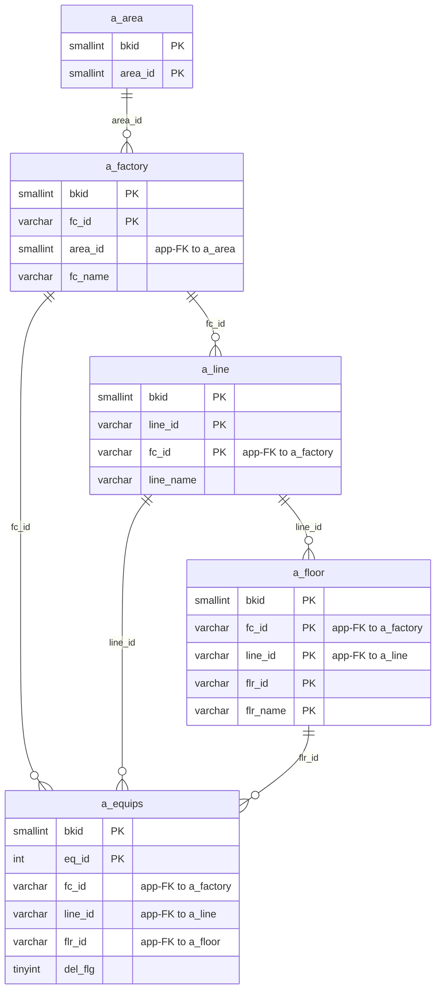
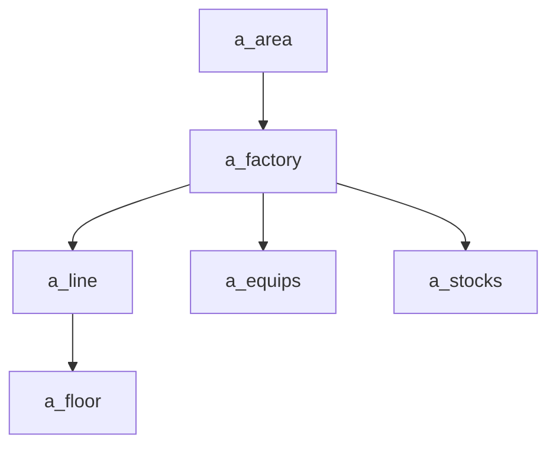

---
aliases:
  - /{tenant}/factory.php
tags:
  - ppes
  - vi
  - admin
  - factory
---

# Master cơ sở và vị trí

## Thuật ngữ chính

- `拠点 (cơ sở)`
- `エリア (khu vực)`
- `設置場所・建屋 (line / khu vực lắp đặt)`
- `階・部屋 (tầng / phòng)`

## Tóm tắt

`/{tenant}/factory.php` là source-of-truth cho location hierarchy.

- `a_area`
- `a_factory`
- `a_line`
- `a_floor`

Downstream lớn nhất là `equip.php` và `stock.php`.

## Bảng chính

- `a_area`
- `a_factory`
- `a_line`
- `a_floor`
- `a_equips`

## Mermaid ER

> **Ghi chú**: Database không có FK constraint. Tất cả quan hệ đều ở tầng application.

## Mermaid

## Xem thêm

- [[Factory and location master]]
- [[Trang thiết bị]]
- [[Quản lý tồn kho]]
