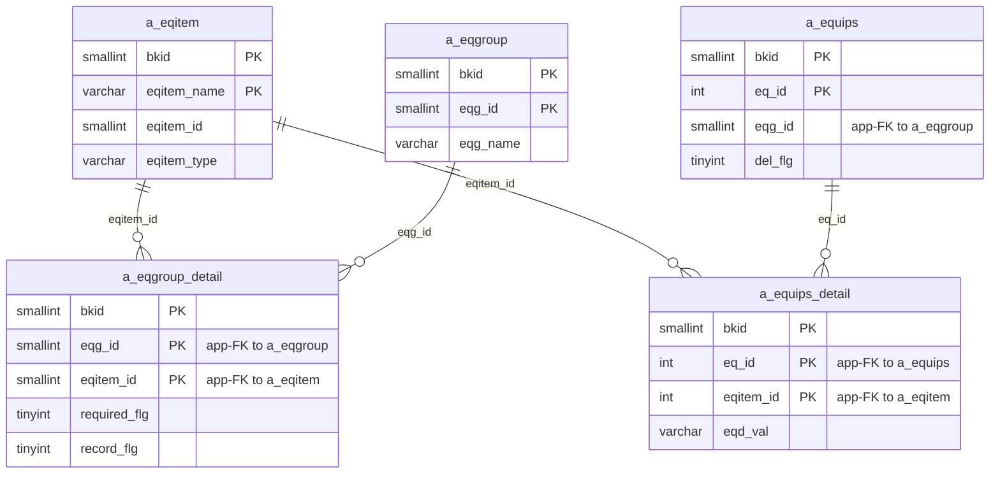
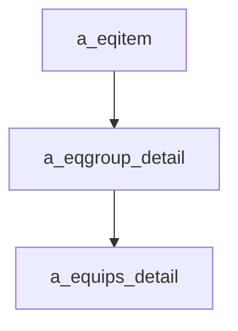

---
aliases:
  - /{tenant}/eqitem.php
tags:
  - ppes
  - vi
  - admin
  - eqitem
---

# Master hạng mục thiết bị

## Thuật ngữ chính

- `設備項目 (hạng mục thiết bị)`
- `required_flg (cờ bắt buộc)`
- `record_flg (cờ ghi lịch sử)`

## Tóm tắt

`/{tenant}/eqitem.php` quản lý definition của từng field thiết bị trong `a_eqitem`.

- có API để bật/tắt `required_flg` và `record_flg` trong `a_eqgroup_detail`
- delete item sẽ cleanup dữ liệu cũ trong `a_equips_detail` và `a_equips.details`

## Bảng chính

- `a_eqitem`
- `a_eqgroup_detail`
- `a_equips_detail`
- `a_equips`

## Mermaid ER

> **Ghi chú**: Database không có FK constraint. Tất cả quan hệ đều ở tầng application.

## Mermaid

## Import / Export

Trang này **không** có chức năng import hoặc export. Dữ liệu hạng mục thiết bị được import/export thông qua [[Master nhóm thiết bị]] (`eqgroup.php`).

## Xem thêm

- [[Equipment item master]]
- [[Master nhóm thiết bị]]

---

## Phụ lục: giải thích tên bảng

> Schema đầy đủ (cột, kiểu dữ liệu, mục đích từng cột) cho tất cả bảng liệt kê ở đây xem tại [[Bảng từ điển]].

### Mô hình hạng mục thiết bị (sở hữu bởi trang này)

| Bảng | Vai trò |
| --- | --- |
| **[[Bảng từ điển#a_eqitem\|a_eqitem]]** | Định nghĩa hạng mục thiết bị. Bảng chính của trang này. Mỗi row là một field definition theo tenant. Lưu tên field (`eqitem_name`), kiểu (`eqitem_type` — text, number, date, select, v.v.), và giá trị dropdown (`select_item`). |
| **[[Bảng từ điển#a_eqgroup_detail\|a_eqgroup_detail]]** | Bảng nối nhóm → hạng mục. Trang này có thể bật/tắt `required_flg` và `record_flg` cho mỗi hạng mục qua API, nhưng membership nhóm chủ yếu được quản lý bởi [[Master nhóm thiết bị]]. |

### Dữ liệu downstream (cleanup khi xóa)

| Bảng | Vai trò |
| --- | --- |
| **[[Bảng từ điển#a_equips_detail\|a_equips_detail]]** | Giá trị hạng mục theo thiết bị. Lưu giá trị field thực tế cho mỗi thiết bị. Khi xóa hạng mục trên trang này, tất cả row `a_equips_detail` có `eqitem_id` tương ứng đều bị cleanup. |
| **[[Bảng từ điển#a_equips\|a_equips]]** | Master thiết bị. Cột blob `details` có thể chứa dữ liệu hạng mục serialised; cleanup khi xóa cũng patch cột này. |
| **[[Bảng từ điển#a_eqgroup\|a_eqgroup]]** | Master nhóm thiết bị. Parent của `a_eqgroup_detail`. Đọc để hiển thị hạng mục thuộc nhóm nào. |

### Tra cứu hỗ trợ

| Bảng | Vai trò |
| --- | --- |
| **[[Bảng từ điển#a_line\|a_line]]** | Master dây chuyền. Đọc cho context UI ở một số view. |
| **[[Bảng từ điển#a_maker\|a_maker]]** | Master maker. Một số kiểu hạng mục dùng giá trị maker làm nguồn lựa chọn ở tầng application. |
| **[[Bảng từ điển#datamaster\|datamaster]]** | Master giá trị dropdown tổng quát. Dùng cho resolve tiêu đề cột và nhãn. |

### Auth / session context

| Bảng | Vai trò |
| --- | --- |
| **[[Bảng từ điển#buscomps\|buscomps]]** | Registry tenant (`zaikodb`). Được đọc khi đăng nhập để xác định công ty tenant và kiểm tra feature flag. |
| **[[Bảng từ điển#bk_staff\|bk_staff]]** | Tài khoản nhân viên theo tenant. Được `openUser()` kiểm tra để xác thực session cookie và resolve `bkid` + `stf_id`. |
| **[[Bảng từ điển#bkmasters\|bkmasters]]** | Cấu hình tenant. Mỗi row ứng với một `bkid`; lưu tên công ty, cài đặt giờ làm việc, tùy chọn hiển thị, và config cấp tenant dùng trên tất cả các trang. |
| **[[Bảng từ điển#a_auths\|a_auths]]** | Nhóm quyền tính năng. `setAuth($db, $request, $authId)` đọc bảng này để xác định người dùng hiện tại có thể xem hay chỉnh sửa gì trên trang. |
