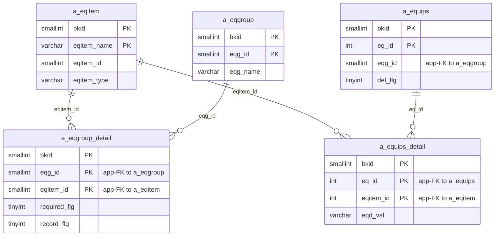
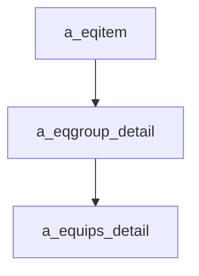

---
aliases:
  - /{tenant}/eqitem.php (VI)
tags:
  - ppes
  - vi
  - admin
  - eqitem
---

# Master hạng mục thiết bị

## Thuật ngữ chính

- `設備項目 (hạng mục thiết bị)`
- `required_flg (cờ bắt buộc)`
- `record_flg (cờ ghi lịch sử)`

## Tóm tắt

`/{tenant}/eqitem.php` quản lý definition của từng field thiết bị trong `a_eqitem`.

- có API để bật/tắt `required_flg` và `record_flg` trong `a_eqgroup_detail`
- delete item sẽ cleanup dữ liệu cũ trong `a_equips_detail` và `a_equips.details`

## Bảng chính

- `a_eqitem`
- `a_eqgroup_detail`
- `a_equips_detail`
- `a_equips`

## Mermaid ER

> **Ghi chú**: Database không có FK constraint. Tất cả quan hệ đều ở tầng application.

## Mermaid

## Xem thêm

- [[Equipment item master]]
- [[Master nhóm thiết bị]]
