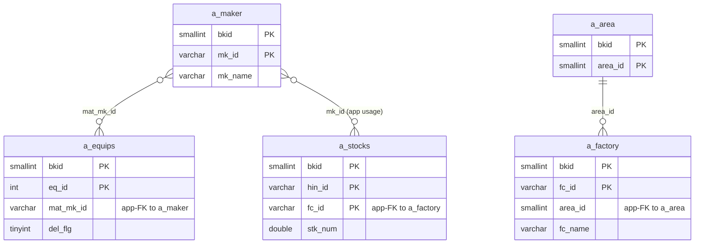
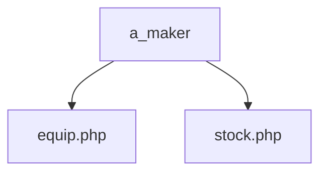

---
aliases:
  - /{tenant}/maker.php
tags:
  - ppes
  - vi
  - admin
  - maker
---

# Master maker

## Thuật ngữ chính

- `メーカー (hãng / maker)`
- `仕入先 (nhà cung cấp)`

## Tóm tắt

`/{tenant}/maker.php` quản lý `a_maker`.

- được dùng lại trong `equip.php`
- được dùng lại trong `stock.php`
- hỗ trợ import/export/order

## Bảng chính

- `a_maker`
- `a_area`
- `a_factory`

## Mermaid ER

> **Ghi chú**: Database không có FK constraint. Tất cả quan hệ đều ở tầng application.

## Mermaid

## Import / Export

> Chi tiết kiến trúc đầy đủ xem tại [[Kiến trúc Import-Export]].

| Hướng | Định dạng | File template | Tên file xuất |
|-------|-----------|--------------|---------------|
| **Export** | Excel (.xlsx) | `M_MAKER.xlsx` | `maker-{ymdhi}.xlsx` |
| **Import** | Excel → CSV | *(không có template — chấp nhận mọi .xlsx/.csv)* | temp: `{bkid}-maker.csv` |

- Export tải `htdocs/base/M_MAKER.xlsx` (hoặc `htdocs/sys/M_MAKER.xlsx` cho module sys) làm template, điền dữ liệu, và stream ra browser.
- Import chấp nhận file Excel, chuyển đổi sang CSV qua `Excel::convToCsv()`, rồi parse hàng bằng `fgetcsv()` và upsert vào `a_maker`.
- Validate trước: kiểm tra trùng `mk_id` và `mk_name`.

## Xem thêm

- [[Maker master]]

---

## Phụ lục: giải thích tên bảng

> Schema đầy đủ (cột, kiểu dữ liệu, mục đích từng cột) cho tất cả bảng liệt kê ở đây xem tại [[Bảng từ điển]].

### Danh mục maker

| Bảng | Vai trò |
| --- | --- |
| **[[Bảng từ điển#a_maker\|a_maker]]** | Master hãng / nhà cung cấp. Mỗi row là một maker theo tenant. Được dùng lại làm nguồn dropdown ở form thiết bị (`mat_mk_id`) và form tồn kho (chọn nhà cung cấp). Khóa bởi `mk_id`; hỗ trợ sắp xếp hiển thị qua `disporder`. |

### Phân cấp địa điểm / tổ chức

| Bảng | Vai trò |
| --- | --- |
| **[[Bảng từ điển#a_area\|a_area]]** | Master khu vực. Nhóm địa lý cấp cao nhất, nằm trên nhà máy. Dùng cho dropdown lọc khu vực trên UI. |
| **[[Bảng từ điển#a_factory\|a_factory]]** | Master nhà máy. Nhóm địa điểm cấp cao nhất. Dùng cho dropdown lọc nhà máy trên UI. |

### Hỗ trợ nhãn UI

| Bảng | Vai trò |
| --- | --- |
| **[[Bảng từ điển#datamaster\|datamaster]]** | Master giá trị dropdown tổng quát. Lưu danh sách tên item theo `propid` với nhãn bốn ngôn ngữ. Dùng trên `maker.php` để resolve tiêu đề cột và nhãn. |

### Auth / session context

| Bảng | Vai trò |
| --- | --- |
| **[[Bảng từ điển#buscomps\|buscomps]]** | Registry tenant (`zaikodb`). Được đọc khi đăng nhập để xác định công ty tenant và kiểm tra feature flag. |
| **[[Bảng từ điển#bk_staff\|bk_staff]]** | Tài khoản nhân viên theo tenant. Được `openUser()` kiểm tra để xác thực session cookie và resolve `bkid` + `stf_id`. |
| **[[Bảng từ điển#bkmasters\|bkmasters]]** | Cấu hình tenant. Mỗi row ứng với một `bkid`; lưu tên công ty, cài đặt giờ làm việc, tùy chọn hiển thị, và config cấp tenant dùng trên tất cả các trang. |
| **[[Bảng từ điển#a_auths\|a_auths]]** | Nhóm quyền tính năng. `setAuth($db, $request, $authId)` đọc bảng này để xác định người dùng hiện tại có thể xem hay chỉnh sửa gì trên trang. |
