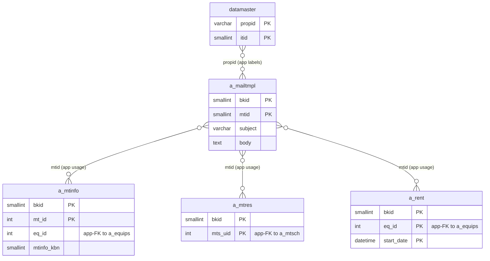
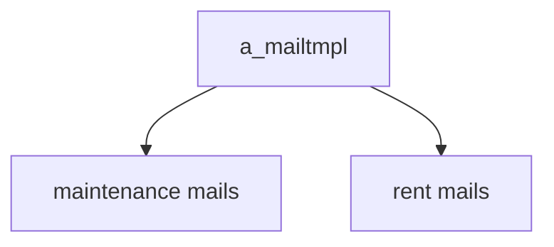

---
aliases:
  - /{tenant}/mailtmpl.php
tags:
  - ppes
  - vi
  - admin
  - mail
---

# Master mẫu email

## Thuật ngữ chính

- `メールテンプレート (mẫu email)`
- `置換タグ (thẻ thay thế)`

## Tóm tắt

`/{tenant}/mailtmpl.php` quản lý `a_mailtmpl`.

- controller này không gửi mail trực tiếp
- nhưng thay đổi ở đây ảnh hưởng tới maintenance flow và rent flow

## Bảng chính

- `a_mailtmpl`
- `datamaster`

## Mermaid ER

> **Ghi chú**: Database không có FK constraint. Tất cả quan hệ đều ở tầng application.

Ghi chú suy luận:

- các quan hệ với `a_mtinfo`, `a_mtres`, `a_rent` là quan hệ usage ở tầng application, vì flow mail load template theo `mtid`.

## Mermaid

## Xem thêm

- [[Mail template master]]
- [[Đặt lịch bảo trì]]
- [[Công việc bảo trì]]

---

## Phụ lục: giải thích tên bảng

> Schema đầy đủ (cột, kiểu dữ liệu, mục đích từng cột) cho tất cả bảng liệt kê ở đây xem tại [[Bảng từ điển]].

### Mẫu email (sở hữu bởi trang này)

| Bảng | Vai trò |
| --- | --- |
| **[[Bảng từ điển#a_mailtmpl\|a_mailtmpl]]** | Master mẫu email. Bảng chính của trang này. Mỗi row là một template theo tenant. Lưu tiêu đề (`subject`), nội dung (`body`) với tag thay thế, và loại template (`mtype`). Khóa bởi `mtid` — các ID cụ thể được dùng bởi luồng mail bảo trì và mượn trả. |

### Consumer downstream (context chỉ đọc)

| Bảng | Vai trò |
| --- | --- |
| **[[Bảng từ điển#a_mtinfo\|a_mtinfo]]** | Kế hoạch bảo trì. Không đọc trực tiếp bởi trang này, nhưng luồng bảo trì load template theo `mtid` khi gửi mail nhắc. |
| **[[Bảng từ điển#a_mtres\|a_mtres]]** | Kết quả bảo trì. Không đọc trực tiếp, nhưng luồng kết quả load template khi gửi thông báo hoàn thành. |
| **[[Bảng từ điển#a_rent\|a_rent]]** | Bản ghi mượn trả. Không đọc trực tiếp, nhưng luồng mượn trả load template cho nhắc trả. |

### Tra cứu hỗ trợ

| Bảng | Vai trò |
| --- | --- |
| **[[Bảng từ điển#datamaster\|datamaster]]** | Master giá trị dropdown tổng quát. Dùng cho resolve nhãn trên form edit template. |

### Auth / session context

| Bảng | Vai trò |
| --- | --- |
| **[[Bảng từ điển#buscomps\|buscomps]]** | Registry tenant (`zaikodb`). Được đọc khi đăng nhập để xác định công ty tenant và kiểm tra feature flag. |
| **[[Bảng từ điển#bk_staff\|bk_staff]]** | Tài khoản nhân viên theo tenant. Được `openUser()` kiểm tra để xác thực session cookie và resolve `bkid` + `stf_id`. |
| **[[Bảng từ điển#bkmasters\|bkmasters]]** | Cấu hình tenant. Mỗi row ứng với một `bkid`; lưu tên công ty, `mng_mail` (email quản lý cho dispatch mail), và config cấp tenant khác. |
| **[[Bảng từ điển#a_auths\|a_auths]]** | Nhóm quyền tính năng. `setAuth($db, $request, $authId)` đọc bảng này để xác định người dùng hiện tại có thể xem hay chỉnh sửa gì trên trang. |
