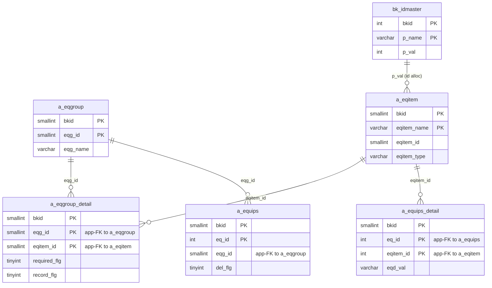
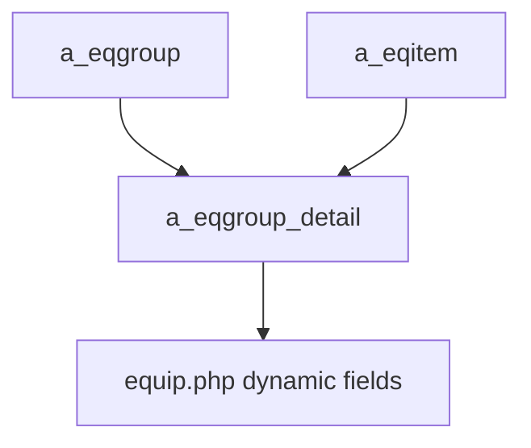

---
aliases:
  - /{tenant}/eqgroup.php
tags:
  - ppes
  - vi
  - admin
  - eqgroup
---

# Master nhóm thiết bị

## Thuật ngữ chính

- `設備グループ (nhóm thiết bị)`
- `必須 (bắt buộc)`
- `履歴記録 (ghi lịch sử)`

## Tóm tắt

`/{tenant}/eqgroup.php` không chỉ quản lý `a_eqgroup`.

- upload còn sync `a_eqitem`
- và mapping `a_eqgroup_detail`
- vì vậy trang này quyết định field nào sẽ xuất hiện trên form thiết bị

## Bảng chính

- `a_eqgroup`
- `a_eqgroup_detail`
- `a_eqitem`
- `bk_idmaster`

## Mermaid ER

> **Ghi chú**: Database không có FK constraint. Tất cả quan hệ đều ở tầng application.

## Mermaid

## Xem thêm

- [[Equipment group master]]
- [[Master hạng mục thiết bị]]
