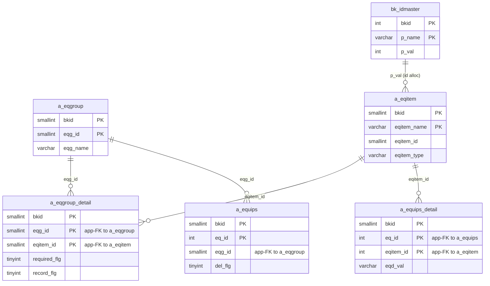
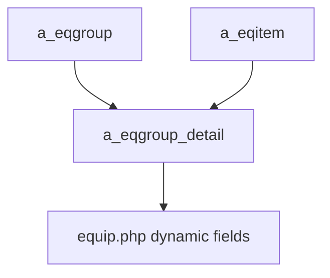

---
aliases:
  - /{tenant}/eqgroup.php
tags:
  - ppes
  - vi
  - admin
  - eqgroup
---

# Master nhóm thiết bị

## Thuật ngữ chính

- `設備グループ (nhóm thiết bị)`
- `必須 (bắt buộc)`
- `履歴記録 (ghi lịch sử)`

## Tóm tắt

`/{tenant}/eqgroup.php` không chỉ quản lý `a_eqgroup`.

- upload còn sync `a_eqitem`
- và mapping `a_eqgroup_detail`
- vì vậy trang này quyết định field nào sẽ xuất hiện trên form thiết bị

## Bảng chính

- `a_eqgroup`
- `a_eqgroup_detail`
- `a_eqitem`
- `bk_idmaster`

## Mermaid ER

> **Ghi chú**: Database không có FK constraint. Tất cả quan hệ đều ở tầng application.

## Mermaid

## Import / Export

> Chi tiết kiến trúc đầy đủ xem tại [[Kiến trúc Import-Export]].

| Hướng | Định dạng | File template | Tên file xuất |
|-------|-----------|--------------|---------------|
| **Export** | Excel (.xlsx) | `M_EQGROUP.xlsx` | `eqgroup-{ymdhi}.xlsx` |
| **Import** | Excel → CSV | *(không có template — chấp nhận mọi .xlsx/.csv)* | temp: `{bkid}-eqgroup.csv` |

- Export tải `htdocs/base/M_EQGROUP.xlsx` (hoặc `htdocs/sys/M_EQGROUP.xlsx` cho module sys) làm template, điền dữ liệu, và stream ra browser.
- Import chấp nhận file Excel, chuyển đổi sang CSV qua `Excel::convToCsv()`, rồi parse hàng bằng `fgetcsv()` và upsert vào `a_eqgroup`, `a_eqitem`, và `a_eqgroup_detail`.
- Upload có thể tăng serial `bk_idmaster` cho record `a_eqitem` mới.

## Xem thêm

- [[Equipment group master]]
- [[Master hạng mục thiết bị]]

---

## Phụ lục: giải thích tên bảng

> Schema đầy đủ (cột, kiểu dữ liệu, mục đích từng cột) cho tất cả bảng liệt kê ở đây xem tại [[Bảng từ điển]].

### Mô hình nhóm thiết bị (sở hữu bởi trang này)

| Bảng | Vai trò |
| --- | --- |
| **[[Bảng từ điển#a_eqgroup\|a_eqgroup]]** | Master nhóm thiết bị. Mỗi row là một nhóm theo tenant. Định nghĩa nhóm thiết bị được đặt tên (ví dụ "Máy ép phun", "CNC Mill"). Khóa bởi `eqg_id`. List, edit, import/export đều nhắm vào bảng này. |
| **[[Bảng từ điển#a_eqgroup_detail\|a_eqgroup_detail]]** | Bảng nối nhóm → hạng mục. Liên kết `eqg_id` với `eqitem_id`. Quyết định field nào xuất hiện trên form thiết bị, cùng `required_flg` và `record_flg` (theo dõi lịch sử) cho mỗi field. Được rebuild khi import. |
| **[[Bảng từ điển#a_eqitem\|a_eqitem]]** | Định nghĩa hạng mục thiết bị. Mỗi row là một field definition. Lưu tên field, kiểu (`eqitem_type`), và giá trị dropdown (`select_item`). Import trên trang này có thể tạo row `a_eqitem` mới và tăng serial trong `bk_idmaster`. |

### Cấp phát ID

| Bảng | Vai trò |
| --- | --- |
| **[[Bảng từ điển#bk_idmaster\|bk_idmaster]]** | Bộ cấp phát serial ở tầng application. Lưu giá trị `eqitem_id` tiếp theo cho mỗi tenant. Tăng lên khi import tạo hạng mục thiết bị mới. |

### Phân cấp địa điểm / tổ chức

| Bảng | Vai trò |
| --- | --- |
| **[[Bảng từ điển#a_area\|a_area]]** | Master khu vực. Dùng cho dropdown lọc khu vực trên UI. |
| **[[Bảng từ điển#a_factory\|a_factory]]** | Master nhà máy. Dùng cho dropdown lọc nhà máy trên UI. |

### Hỗ trợ nhãn UI

| Bảng | Vai trò |
| --- | --- |
| **[[Bảng từ điển#datamaster\|datamaster]]** | Master giá trị dropdown tổng quát. Dùng cho resolve tiêu đề cột và nhãn. |

### Auth / session context

| Bảng | Vai trò |
| --- | --- |
| **[[Bảng từ điển#buscomps\|buscomps]]** | Registry tenant (`zaikodb`). Được đọc khi đăng nhập để xác định công ty tenant và kiểm tra feature flag. |
| **[[Bảng từ điển#bk_staff\|bk_staff]]** | Tài khoản nhân viên theo tenant. Được `openUser()` kiểm tra để xác thực session cookie và resolve `bkid` + `stf_id`. |
| **[[Bảng từ điển#bkmasters\|bkmasters]]** | Cấu hình tenant. Mỗi row ứng với một `bkid`; lưu tên công ty, cài đặt giờ làm việc, tùy chọn hiển thị, và config cấp tenant dùng trên tất cả các trang. |
| **[[Bảng từ điển#a_auths\|a_auths]]** | Nhóm quyền tính năng. `setAuth($db, $request, $authId)` đọc bảng này để xác định người dùng hiện tại có thể xem hay chỉnh sửa gì trên trang. |
