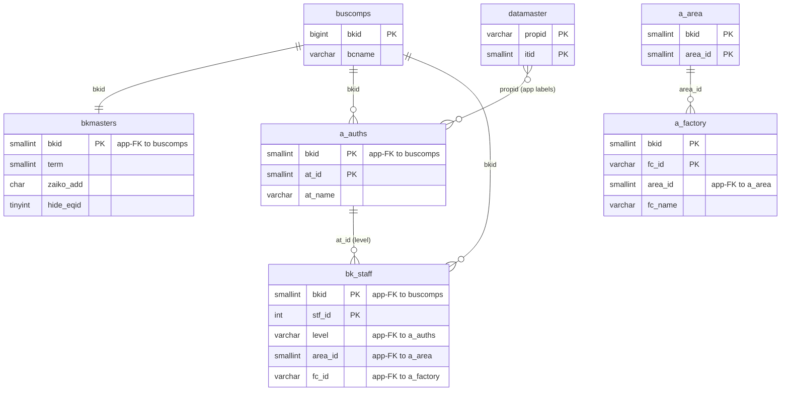
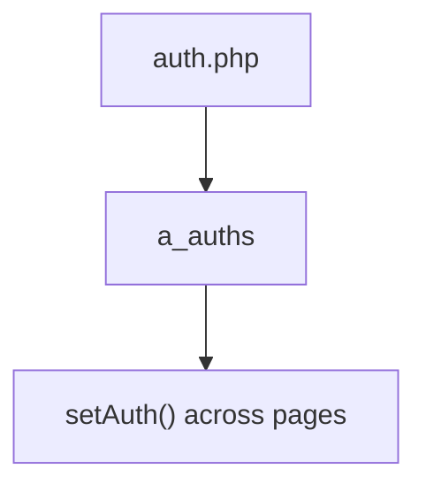

---
aliases:
  - /{tenant}/auth.php
tags:
  - vi
  - admin
  - auth
---

# Phân quyền master

## Thuật ngữ chính

- `権限 (phân quyền)`
- `マスタ管理 (quản lý master)`

## Tóm tắt

`/{tenant}/auth.php` quản lý `a_auths`.

- upload/import là nhánh ghi dữ liệu thực sự quan trọng
- list/download đang hoạt động
- manual edit có dấu hiệu stale hoặc copy-paste lỗi

## Bảng chính

- `a_auths`
- `datamaster`
- `a_area`
- `a_factory`
- `buscomps`
- `bk_staff`
- `bkmasters`

## Mermaid ER

> **Ghi chú**: Database không có FK constraint. Tất cả quan hệ đều ở tầng application.

## Mermaid

## Import / Export

> Chi tiết kiến trúc đầy đủ xem tại [[Kiến trúc Import-Export]].

| Hướng | Định dạng | File template | Tên file xuất |
|-------|-----------|--------------|---------------|
| **Export** | Excel (.xlsx) | `M_PERMIT.xlsx` | `auth-{ymdhi}.xlsx` |
| **Import** | Excel → CSV | *(không có template — chấp nhận mọi .xlsx/.csv)* | temp: `{bkid}-auth.csv` |

- Export tải `htdocs/base/M_PERMIT.xlsx` (hoặc `htdocs/sys/M_PERMIT.xlsx` cho module sys) làm template, điền dữ liệu, và stream ra browser.
- Import chấp nhận file Excel, chuyển đổi sang CSV qua `Excel::convToCsv()`, rồi parse hàng bằng `fgetcsv()` và upsert vào `a_auths`.

## Xem thêm

- [[Authorization master]]
- [[Quản lý nhân sự]]

---

## Phụ lục: giải thích tên bảng

> Schema đầy đủ (cột, kiểu dữ liệu, mục đích từng cột) cho tất cả bảng liệt kê ở đây xem tại [[Bảng từ điển]].

### Danh mục quyền

| Bảng | Vai trò |
| --- | --- |
| **[[Bảng từ điển#a_auths\|a_auths]]** | Nhóm quyền tính năng. Mỗi row là một nhóm quyền của một tenant. `aspUser->setAuth()` đọc bảng này để xác định người dùng hiện tại có thể xem hoặc chỉnh sửa gì. Mỗi cờ `at_N` ánh xạ đến một tính năng cụ thể. |

### Phân cấp địa điểm / tổ chức

| Bảng | Vai trò |
| --- | --- |
| **[[Bảng từ điển#a_area\|a_area]]** | Master khu vực. Nhóm địa lý cấp cao nhất, nằm trên nhà máy. Được dùng trong UI trang như một lookup hỗ trợ — không phải parent cấu trúc trực tiếp của `a_auths` trong mô hình DB. |
| **[[Bảng từ điển#a_factory\|a_factory]]** | Master nhà máy. Nhóm địa điểm cấp cao nhất. Được dùng trong UI trang cho lookup phân công nhân viên theo nhà máy. |

### Hỗ trợ hiển thị

| Bảng | Vai trò |
| --- | --- |
| **[[Bảng từ điển#datamaster\|datamaster]]** | Master giá trị dropdown tổng quát. Lưu danh sách tên item theo `propid` với nhãn bốn ngôn ngữ. Được dùng trên `auth.php` để resolve nhãn nhóm quyền. |

### Auth / session context

| Bảng | Vai trò |
| --- | --- |
| **[[Bảng từ điển#buscomps\|buscomps]]** | Registry tenant (`zaikodb`). Được đọc khi đăng nhập để xác định công ty tenant và kiểm tra feature flag. |
| **[[Bảng từ điển#bk_staff\|bk_staff]]** | Tài khoản nhân viên theo tenant. Được `openUser()` kiểm tra để xác thực session cookie và resolve `bkid` + `stf_id`. |
| **[[Bảng từ điển#bkmasters\|bkmasters]]** | Cấu hình tenant. Mỗi row ứng với một `bkid`; lưu tên công ty, cài đặt giờ làm việc, tùy chọn hiển thị, và config cấp tenant dùng trên tất cả các trang. |
