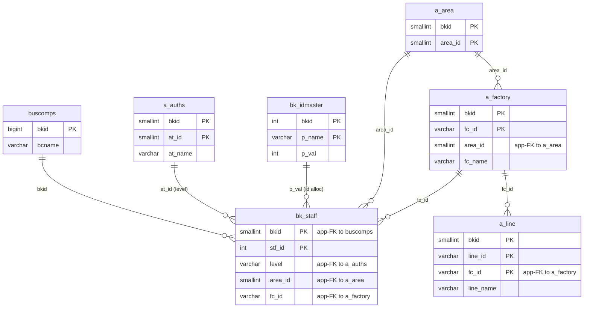
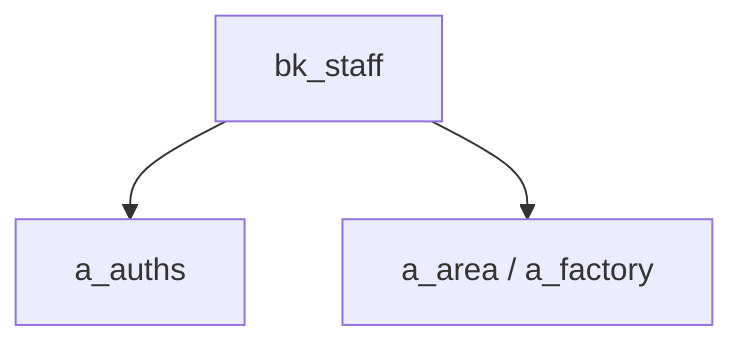

---
aliases:
  - /{tenant}/staff.php
tags:
  - ppes
  - vi
  - admin
  - staff
---

# Quản lý nhân sự

## Thuật ngữ chính

- `ユーザ管理 (quản lý người dùng)`
- `担当者 (người phụ trách)`

## Tóm tắt

`/{tenant}/staff.php` quản lý `bk_staff`.

- dùng `a_auths` để gán level quyền
- dùng area/factory để scope người dùng
- hỗ trợ import
- có rule: luôn phải còn ít nhất một admin active

## Bảng chính

- `bk_staff`
- `bk_idmaster`
- `a_auths`
- `a_area`
- `a_factory`
- `a_line`

## Mermaid ER

> **Ghi chú**: Database không có FK constraint. Tất cả quan hệ đều ở tầng application.

## Mermaid

## Import / Export

> Chi tiết kiến trúc đầy đủ xem tại [[Kiến trúc Import-Export]].

| Hướng | Định dạng | File template | Tên file xuất |
|-------|-----------|--------------|---------------|
| **Export** | CSV | *(không có template)* | `staff-{ymdhi}.csv` |
| **Import** | Excel → CSV | *(không có template — chấp nhận mọi .xlsx/.csv)* | temp: `{bkid}-staff.csv` |

- Export stream CSV trực tiếp ra browser qua `printdownLoadHeader()` — không dùng template Excel.
- Import chấp nhận file Excel, chuyển đổi sang CSV qua `Excel::convToCsv()`, rồi parse hàng bằng `fgetcsv()` và upsert vào `bk_staff`.
- Validate trước: kiểm tra trùng email, đảm bảo luôn còn ít nhất một admin.

## Xem thêm

- [[Staff management]]

---

## Phụ lục: giải thích tên bảng

> Schema đầy đủ (cột, kiểu dữ liệu, mục đích từng cột) cho tất cả bảng liệt kê ở đây xem tại [[Bảng từ điển]].

### Tài khoản nhân viên

| Bảng | Vai trò |
| --- | --- |
| **[[Bảng từ điển#bk_staff\|bk_staff]]** | Tài khoản nhân viên theo tenant. Bảng chính của trang này. Mỗi row là một user theo tenant. Lưu thông tin đăng nhập, email, level quyền (`level` → app-FK tới `a_auths`), phân công area/factory, và cờ xóa mềm (`bs_delete`). Import/export và sửa thủ công đều nhắm vào bảng này. |

### Cấp phát ID

| Bảng | Vai trò |
| --- | --- |
| **[[Bảng từ điển#bk_idmaster\|bk_idmaster]]** | Bộ cấp phát serial ở tầng application. Lưu giá trị `stf_id` tiếp theo cho mỗi tenant. Tăng lên khi tạo staff record mới. |

### Tra cứu quyền

| Bảng | Vai trò |
| --- | --- |
| **[[Bảng từ điển#a_auths\|a_auths]]** | Nhóm quyền tính năng. Dùng trên form nhân sự làm dropdown cho các level quyền có thể gán. `bk_staff.level` resolve với `a_auths.at_id` ở tầng application. |

### Phân cấp địa điểm / tổ chức

| Bảng | Vai trò |
| --- | --- |
| **[[Bảng từ điển#a_area\|a_area]]** | Master khu vực. Nhóm địa lý cấp cao nhất. Dùng cho dropdown phân công khu vực trên form nhân sự. |
| **[[Bảng từ điển#a_factory\|a_factory]]** | Master nhà máy. Nhóm địa điểm cấp cao nhất. Dùng cho dropdown phân công nhà máy trên form nhân sự. |
| **[[Bảng từ điển#a_line\|a_line]]** | Master dây chuyền. Địa điểm con trong nhà máy. Dùng khi hiển thị phân công nhân viên trong context. |

### Hỗ trợ nhãn UI

| Bảng | Vai trò |
| --- | --- |
| **[[Bảng từ điển#datamaster\|datamaster]]** | Master giá trị dropdown tổng quát. Lưu danh sách tên item theo `propid` với nhãn bốn ngôn ngữ. Dùng cho tiêu đề cột và resolve nhãn trên form nhân sự. |

### Auth / session context

| Bảng | Vai trò |
| --- | --- |
| **[[Bảng từ điển#buscomps\|buscomps]]** | Registry tenant (`zaikodb`). Được đọc khi đăng nhập để xác định công ty tenant và kiểm tra feature flag. |
| **[[Bảng từ điển#bkmasters\|bkmasters]]** | Cấu hình tenant. Mỗi row ứng với một `bkid`; lưu tên công ty, cài đặt giờ làm việc, tùy chọn hiển thị, và config cấp tenant dùng trên tất cả các trang. |
