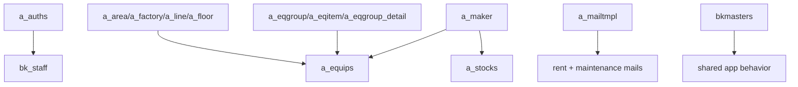

---
tags:
  - ppes
  - vi
  - admin
  - menu
---

# Quản trị index

## Notes

- [[Thông báo nội bộ]]
- [[Phân quyền master]]
- [[Quản lý nhân sự]]
- [[Master cơ sở và vị trí]]
- [[Master nhóm thiết bị]]
- [[Master hạng mục thiết bị]]
- [[Master maker]]
- [[Master mẫu email]]
- [[Trang cấu hình]]
- [[Từ vựng chuyên ngành JA-VI]]

## Kiến trúc xuyên suốt

- [[Kiến trúc Import-Export]] — pattern import/export chung được dùng bởi tất cả trang master ở trên

## Mermaid

