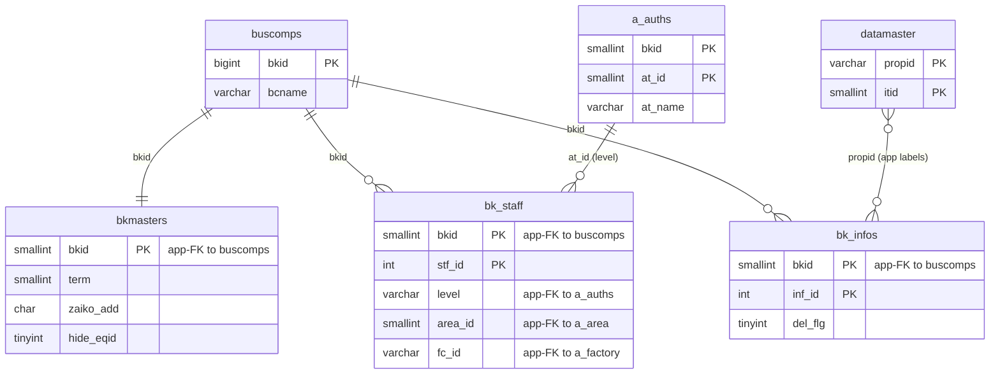
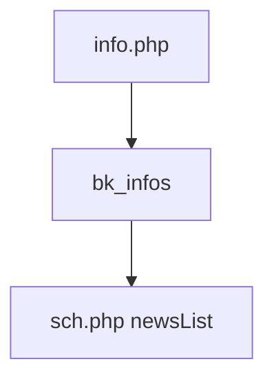

---
aliases:
  - /{tenant}/info.php
tags:
  - ppes
  - vi
  - admin
  - info
---

# Thông báo nội bộ

## Thuật ngữ chính

- `基本情報 (thông tin cơ bản)`
- `お知らせ / 情報 (thông báo / thông tin)`

## Tóm tắt

`/{tenant}/info.php` là CRUD cho thông báo tenant trong `bk_infos`.

- list / edit / confirm / save / soft-delete
- dữ liệu này được hiển thị lại ở trang lịch như news/info

## Bảng chính

- `bk_infos`
- `datamaster`
- `buscomps`
- `bk_staff`
- `bkmasters`
- `a_auths`

## Mermaid ER

> **Ghi chú**: Database không có FK constraint. Tất cả quan hệ đều ở tầng application.

## Mermaid

## Xem thêm

- [[Info announcements]]

---

## Phụ lục: giải thích tên bảng

> Schema đầy đủ (cột, kiểu dữ liệu, mục đích từng cột) cho tất cả bảng liệt kê ở đây xem tại [[Bảng từ điển]].

### Dữ liệu thông báo (sở hữu bởi trang này)

| Bảng | Vai trò |
| --- | --- |
| **[[Bảng từ điển#bk_infos\|bk_infos]]** | Thông báo theo tenant. Bảng chính của trang này. Mỗi row là một thông báo theo tenant. Lưu tiêu đề (`inf_title`), nội dung (`inf_conts`), và cờ xóa mềm (`del_flg`). Nội dung tạo ở đây được hiển thị trong widget news/info trên [[Lịch bảo trì]]. |

### Tra cứu hỗ trợ

| Bảng | Vai trò |
| --- | --- |
| **[[Bảng từ điển#datamaster\|datamaster]]** | Master giá trị dropdown tổng quát. Dùng cho resolve nhãn trên form thông báo. |

### Auth / session context

| Bảng | Vai trò |
| --- | --- |
| **[[Bảng từ điển#buscomps\|buscomps]]** | Registry tenant (`zaikodb`). Được đọc khi đăng nhập để xác định công ty tenant và kiểm tra feature flag. |
| **[[Bảng từ điển#bk_staff\|bk_staff]]** | Tài khoản nhân viên theo tenant. Được `openUser()` kiểm tra để xác thực session cookie và resolve `bkid` + `stf_id`. |
| **[[Bảng từ điển#bkmasters\|bkmasters]]** | Cấu hình tenant. Mỗi row ứng với một `bkid`; lưu tên công ty, cài đặt giờ làm việc, tùy chọn hiển thị, và config cấp tenant khác. |
| **[[Bảng từ điển#a_auths\|a_auths]]** | Nhóm quyền tính năng. `setAuth($db, $request, 1)` xác định quyền list/edit thông báo. |
