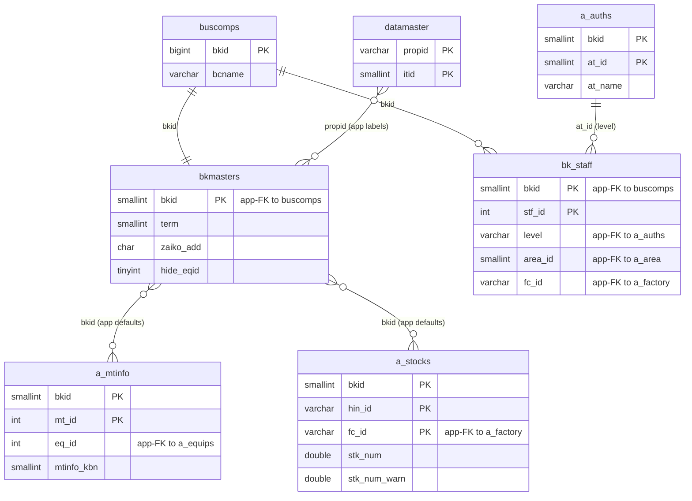
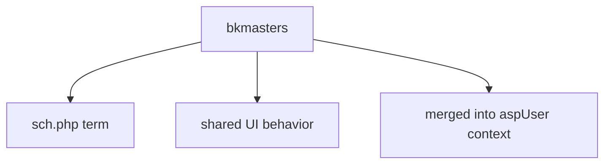

---
aliases:
  - /{tenant}/config.php
tags:
  - ppes
  - vi
  - admin
  - config
---

# Trang cấu hình

## Thuật ngữ chính

- `基本設定 (cấu hình cơ bản)`
- `期間 (khoảng thời gian)`

## Tóm tắt

`/{tenant}/config.php` chỉnh một record cấu hình dùng chung trong `bkmasters`.

- ảnh hưởng tới term mặc định của lịch
- ảnh hưởng tới một số behavior giao diện chung
- không có list page thực sự, gần giống một form cấu hình

## Bảng chính

- `bkmasters`
- `buscomps`
- `bk_staff`
- `a_auths`
- `datamaster`

## Mermaid ER

> **Ghi chú**: Database không có FK constraint. Tất cả quan hệ đều ở tầng application.

Ghi chú suy luận:

- `bkmasters` ảnh hưởng tới behavior của nhiều trang qua application context, không phải do foreign key trực tiếp.

## Mermaid

## Xem thêm

- [[Configuration page]]
- [[Lịch bảo trì]]
