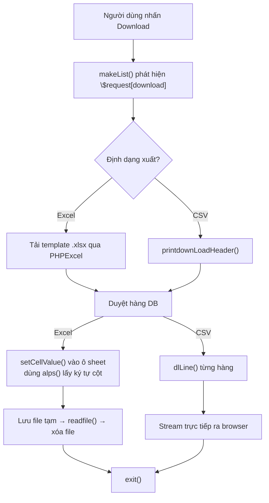
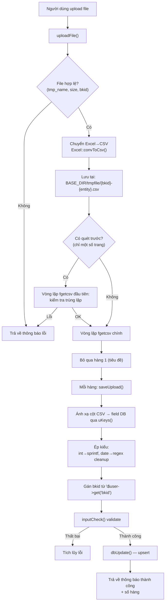

---
aliases:
  - kiến trúc import export
  - upload download pattern
tags:
  - ppes
  - vi
  - architecture
  - import
  - export
---

# Kiến trúc Import-Export

Xem thêm:

- [[Import-Export architecture]]
- [[Quản trị index]]
- [[Kiến trúc đa tenant]]

## Tổng quan

Hầu hết tất cả các trang quản lý master và danh sách dữ liệu trong hệ thống đều chia sẻ **một kiến trúc chung** cho việc nhập dữ liệu từ file Excel/CSV và xuất dữ liệu ra file Excel/CSV. Tài liệu này mô tả pattern chung đó, liệt kê tất cả các trang sử dụng nó, và ghi chú những chỗ khác biệt.

**Không có class cơ sở chung** — mỗi file PHP tự cài đặt lại cùng các hàm với các hằng số riêng cho từng thực thể (entity). Pattern là ngầm định, không tường minh — về cơ bản là copy-paste.

## Bộ khung trang chung

Mỗi trang import/export đều có cấu trúc `#main` block giống nhau:

```
#main {
  1. Khởi tạo ──── require env.php, Browser, TakeDbTest, aspUser, PHPExcel, Excel
  2. Xác thực ──── openUser() → gotoLogin() nếu thất bại
  3. Phân quyền ── setAuth($db, $_REQUEST, $authId)
  4. Điều hướng theo $_REQUEST:
     ├── $_REQUEST[upload]   → uploadFile(...)
     ├── $_REQUEST[edit]     → luồng chỉnh sửa
     │     ├── inputCheck() → saveData() → makeEdit()
     │     └── template = "*_edit.tmpl"
     ├── $_REQUEST[download] → xử lý bên trong makeList()
     └── else               → makeList(...)
  5. Hậu xử lý ── if download → exit; if save_order → redirect
  6. Gán biến ──── request, title, prop
  7. Render ────── printHeader() → dispPage($template)
}
```

## 6 hàm cốt lõi

Mỗi trang có cả import lẫn export đều định nghĩa 6 hàm này. Tên bảng, tên cột, quy tắc validate thay đổi — cấu trúc thì không.

### Các hàm định nghĩa dữ liệu

| Hàm | Mục đích | Trả về |
|-----|----------|--------|
| `Keys()` | Schema cho **form chỉnh sửa** (tạo/cập nhật 1 bản ghi) | `array("field" => array(type, min, max, label, flags))` |
| `uKeys()` | Schema cho **upload** — ánh xạ chỉ số cột CSV sang field DB | `array("field" => array(type, min, max, label, csv_col_index))` |
| `dlKeys()` | Tiêu đề cột cho **download** — ánh xạ field DB sang tên hiển thị | `array("db_field" => "Tiêu đề")` |

Ví dụ từ `maker.php`:

```php
// Keys() — schema form chỉnh sửa
"mk_id"    => array("uid",  1, 16,    "メーカーID", 1),
"mk_name"  => array("char", 1, 64,    "メーカー名", 1),
"disporder"=> array("int",  0, 99999, "表示順",     1),

// uKeys() — ánh xạ cột upload (index 0 = cột CSV đầu tiên)
"mk_id"    => array("char", 1, 16,    "メーカーID", 0),  // ← cột CSV 0
"mk_name"  => array("char", 1, 64,    "メーカー名", 1),  // ← cột CSV 1
"disporder"=> array("int",  0, 999999,"表示順",     2),  // ← cột CSV 2

// dlKeys() — cột download
"mk_id"    => "メーカーID",
"mk_name"  => "メーカー名",
"disporder"=> "表示順",
```

### Các hàm xử lý

| Hàm | Mục đích | Chữ ký |
|-----|----------|--------|
| `makeList()` | Tạo SQL, duyệt hàng; nếu `$request[download]` → ghi ra Excel/CSV, nếu không → đổ vào `$lists[]` để hiển thị | `($db, &$browser, &$request, $server, $user)` |
| `uploadFile()` | Validate file upload, chuyển Excel→CSV, duyệt từng hàng gọi `saveUpload()` | `($db, $browser, $request, $file, $user)` |
| `saveUpload()` | Xử lý 1 hàng CSV: ánh xạ cột qua `uKeys()`, validate qua `inputCheck()`, upsert vào DB | `($db, $browser, $cols, $user)` |

Các hàm hỗ trợ có mặt ở tất cả file:

| Hàm | Mục đích |
|-----|----------|
| `makeEdit()` | Load 1 bản ghi cho form chỉnh sửa |
| `saveData()` | Lưu/xóa 1 bản ghi từ form chỉnh sửa |
| `inputCheck()` | Duyệt `Keys`/`uKeys`, gọi `$browser->checkInput()` cho từng field |
| `saveOrder()` | Sắp xếp lại thứ tự theo sort hiện tại (kéo thả) |

## Luồng Export (Download)



### Chi tiết export Excel

1. `PHPExcel_IOFactory::createReader('Excel2007')` tải **file template** (vd: `M_MAKER.xlsx`)
2. Template chứa hàng tiêu đề đã format sẵn ở hàng 1
3. Dữ liệu bắt đầu từ hàng 2; style được duplicate từ hàng 2 cho mỗi hàng mới
4. `alps()` trả về `['A','B','C',...]` để ánh xạ index của `dlKeys()` sang ký tự cột
5. Writer lưu vào `$user->excelPath()` (thư mục tạm)
6. `$browser->printExcelHeader($fileName)` set response headers
7. `readfile()` stream nội dung, rồi `unlink()` xóa file tạm

### Chi tiết export CSV

1. `$browser->printdownLoadHeader($fileName)` set CSV response headers
2. Hàng tiêu đề: `join(",", dlKeys())`
3. Mỗi hàng dữ liệu: `$browser->dlLine($row, $dlkeys)`

## Luồng Import (Upload)



### Những điểm cần lưu ý khi triển khai

- **Chuyển đổi file**: Tất cả trang đều chấp nhận file Excel. `Excel::convToCsv()` chuyển `.xlsx`/`.xls` sang CSV trước khi parse bằng `fgetcsv()`.
- **Đường dẫn file tạm**: `BASE_DIR/tmpfile/{bkid}-{entity}.csv` (vd: `-maker.csv`, `-staff.csv`)
- **Bỏ qua tiêu đề**: Hàng 1 luôn bị bỏ qua (`if ($n==1) { $n++; continue; }`)
- **Ánh xạ cột**: Phần tử index `[4]` trong mảng `uKeys()` chứa số thứ tự cột CSV
- **Upsert pattern**: `$user->dbUpdate($db, $table, $data, $where)` — insert nếu chưa có, update nếu đã tồn tại
- **Tích lũy lỗi**: Lỗi được gom thành `"N行目: thông báo lỗi<br>"` và trả về dạng string
- **Timestamp**: Hầu hết trang đều set `$data[uptime] = time()` cho mỗi hàng upsert

## Danh sách đầy đủ các file

### Trang có CẢ import và export

#### `htdocs/base/` (Module Thiết bị/ADS)

| File | Bảng | Export | Template import | Auth ID |
|------|------|--------|----------------|---------|
| `auth.php` | `a_auths` | Excel | `M_PERMIT.xlsx` | 2 |
| `maker.php` | `a_maker` | Excel | `M_MAKER.xlsx` | 2 |
| `staff.php` | `bk_staff` | CSV | — | 3 |
| `factory.php` | `a_factory`, `a_line`, `a_floor`, `a_area` | Excel | `M_FACTORY_LINE.xlsx` | 2 |
| `eqgroup.php` | `a_eqgroup`, `a_eqgroup_detail` | Excel | `M_EQGROUP.xlsx` | 2 |
| `mt_master.php` | `datamaster` | Excel | `download.xlsx` | 2 |
| `tana.php` | `a_tana` + `a_equips`/`a_equips_detail` | CSV | — | 14 |
| `equip.php` | `a_equips`, `a_equips_detail`, v.v. | Excel + CSV | `equip.xlsx` | 10 |
| `mtinfo.php` | `a_mtinfo`, `a_mtsch` | CSV | — | 11 |

#### `htdocs/sys/` (Module Hệ thống — chủ yếu là bản sao của base)

| File | Sao chép từ | Khác biệt |
|------|-------------|-----------|
| `maker.php`, `maker0.php` | `base/maker.php` | Đường dẫn template `sys/` thay vì `ads/` |
| `staff.php`, `staff0.php` | `base/staff.php` | Chỉ khác đường dẫn template |
| `factory.php`, `factory0.php`, `factory2.php` | `base/factory.php` | Chỉ khác đường dẫn template |
| `auth.php` | `base/auth.php` | Chỉ khác đường dẫn template |
| `eqgroup.php` | `base/eqgroup.php` | Chỉ khác đường dẫn template |
| `equip.php`, `equip0.php`, `equip2.php` | `base/equip.php` | Chỉ export CSV (không có Excel) |
| `ckgroup.php` | *(riêng của sys)* | Master checklist; `M_CHECK.xlsx` |
| `master.php` | *(riêng của sys)* | Import CSV trực tiếp (không qua convToCsv) |

### Trang chỉ có export

| File | Bảng | Định dạng |
|------|------|-----------|
| `base/stock.php` / `sys/stock.php` | `a_stocks`, `a_eqstocks` | CSV + Excel (`T_STOCK.xlsx`) |
| `base/mtres_list.php` / `sys/mtres_list.php` | `a_mtinfo`, `a_mtres` | CSV |
| `sys/loginhist.php` | `loginhist`, `bk_staff` | CSV |
| `padmin/words.php` | `datamaster` + `lang.php` | CSV |

## Mức độ tuân thủ pattern

### Tier 1 — Hoàn toàn khớp (~16 file)

Cả 6 hàm đều có mặt với cấu trúc y hệt. Chỉ khác tên bảng, định nghĩa cột, và đường dẫn template. Bao gồm tất cả master chuẩn (`maker`, `auth`, `factory`, `eqgroup`, `staff`, `mt_master`) và các bản sao `sys/`.

### Tier 2 — Cùng bộ khung, có biến thể nhỏ (~3 file)

| File | Biến thể |
|------|----------|
| `sys/ckgroup.php` | Download chạy **query khác** so với list (join `a_ckitem` + `a_ckgroup_detail`). Upload parse header 2 bước: hàng 1–2 định nghĩa group, hàng 3+ là item. Có thêm `saveGroup()`, `checkUpload()`. |
| `sys/master.php` | **Không dùng `convToCsv`** — đọc CSV trực tiếp từ `$file[tmp_name]`. `saveUpload()` dùng `dlKeys()` thay vì `uKeys()`. Không truyền `$user` vào hàm upload. |
| `base/tana.php` | **Hai chế độ import**: `upload=1` → `uploadFile()` cho `a_tana`; `upload=2` → `uploadFile_eq()` cho `a_equips`. Không có form chỉnh sửa — chỉ có trang danh sách. |

### Tier 3 — Cùng bộ khung, mở rộng nặng (~4 file)

| File | Biến thể |
|------|----------|
| `base/equip.php` | Phức tạp nhất. Hàm import là `uploadEqFile()` với xử lý 2 bước (check rồi mới update). Export có 2 format (`download=1` → Excel, `download=2` → CSV). Theo dõi tiến độ bất đồng bộ qua `donefile`. `dlKeys()` được **tạo động** — xây dựng lúc runtime từ `detailKeys()` dựa trên cấu hình nhóm thiết bị. |
| `base/mtinfo.php` | Hàm import là `uploadTeikiFile()` cho bảo trì định kỳ. Hàm save là `saveTeikiUpload()` tạo các mục lịch trình lặp lại. Export là CSV chuẩn. |
| `sys/equip*.php` | Bản sao của `base/equip.php` chỉ export CSV. |

## Nếu refactor thành class chung

Nếu pattern này được tái cấu trúc thành class cơ sở, cấu hình cho mỗi thực thể sẽ là:

```
Cấu hình cho mỗi entity:
  - $tableName         — "a_maker", "bk_staff", v.v.
  - $templateFile      — "M_MAKER.xlsx" hoặc null cho CSV
  - $entityKey         — "maker", "staff", v.v.
  - $authId            — 2, 3, 10, v.v.
  - $downloadFormat    — "excel" | "csv" | "both"
  - Keys()             — schema field form chỉnh sửa
  - uKeys()            — schema field upload
  - dlKeys()           — schema cột download

Hook tùy chỉnh:
  - buildWhere()       — filter tìm kiếm riêng từng entity
  - preValidateUpload()— kiểm tra trùng lặp / admin
  - postProcessRow()   — cascade insert (factory), auto-gen ID (staff)
```

~80% code giống hệt nhau giữa tất cả file và có thể dùng chung.

## Tham chiếu code

Các ví dụ chính thể hiện pattern:

- Pattern chuẩn: `htdocs/base/maker.php` (414 dòng)
- Biến thể CSV export: `htdocs/base/staff.php` (542 dòng)
- Import nhiều bảng: `htdocs/base/factory.php` (600 dòng)
- Phức tạp nhất: `htdocs/base/equip.php` (~1700 dòng)
- Import CSV trực tiếp: `htdocs/sys/master.php` (271 dòng)
- Hai chế độ import: `htdocs/base/tana.php` (712 dòng)
- Biến thể checklist: `htdocs/sys/ckgroup.php` (616 dòng)
- Import bảo trì định kỳ: `htdocs/base/mtinfo.php` (1442 dòng)
