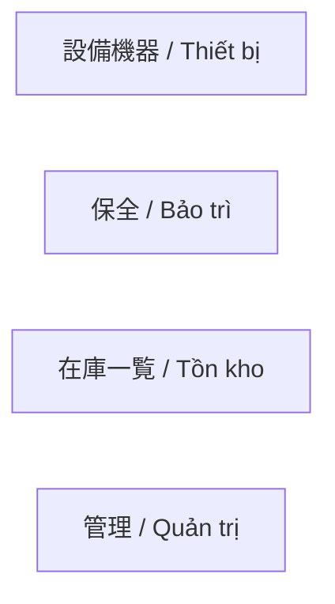
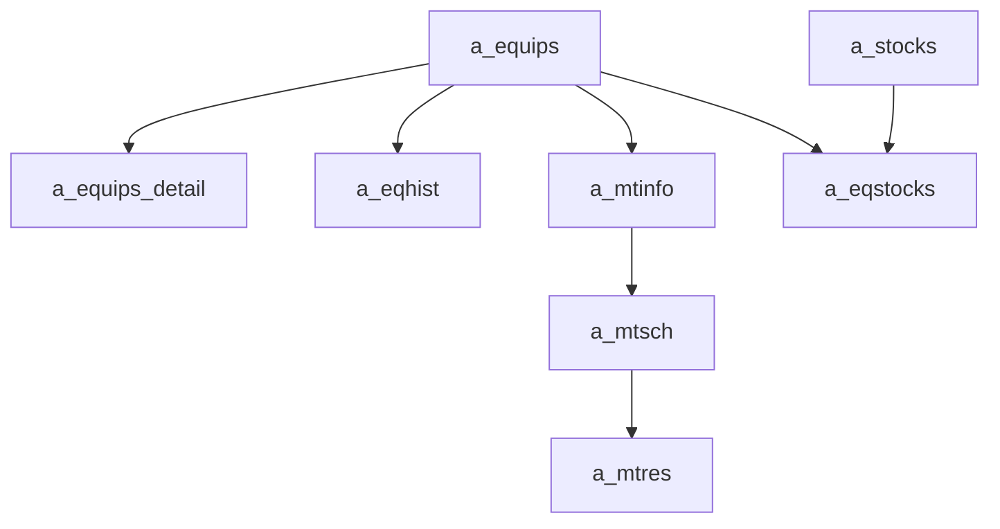

---
aliases:
  - PPES map VI
  - Vietnamese PPES map
tags:
  - ppes
  - vietnamese
  - overview
  - obsidian
---

# Bản đồ trang PPES (VI)

Note tổng quan tiếng Việt cho wiki PPES.

## Chỉ mục theo menu

- [[Thiết bị index (VI)]]
- [[Bảo trì index (VI)]]
- [[Tồn kho index (VI)]]
- [[Quản trị index (VI)]]
- [[Từ vựng chuyên ngành JA-VI]]

## Sơ đồ menu

## Sơ đồ dữ liệu lõi

## Cách đọc bộ note VI

- Dùng bản VI để nắm ý nghĩa nghiệp vụ nhanh.
- Dùng note tiếng Anh gốc khi cần chi tiết controller, code reference, hoặc rủi ro kỹ thuật sâu hơn.
- Thuật ngữ chuyên ngành giữ dạng `JA-VI` theo [[Từ vựng chuyên ngành JA-VI]].

## Link sang bản chi tiết gốc

- [[PPES page map]]
