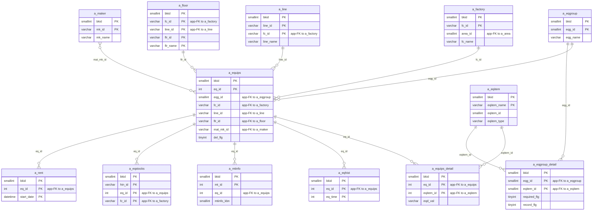
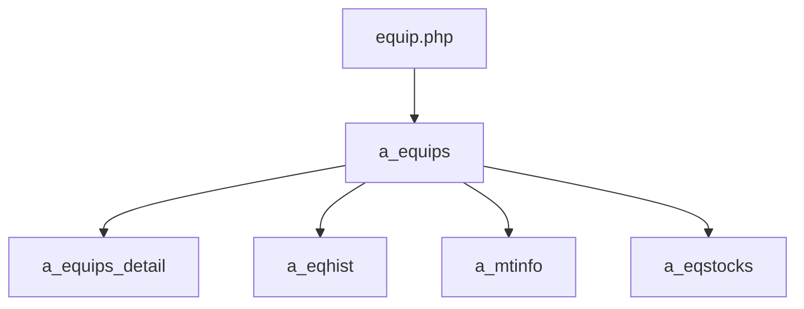

---
aliases:
  - /{tenant}/equip.php (VI)
tags:
  - ppes
  - vi
  - equip
---

# Trang thiết bị (VI)

## Thuật ngữ chính

- `設備機器 (thiết bị / máy móc)`
- `設備グループ (nhóm thiết bị)`
- `設備項目 (hạng mục thiết bị)`

## Tóm tắt

`/{tenant}/equip.php` là controller trung tâm của domain thiết bị.

- sở hữu `a_equips`, `a_equips_detail`, `a_eqhist`
- list/search/export thiết bị
- edit/add/copy/look thiết bị
- có thể import file tồn kho liên kết sang `a_stocks` và `a_eqstocks`
- delete bị chặn nếu đang bị dùng bởi bảo trì, tồn kho, hoặc mượn trả

## Bảng chính

- đọc: `a_equips`, `a_eqgroup`, `a_factory`, `a_line`, `a_floor`, `a_eqitem`, `a_eqgroup_detail`, `a_maker`, `datamaster`
- ghi: `a_equips`, `a_equips_detail`, `a_eqhist`
- phụ thuộc khi delete: `a_mtinfo`, `a_mtsch`, `a_eqstocks`, `a_rent`

## Mermaid ER

> **Ghi chú**: Database không có FK constraint. Tất cả quan hệ đều ở tầng application.

Ghi chú suy luận:

- một số link như `a_maker -> a_equips` là quan hệ ở mức application/UI, không nhất thiết là foreign key cứng.

## Side effects

- upload/copy/delete file vật lý của thiết bị
- import spreadsheet tồn kho
- download Excel/CSV
- utility sửa `flr_id`

## Mermaid

## Xem thêm

- [[Equipment page]]
- [[Thêm thiết bị (VI)]]
- [[Quản lý tồn kho (VI)]]
