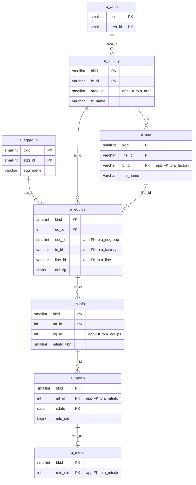
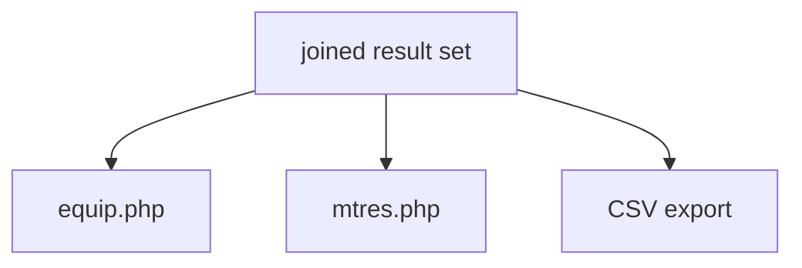

---
aliases:
  - /{tenant}/mtres_list.php (VI)
tags:
  - ppes
  - vi
  - maintenance
  - results
---

# Danh sách kết quả bảo trì (VI)

## Thuật ngữ chính

- `実績一覧 (danh sách kết quả)`
- `保全履歴 (lịch sử bảo trì)`

## Tóm tắt

`/{tenant}/mtres_list.php` là trang reporting trên các maintenance row đã hoàn tất.

- chủ yếu read-only
- join `a_mtinfo + a_equips + a_mtsch + a_mtres`
- export CSV
- link sang equip và mtres detail

## Bảng chính

- `a_mtinfo`
- `a_equips`
- `a_mtsch`
- `a_mtres`
- `a_factory`
- `a_area`
- `a_line`
- `a_eqgroup`

## Mermaid ER

> **Ghi chú**: Database không có FK constraint. Tất cả quan hệ đều ở tầng application.

## Điểm cần chú ý

- có một nhánh delete bất thường đụng vào `a_equips`

## Mermaid

## Xem thêm

- [[Maintenance results list]]
- [[Công việc bảo trì (VI)]]
