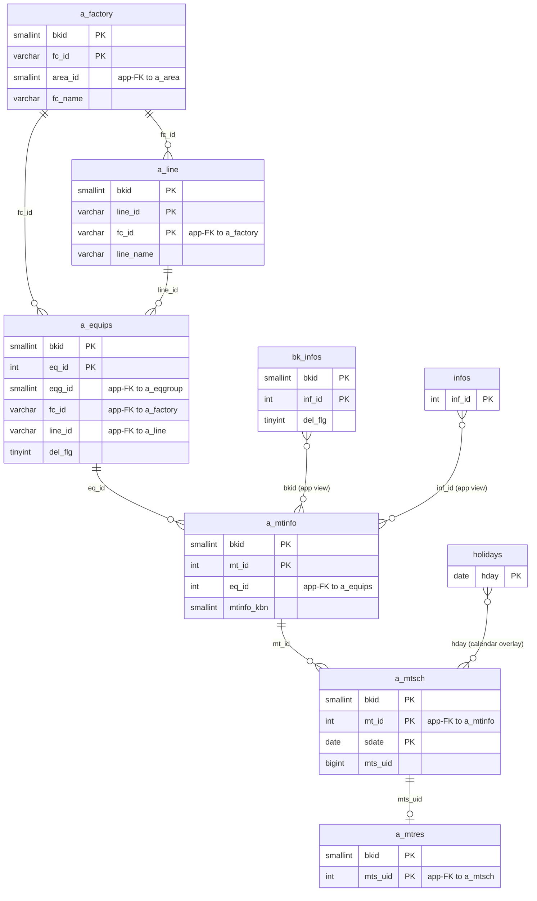
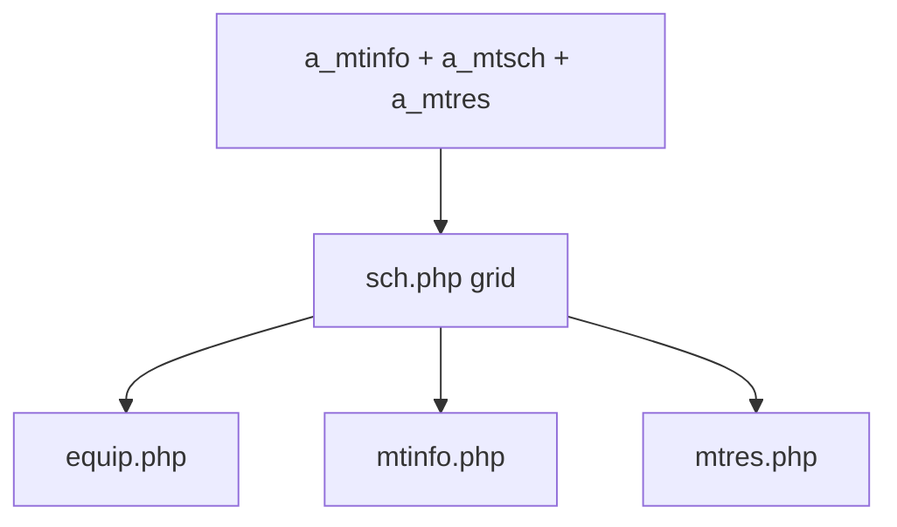

---
aliases:
  - /{tenant}/sch.php (VI)
tags:
  - ppes
  - vi
  - maintenance
  - calendar
---

# Lịch bảo trì (VI)

## Thuật ngữ chính

- `保全カレンダー (lịch bảo trì)`
- `日次計画 (kế hoạch ngày)`
- `月次計画 (kế hoạch tháng)`
- `年次計画 (kế hoạch năm)`

## Tóm tắt

`/{tenant}/sch.php` là trang calendar/projection, không phải source-of-truth editor.

- đọc lịch từ `a_mtinfo + a_mtsch + a_mtres + a_equips`
- hỗ trợ view day/month/year/long
- là hub điều hướng sang equip/mtinfo/mtres

## Bảng chính

- `a_equips`
- `a_mtinfo`
- `a_mtsch`
- `a_mtres`
- `a_factory`
- `a_line`
- `holidays`
- `bk_infos`
- `infos`

## Mermaid ER

> **Ghi chú**: Database không có FK constraint. Tất cả quan hệ đều ở tầng application.

Ghi chú suy luận:

- `bk_infos`, `infos`, `holidays` không phải parent thực của maintenance data; chúng chỉ được ghép vào calendar ở mức application view.

## Side effects

- không ghi business table
- redirect login nếu fail auth
- render widget news/info/today list

## Mermaid

## Xem thêm

- [[Schedule calendar]]
- [[Đặt lịch bảo trì (VI)]]
- [[Công việc bảo trì (VI)]]
