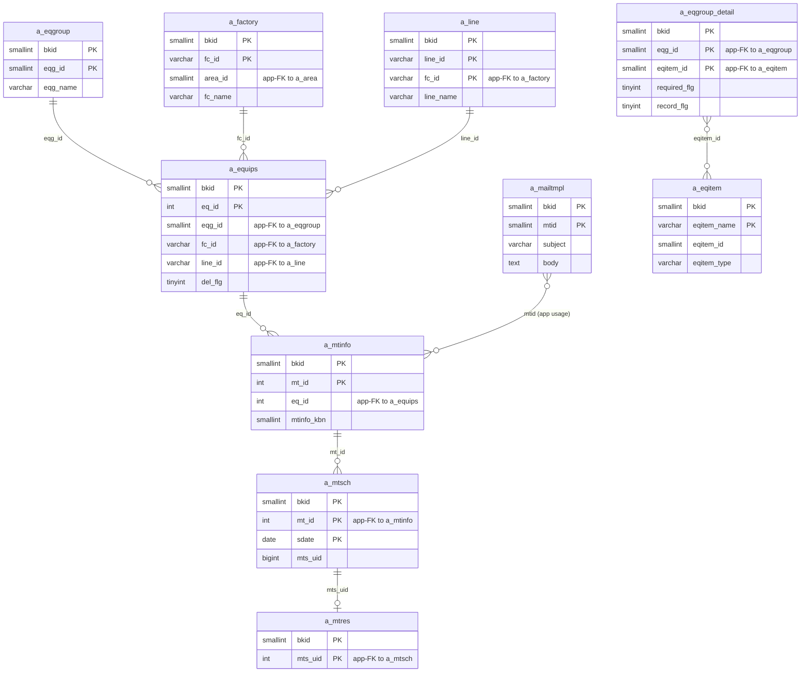
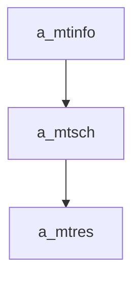

---
aliases:
  - /{tenant}/mtinfo_yoyaku.php (VI)
tags:
  - ppes
  - vi
  - maintenance
  - reservation
---

# Đặt lịch bảo trì (VI)

## Thuật ngữ chính

- `保全予約 (đặt lịch bảo trì)`
- `定期 (định kỳ)`
- `突発 (đột xuất)`

## Tóm tắt

`/{tenant}/mtinfo_yoyaku.php` là nhánh reservation-oriented của maintenance.

- tạo/sửa `a_mtinfo`
- với `定期` sẽ generate nhiều row `a_mtsch`
- với non-periodic có thể ghi cả `a_mtsch` và `a_mtres`
- có thể gửi mail nhắc việc

## Bảng chính

- đọc: `a_mtinfo`, `a_equips`, `a_eqgroup`, `a_factory`, `a_line`, `a_mtsch`, `a_mtres`, `a_eqitem`, `a_eqgroup_detail`, `a_mailtmpl`
- ghi: `a_mtinfo`, `a_mtsch`, `a_mtres`

## Mermaid ER

> **Ghi chú**: Database không có FK constraint. Tất cả quan hệ đều ở tầng application.

## Side effects

- generate lịch bảo trì tương lai
- gửi mail template `mtid=9`
- import periodic plan từ file

## Mermaid

## Xem thêm

- [[Maintenance reservation page]]
- [[Công việc bảo trì (VI)]]
- [[Lịch bảo trì (VI)]]
