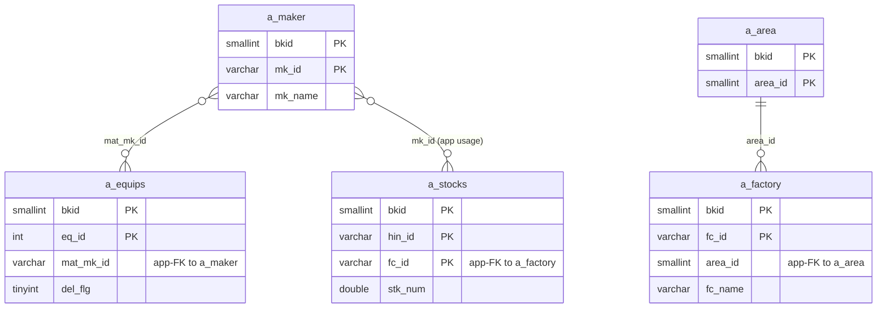
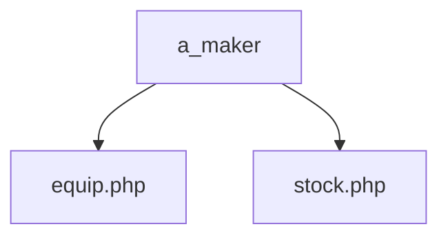

---
aliases:
  - /{tenant}/maker.php (VI)
tags:
  - ppes
  - vi
  - admin
  - maker
---

# Master maker (VI)

## Thuật ngữ chính

- `メーカー (hãng / maker)`
- `仕入先 (nhà cung cấp)`

## Tóm tắt

`/{tenant}/maker.php` quản lý `a_maker`.

- được dùng lại trong `equip.php`
- được dùng lại trong `stock.php`
- hỗ trợ import/export/order

## Bảng chính

- `a_maker`
- `a_area`
- `a_factory`

## Mermaid ER

> **Ghi chú**: Database không có FK constraint. Tất cả quan hệ đều ở tầng application.

## Mermaid

## Xem thêm

- [[Maker master]]
